算法学习分析：此算法是要解决什么问题、为什么遇到类似问题时此算法效率高、

算法使用分析：分析问题适合什么算法、使用此算法可以提高多少效率、逻辑设计

# 贪心算法

不从整体上考虑，从局部上考虑出最优解

分割数组为连续子序列

把一个数组分割成连续数组组成的至少一个或多个子序列长度至少为3

# 双指针

## 双指针滑动窗口

起始指针、终止指针

起始针到终止针的内容叫做窗口

窗口内数据一定是连续的并且是有一定共同点的

指针每动一次对新来的数据做规则判断，判断是否与窗口内有共同点

## 最长无重复字符串

**描述**

给定一个字符串，请找出其中无重复字符的最长子字符串。

**思路**

```
给定一个字符串'asdfgasd'
1、左指针指向a，右指针指向s
2、右指针向右移动，判断新字符'd'是否与前面的字符相等
2-1(不相等){
	右指针向右移动继续判断 ==》 1
}else(相等){
	记录以做指针指向的字符为起始的连续的最长不重复字符串，终止
	O1：左指针向右移动，右指针指向做指针下一个字符 ==》 1
	优化O1：右指针的前一个字符为终止，那么左指针指向窗口内的任意一个字符都不会重复
	例1：(asdfg)a(<-右指针)sd
	此时g为右指针的前一个字符，因为之前以做判断因此，左指针指向(asdfg)内出g以外的任意一个字符都不会右重复。
}
3、输出所记录的做大连续字符
```

## 盛最多水的容器

**描述**

给你 n 个非负整数 a1，a2，...，an，每个数代表坐标中的一个点 (i, ai) 。在坐标内画 n 条垂直线，垂直线 i 的两个端点分别为 (i, ai) 和 (i, 0) 。找出其中的两条线，使得它们与 x 轴共同构成的容器可以容纳最多的水。

[成最多的水题目](https://leetcode-cn.com/problems/container-with-most-water/)

```
输入：[1,8,6,2,5,4,8,3,7]
输出：49 
解释：图中垂直线代表输入数组 [1,8,6,2,5,4,8,3,7]。在此情况下，容器能够容纳水的最大值为 49。

```

**思路**

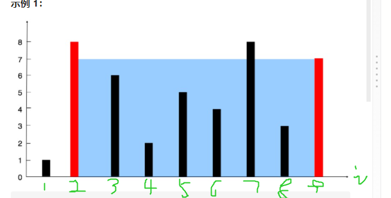

```
左指针：(x1,y1) 右指针(X2,y2) 
S = abs((X1 - X2)) * min(Y1,Y2) 
此题的双指针：左指针是数据集合起点，右指针是数据集合终点，移动则向中间移动
确定改变结果的因素，也就是桶的面积，有一下几点注意项
1、实际面积的桶高度是以最小的
2、索引的增加会加大宽度
先找到规律确定固定项
步骤：
1、左指针指向1，右指针指向9，求得面积为S= (9-1) * min(i1,i9) = 8
2、此时影响面积的因素右两种：1、最低高度 2、宽度；因为宽度已经是最高不管移动哪个指针都会导致宽度变小，那么只有移动低高度的指针才(有可能)使面积变高，因此记录面积移动低高度的指针直至两个指针相逢
3、输出记录的最大面积
```

## 接雨水

**描述**

给定 *n* 个非负整数表示每个宽度为 1 的柱子的高度图，计算按此排列的柱子，下雨之后能接多少雨水。

[接雨水](https://leetcode-cn.com/problems/trapping-rain-water/)

```
输入：height = [0,1,0,2,1,0,1,3,2,1,2,1]
输出：6
解释：上面是由数组 [0,1,0,2,1,0,1,3,2,1,2,1] 表示的高度图，在这种情况下，可以接 6 个单位的雨水（蓝色部分表示雨水）。
```

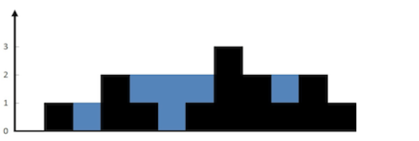

**思路**

```
左指针指向起始leftIndex位置，右指针指向结束rightIndex位置，同时记录leftMax(左边最高高度) rightMax(右边最高高度)，ans(雨水量)，
1、初始化leftMax = leftIndex---rightMax = rightIndex
2、当rightIndex <= leftIndex---右指针向左移 else rightIndex > leftIndex---左指针向右移
3、判断指针的当leftMax<leftIndex? 或者 rightMax<rightIndex 
3-1、大于 更新leftMax和rightMax
3-2、小于则 计算leftMax - leftIndex 或 rightMax - rightIndex 的差值 + ans
4、直到两个指针相遇
```

**代码**

```javascript
var trap = function (height) {
    let left = 0;
    let right = height.length - 1;
    let res = 0;
    let max = Math.min(height[left], height[right])
    while (left < height.length && right > left) {
        if (height[left] < height[right]) {
            max = Math.max(max, height[left])
            res += max - height[left]
            left++
        } else {
            max = Math.max(max, height[right])
            res += max - height[right]
            right--
        }
    }
    return res
};
```


## 验证回文串

**描述**

给定一个字符串，验证它是否是回文串，只考虑字母和数字字符，可以忽略字母的大小写。

[验证回文串](https://leetcode-cn.com/problems/valid-palindrome/)

```
输入: "A man, a plan, a canal: Panama"
输出: true
```

**思路**

```
左指针指向第一个字符，右指针指向最终字符
1、判断左指针是否是字母和数字
1-1、是数字 { 
	判断右指针是否是字母和数字{
		是数字：两个指针对比是否相等、相等则共同向内移动、不相等返回false
	}不是数字{
		右指针向左移动
		移动过指针后判断两指针是否相遇或者是否相交错
	}    
} else {
	左指针向右移动
	移动过指针后判断两指针是否相遇或者是否相交错
}
2、相遇或者交错 返回 true
```

## 环形链表

**描述**

给定一个链表，返回链表开始入环的第一个节点。 如果链表无环，则返回 `null`。

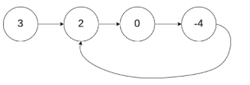

```
输入：head = [3,2,0,-4], pos = 1
输出：返回索引为 1 的链表节点
解释：链表中有一个环，其尾部连接到第二个节点。
```

**思路**

示例图

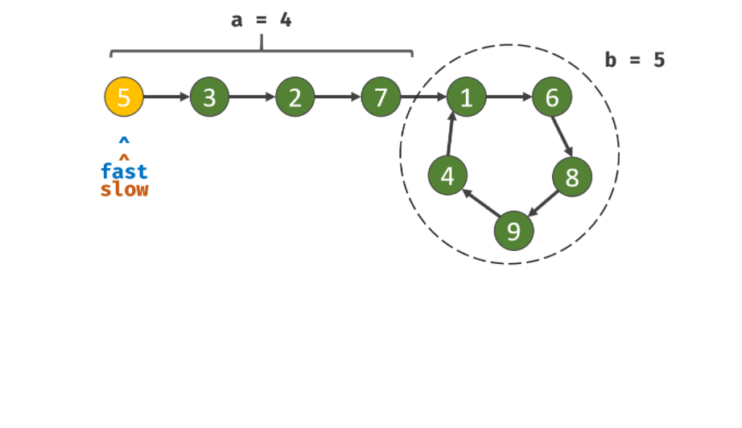

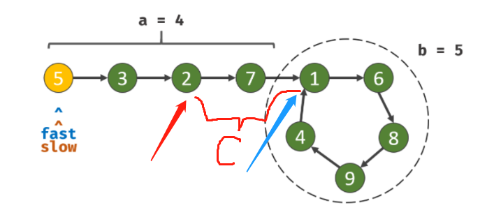

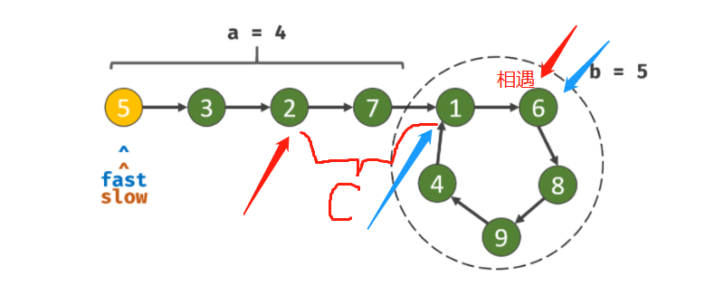

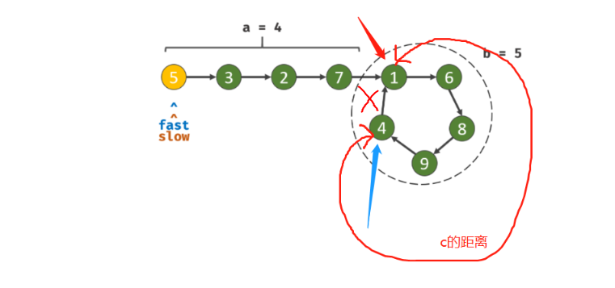

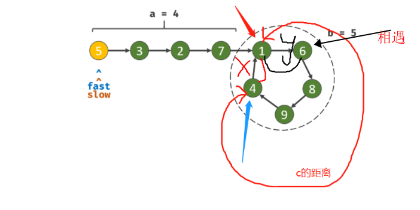

```
使用快慢指针解题，快指针fast和慢指针slow，快指针一次两步，慢指针一次一步，
提前知道的知识，也就是说同一个循环圆的起点出发那么相遇时一定在起点
其实看图来说：当aslow指针走到1时，fast应该停留在4，此时4-》1差一步，
也就是说，此时fast走的步数应该是：a +nb + c ,a：是起点到循环起点的距离；n是此时fast指针循环的圈数；c：是当slow指针走到起点时fast从循环起点到此时的距离。也就是说如果：n=0其实也就是a<=5时；a == c。
之后我们需要确定：循环的起点和走了几圈；
循环的起点确定：此时继续走知道两个指针相遇，那么相遇时X一定等于Y，
所以相遇时指针到循环起点的距离一定是a(a<=b时)
如果a>b那么就需要确定n(快指针在慢指针走到循环起点时已经循环的圈数)
如果确定起点到循环起点的距离？已知c==b-y==a，那么只要此时新建一个慢指针从起点触发那么新建的慢指针和旧慢指针的相遇点一定是循环的起点，新慢指针的步数就是起点到循环起点的距离
同样如果a>b时n也会大于0，也就是旧慢指针会多跑一圈
```

**代码**

```
```


## 实现strStr()

**描述**

给你两个字符串 haystack 和 needle ，请你在 haystack 字符串中找出 needle 字符串出现的第一个位置（下标从 0 开始）。如果不存在，则返回  -1 。

[实现strStr()](https://leetcode-cn.com/problems/implement-strstr/)

### 滑动窗口

**思路**

```
1、循环haystack字符串
2、首先再haystack中提取haystack(i,needleLength)字符串与needle比较
2-1、成功则直接返回
2-2、失败则继续提取
3、循环结束返回 -1
```

**代码**

```javascript
var strStr = function (haystack, needle) {
    //滑动窗口,以needle.length为窗口大小,步长为一
    if (haystack === '' && needle == "") return 0;
    let step = needle.length;
    for (let i = 0; i < haystack.length; i++) {
        if (haystack.substr(i, step) == needle) {
            return i;
        }
    }
    return -1;
};
```

### Sunday算法

**思路**

```
1、记录初始值要求字符串长度和模板字符串长度j
2、使用while判断字符串是否和模板字符串相匹配，注意从后往前匹配，while(j>=0) 成功 j--，起始被匹配的字符串起始点start = i + j
2-1、成功则返回循环发i值
2-2、失败则需要再次匹配当前被匹配窗口的后一位，next = i + jj + 1，jj =  needle.length - 1
3、为什么需要匹配后一位，如果后一位包含在模板字符串needle中则可以直接使其匹配的那个字符对其，不匹配可以直接移动整个模板字符串到next下一位
4、循环结束还是没有匹配成功则返回-1
```

**代码**

```javascript
/**
 * @param {string} haystack
 * @param {string} needle
 * @return {number}
 */
// sunday
var strStr = function (haystack, needle) {
    if (needle.length <= 0) return 0
    return searchIndex(haystack, needle)
};
function searchIndex(haystack, needle) {
    let j = needle.length - 1;
    for (let i = 0; i < haystack.length; i++) {
        j = needle.length-1
        while (j >= 0) {
            // 判断边界
            if (i + j >= haystack.length) return -1
            if (haystack[i + j] == needle[j]) {
                j--
            } else {
                let jj = needle.length - 1
                let next = i + jj + 1
                if (next >= haystack.length) return -1
                // 匹配模式串后一个字符
                while (jj >= 0) {
                    if (haystack[next] == needle[jj]) {
                        break
                    } else {
                        jj--
                    }
                }
                // 如果后一个字符没有匹配到 计算需要移动距离
                let y
                if (jj < 0) {
                    y = needle.length + 1
                }else {
                    y= needle.length - jj
                }
                // 因为i++的缘故所以需要-1
                i = i + y - 1
                break;
            }
        }
        if (j < 0) {
            return i
        }
    }
    return -1
}
```


### KMP算法

## 下一个排列

**描述**

实现获取 下一个排列 的函数，算法需要将给定数字序列重新排列成字典序中下一个更大的排列（即，组合出下一个更大的整数）。

如果不存在下一个更大的排列，则将数字重新排列成最小的排列（即升序排列）。

[下一个排列](https://leetcode-cn.com/problems/next-permutation/)

**思路**

```
例子：[5,4,7,5,3,2]
1、首先从后往前检索找到一个nums[i] < nums[j] 的递增数和索引，当前就是[4,7] 下标1，2
2、此时找出下标2之后的数组中大于4且最小的，本例子中就是5，因为在下标为2值为7之后的数组中全部都是递减的数组，此时的目的就是把当前的4换入到那些递减的数组中且不打乱递增的顺序，当前是交换下标为3的5
3、因为想要比现在的值大的情况，仅仅交换完并不一定是下一个较大的，此时需要把7和之后的数组进行反序,[7,4,3,2]反序[2,3,4,7]
4、结果数组[5,5,2,3,4,7]
思考为什么这样交换是最大的
首先思考一下当前数组最小的情况时什么，就是从下到大的排序是最小的，最大的情况就是从大到小的排序
那么就明了了，想要这个数组的排序大于当前就必须在一串从大到小的数组中找到一个从小到大的数组然后进行处理，又因为位数越大数目越大，所以要从个位开始找也就是为什么会从数组的末尾开始匹配
```

**代码**

```javascript
/**
 * @param {number[]} nums
 * @return {void} Do not return anything, modify nums in-place instead.
 */
var nextPermutation = function (nums) {
    let right = nums.length - 1;
    let left = right - 1
    let leg = nums.length - 1
    while (left >= 0) {
        // 判断递减
        if (nums[left] < nums[right]) {
            if (right !== nums.length - 1) {
                let minArr = [nums[right]]
                //minArr 储存匹配到递增数right 后面的数组
                for (let i = right + 1; i < nums.length; i++) {
                    if (nums[left] < nums[i]) {
                        minArr.push(nums[i])
                    }
                }
                // 找出大于nums[left]并且在minArr这个数组中最小的
                let minIndex = nums.lastIndexOf(Math.min(...minArr))
                let temp = nums[minIndex]
                nums[minIndex] = nums[left]
                nums[left] = temp
                // 反转
                let rev = nums.slice(right, leg + 1).reverse()
                nums.splice(right, leg, ...rev)
                return nums
            } else {
                // 如果left和right指针指向的是最后两个则直接交换一下
                let temp = nums[left]
                nums[left] = nums[right]
                nums[right] = temp
                return nums
            }
        }
        left--
        right--
    }
    // 没有找到最大的返回最小的
    return nums.sort((a, b) => a - b)
};
```

## 颜色分类

**描述**

给定一个包含红色、白色和蓝色，一共 n 个元素的数组，原地对它们进行排序，使得相同颜色的元素相邻，并按照红色、白色、蓝色顺序排列。

此题中，我们使用整数 0、 1 和 2 分别表示红色、白色和蓝色。

[颜色分类](https://leetcode-cn.com/problems/sort-colors/)

**思路**

>1.p0表示指向红色的指针，p1表示指向白色的指针
>2.初始化p0和p1为0
>3.循环颜色数组，判断如果当前是1，则交换一下nums[p1]和nums[i],然后p++
>
>---如果当前是0，交换nums[p0]和nums[i]，然后判断p0是否小于p1，小于则说明当前p0下标的值一定是1，所以需要再次交换交换一下nums[p1]和nums[i]，p0++，p1++

**代码**

```javascript
/**
 * @param {number[]} nums
 * @return {void} Do not return anything, modify nums in-place instead.
 */
var sortColors = function (nums) {
    let n = nums.length;
    let p0 = 0, p1 = 0;
    for (let i = 0; i < n; i++) {
        if (nums[i] == 1) {
            let temp = nums[i]
            nums[i] = nums[p1]
            nums[p1] = temp
            p1++
        } else if (nums[i] == 0) {
            let temp = nums[i]
            nums[i] = nums[p0]
            nums[p0] = temp
            if (p0 < p1) {
                let temp = nums[i]
                nums[i] = nums[p1]
                nums[p1] = temp
            }
            p1++
            p0++
        }
    }
    return nums
};
```

## 删除数组中的重复项

**描述**

给你一个有序数组 nums ，请你 原地 删除重复出现的元素，使每个元素 最多出现两次 ，返回删除后数组的新长度。

不要使用额外的数组空间，你必须在 原地 修改输入数组 并在使用 O(1) 额外空间的条件下完成。

**思路**

```
使用快慢指针实现，
定义slow=2，fast=2，leg数组长度
while循环条件就是判断快指针fast是否越界
判断nums[slow-2]是否等于nums[fast]
--解释一下当前的数组表示的意思：nums[slow]就是需要被处理的数组，nums[fast]表示判断是否需要处理的条件比较
--如果相等则fast指针向后移动，因为相等就表示之前已经有存在两个相同数，不予处理
--如果相等则表示有新值需要赋值：nums[slow]=nums[fast]
```

**代码**

```javascript
/**
 * @param {number[]} nums
 * @return {number}
 */
var removeDuplicates = function (nums) {
    if(nums.length < 2) return nums.length
    let max = 2
    let slow = max
    let fast = max
    let leg = nums.length
    while (fast < leg) {
        if(nums[slow-max] != nums[fast]) {
            nums[slow] = nums[fast]
            slow++
        }
        fast++
    }
    return slow
};
```

如果需要增加最多出现的次数，只需要改变一下max

## 相交链表

**描述**

[相交链表](https://leetcode-cn.com/problems/intersection-of-two-linked-lists/)

给你两个单链表的头节点 `headA` 和 `headB` ，请你找出并返回两个单链表相交的起始节点。如果两个链表没有交点，返回 `null` 。

**思路**

> 判断两个链表的头部节点的下一个节点是否为null，任意一个为null则没有相交点
>
> 设置headA不相交节点为a,长度为m，headB不相交节点为b，长度为n，共有节点为c，则：a+c=m，b+c=n
>
> 情况一：两者相交
>
> 如果a=b说明两个遇到相同的节点，此时返回相交的节点
>
> 如果a≠b，则两个不会同时到达链表的根节点，pA到达根节点后指向headB，pB到达根节点后指向headA，此时移动的路径为a+c+b，如果有相交节点则会相遇
>
> 情况二：两者不相交
>
> 如果m=n，则两个指针会同时达到跟阶段返回null
>
> 如果m≠n，则两个指针会同时遍历完两个链表返回null

**代码**

```javascript
var getIntersectionNode = function (headA, headB) {
    if (headA == null || headB == null) return null
    let pA = headA, pB = headB
    while (pA !== pB) {
        pA = pA == null ? headB : pA.next
        pB = pB == null ? headA : pB.next
    }
    return pA
};
```

## 三数之和(排序+双指针)

**描述**

[三数之和](https://leetcode-cn.com/problems/3sum/)

给你一个包含 n 个整数的数组 nums，判断 nums 中是否存在三个元素 a，b，c ，使得 a + b + c = 0 ？请你找出所有和为 0 且不重复的三元组。

**思路**

>首先对数组进行从小到大排序
>
>取第一个数，如果大于0则直接返回[]，因为最小就大于0此数组无法和为0
>
>取最后一个数，如果小于0则直接返回[]，因为最大不大于0也无法和为0
>
>定义arr数组用于存储符合要求的数组
>
>循环nums数组，同时定义left和right
>
>left=i+1，right=nums.length-1
>
>nums循环从0开始到nums.length-2结束
>
>while(left<right)判断如果nums[i] + nums[right] + nums[left] = 0则存储到arr同时left++，right--
>
>如果小于0则移动left+1，原因是nums[left]太小了
>
>如果大于0则移动right-1
>
>最后需要处理重复问题，重复问题需要在两处判断
>
>如果当前最外层循环的nums[i]的值在之前已经循环过了则直接跳过
>
>当nums[i] + nums[right] + nums[left] = 0时需要再进行判断，后续left和right有没有重复，有重复则直接跳过

**代码**

```javascript
var threeSum = function (nums) {
    nums.sort((a, b) => a - b)
    if (nums[0] > 0) return []
    if (nums[nums.length - 1] < 0) return []
    let arr = []
    for (let i = 0; i < nums.length - 2; i++) {
        let left = i + 1
        let right = nums.length - 1
        // 遍历过的直接跳过
        if (nums.slice(0, i).indexOf(nums[i]) !== -1) continue
        while (left < right) {
            let val = nums[i] + nums[right] + nums[left]
            if (val == 0) {
                arr.push([nums[i], nums[right], nums[left]])
                left++
                right--
                // 如果有相等该表指向
                while (left < right && nums[left] == nums[left - 1]) {
                    left++
                }
                while (left < right && nums[right] == nums[right + 1]) {
                    right--
                }
            } else if (val > 0) {
                right--
            } else {
                left++
            }

        }
    }
    return arr
};
```

## 乘积小于K的子数组

**描述：**[乘积小于K的子数组](https://leetcode-cn.com/problems/subarray-product-less-than-k/)

>给定一个正整数数组 `nums`和整数 `k` 。
>
>请找出该数组内乘积小于 `k` 的连续的子数组的个数。
>
>输入: nums = [10,5,2,6], k = 100
>输出: 8
>解释: 8个乘积小于100的子数组分别为: [10], [5], [2], [6], [10,5], [5,2], [2,6], [5,2,6]。
>需要注意的是 [10,5,2] 并不是乘积小于100的子数组。

**代码：**

```javascript
var numSubarrayProductLessThanK = function (nums, k) 
    let product = 1, left = 0;
    let count = 0;
    for (let right = 0; right < nums.length; right++) {
        // 初始化product 
        product *= nums[right];
        // 如果left到right的范围超过了 k 那么左指针向右移动
        // 循环条件就是 如果右移动后的范围积小于k则结束循环
        while (left <= right && product >= k) {
            product /= nums[left++];
        }
        count += right >= left ? right - left + 1 : 0;
    }
    return count;
};
```

## 长度最小的子数组

**描述：**[长度最小的子数组](https://leetcode-cn.com/problems/minimum-size-subarray-sum/)

>给定一个含有 n 个正整数的数组和一个正整数 target 。
>
>找出该数组中满足其和 ≥ target 的长度最小的 连续子数组 [numsl, numsl+1, ..., numsr-1, numsr] ，并返回其长度。如果不存在符合条件的子数组，返回 0 。
>
>**示例 1：**
>
>```
>输入：target = 7, nums = [2,3,1,2,4,3]
>输出：2
>解释：子数组 [4,3] 是该条件下的长度最小的子数组。
>```

**代码：**

```javascript
/**
 * @param {number} target
 * @param {number[]} nums
 * @return {number}
 */
var minSubArrayLen = function (target, nums) {
    let left = right = 0
    let res = 0
    let product = 0
    // 使用滑动窗口，首先left=right=0 
    // 然后移动right进行扩展窗口  计算窗口内的大小并和target比较
    while (right < nums.length) {
        product += nums[right]
        // 如果大于指定值的进入循环
        while (left <= nums.length && product >= target) {
            // 记录大与target值的长度，取最小的哪一个
            res = res ? Math.min(res, right - left + 1) : right - left+1
            product -= nums[left]
            // 计算完成之后从左边缩小滑动窗口的长度
            // 目的是为了减少product的值同时 为了判断符合条件的长度是否可以进一步的缩小
            left++
        }
        right++
    }
    return res 
};
```


## 总结

快慢指针、收合指针、扩散指针

# 动态规划(DP)

动态规划（Dynamic programming）是一种在数学、计算机科学和经济学中使用的，通过把原问题分解为相对简单的子问题的方式求解复杂问题的方法。 动态规划常常适用于有重叠子问题和最优子结构性质的问题，动态规划方法所耗时间往往远少于朴素解法。 动态规划背后的基本思想非常简单。大致上，若要解一个给定问题，我们需要解其不同部分（即子问题），再合并子问题的解以得出原问题的解。 通常许多子问题非常相似，为此动态规划法试图仅仅解决每个子问题一次，从而减少计算量： 一旦某个给定子问题的解已经算出，则将其记忆化存储，以便下次需要同一个子问题解之时直接查表。 这种做法在重复子问题的数目关于输入的规模呈指数增长时特别有用。 关于动态规划最经典的问题当属背包问题。

## 性质

1. 最优子结构性质。如果问题的最优解所包含的子问题的解也是最优的，我们就称该问题具有最优子结构性质（即满足最优化原理）。最优子结构性质为动态规划算法解决问题提供了重要线索。
2. 子问题重叠性质。子问题重叠性质是指在用递归算法自顶向下对问题进行求解时，每次产生的子问题并不总是新问题，有些子问题会被重复计算多次。动态规划算法正是利用了这种子问题的重叠性质，对每一个子问题只计算一次，然后将其计算结果保存在一个表格中，当再次需要计算已经计算过的子问题时，只是在表格中简单地查看一下结果，从而获得较高的效率。
3. 无后效性：即某阶段状态一旦确定，就不受这个状态以后决策的影响。也就是说，某状态以后的过程不会影响以前的状态，只与当前状态有关。

## 步骤

1. 划分：按照问题的特征，把问题分为若干阶段。注意：划分后的阶段一定是有序的或者可排序的
2. 确定状态和状态变量：将问题发展到各个阶段时所处的各种不同的客观情况表现出来。状态的选择要满足无后续性
3. 确定决策并写出状态转移方程：状态转移就是根据上一阶段的决策和状态来导出本阶段的状态。根据相邻两个阶段状态之间的联系来确定决策方法和状态转移方程
4. 边界条件：状态转移方程是一个递推式，因此需要找到递推终止的条件

## 爬楼梯

**描述**：[爬楼梯](https://leetcode-cn.com/problems/climbing-stairs/)

假设你正在爬楼梯。需要 `n` 阶你才能到达楼顶。

每次你可以爬 `1` 或 `2` 个台阶。你有多少种不同的方法可以爬到楼顶呢？

>```
>输入：n = 2
>输出：2
>解释：有两种方法可以爬到楼顶。
>1. 1 阶 + 1 阶
>2. 2 阶
>```

**代码：**

```javascript
/**
 * @param {number} n
 * @return {number}
 */
var climbStairs = function (n) {
    // 因为只能趴1个台阶和2个台阶  变为函数就是f(n) = f(n-1) + f(n-2)
    // f(n)代表的是到达n台阶有多少种爬梯方式 
    // 可以用递归实现 但是时间太长 
    let p = 0, q = 0, r = 1;
    for (let i = 1; i <= n; ++i) {
        p = q;
        q = r;
        r = p + q;
    }
    return r;
};
```


## 摆动序列

**描述**

如果连续数字之间的差严格地在正数和负数之间交替，则数字序列称为 摆动序列 。第一个差（如果存在的话）可能是正数或负数。仅有一个元素或者含两个不等元素的序列也视作摆动序列。

例如， [1, 7, 4, 9, 2, 5] 是一个 摆动序列 ，因为差值 (6, -3, 5, -7, 3) 是正负交替出现的。

相反，[1, 4, 7, 2, 5] 和 [1, 7, 4, 5, 5] 不是摆动序列，第一个序列是因为它的前两个差值都是正数，第二个序列是因为它的最后一个差值为零。
子序列 可以通过从原始序列中删除一些（也可以不删除）元素来获得，剩下的元素保持其原始顺序。

给你一个整数数组 nums ，返回 nums 中作为 摆动序列 的 最长子序列的长度 

[摆动序列](https://leetcode-cn.com/problems/wiggle-subsequence/)

```
// 示例
输入：nums = [1,17,5,10,13,15,10,5,16,8]
输出：7
解释：这个序列包含几个长度为 7 摆动序列。
其中一个是 [1,17,5,15,10,16,8]
另一个是 [1,17,10,13,10,16,8] 
```
|  i   | 0          | 1             | 2               | 3                  | 4                  | 5                  | 6                     | 7                     | 8                        | 9                          |
| :--: | ---------- | ------------- | --------------- | ------------------ | ------------------ | ------------------ | --------------------- | --------------------- | ------------------------ | -------------------------- |
| nums | 1          | 17            | 5               | 10                 | 13                 | 15                 | 10                    | 5                     | 16                       | 8                          |
|  up  | 1<br />(1) | 2<br />(1,17) | 2<br />(1,17)   | 4<br />(1,17,5,10) | 4<br />(1,17,5,13) | 4<br />(1,17,5,15) | 4<br />(1,17,5,15)    | 4<br />(1,17,5,15)    | 6<br />(1,17,5,15,10,16) | 6<br />(1,17,5,15,10,16)   |
| down | 1<br />(1) | 1<br />(1)    | 3<br />(1,17,5) | 3<br />(1,17,5)    | 3<br />(1,17,5)    | 3<br />(1,17,5)    | 5<br />(1,17,5,15,10) | 5<br />(1,17,5,15,10) | 5<br />(1,17,5,15,10)    | 7<br />(1,17,5,15,10,16,8) |

**思路**

```
划分两个子问题：到达i后以降序终止的最大数量down[i]和以升序终止的最大数量up[i]
然后判单这两个问题求出的结果是否符合《子问题重叠性质》和《无后效性》
先对down[i]判断：是否符合无后效性；根本原因就是来判断对于未判断的值进行改变是否会影响之前所计算的值
由以上表格来看，完全符合，
up[i]同上
然后我们确定了两个子问题那么就需要---确定决策并写出状态转移方程，
先看up[x]，那么up[x-1]一定是降序结尾的序列，因为数列规则就是交替出现的，因此这也是他们之间的状态转换规则
所以：up[i+1] = down[i]+1，解释就是如果判断了下一个是以升序结尾的数列，那么当前肯定是以降序结尾的数列 （出第一个外）
同理：down[i+1] = up[i]+1
最后再对比Max(down[i],up[i])
输出结果最大值
详细请看图表
```

**代码**

```javascript
var wiggleMaxLength = function(nums) {
    const n = nums.length;
    if (n < 2) {
        return n;
    }
    let prevdiff = nums[1] - nums[0];
    let ret = prevdiff !== 0 ? 2 : 1;
    for (let i = 2; i < n; i++) {
        const diff = nums[i] - nums[i - 1];
        if ((diff > 0 && prevdiff <= 0) || (diff < 0 && prevdiff >= 0)) {
            ret++;
            prevdiff = diff;
        }
    }
    return ret;
};
```

## 二数之和（哈希表、类动态规划）

**描述**

给定一个整数数组 nums 和一个整数目标值 target，请你在该数组中找出 和为目标值 target  的那 两个 整数，并返回它们的数组下标。

你可以假设每种输入只会对应一个答案。但是，数组中同一个元素在答案里不能重复出现。

[两数之和](https://leetcode-cn.com/problems/two-sum/)

**思路**

> 首先明确：target - x1 = x2 ，x1为数组中任意取出的第一个数，x2为数组去取出的第二个数，map：储存以当前遍历的nuns[i]与target差值为下标，以当前nums遍历下标为值的数组
>
> 首先遍历nums数组，每次使用target-xi得到的值进行在map中查找如果有的话返回[map.get(nums[i]),i]如果没有的话存储以nums[i]为下标以当前遍历的i为值

**代码**

```javascript
var twoSum = function(nums, target) {
    let map = new Map()
    for(let i=0;i<nums.length;i++) {
        let x = target-nums[i]
        if(map.has(x)){
            return [map.get(x),i]
        }
        map.set(nums[i],i)
    }
};
```

## 括号生成

描述：[括号生成](https://leetcode-cn.com/problems/generate-parentheses/)

>数字 `n` 代表生成括号的对数，请你设计一个函数，用于能够生成所有可能的并且 **有效的** 括号组合。
>
>**示例 1：**
>
>```
>输入：n = 3
>输出：["((()))","(()())","(())()","()(())","()()()"]
>```

**代码**

```javascript
/**
 * @param {number} n
 * @return {string[]}
 */
var generateParenthesis = function (n) {
    // 首先保存所有括号下的数量
    // 增加一个括号，所得到的情况只能由两种，第一个在内部增加，第二个在外部增加
    /*
        0个括号
        -''
        1个括号
        结果：()
        2个括号
        -内部增加：(())
        -放在外部：()()
        -结果：()()、(())
        3个括号
        -需要把前面所有的组合情况考虑进去
        -内2外0、内1外1、内0外2：为什么总和是2，因为在本身增加的一个括号也要算进去
        -内2外1：(()())、((()))
        -内1外1：(())()
        -内0外2：()()()、()(())
        -结果：(()())、((()))、(())()、()()()、()(())
     */
    let dp = [
        [''],
        ['()'],
        ['()()', '(())']
    ]
    if (n <= 2) {
        return dp[n]
    }
    let p = '('
    let q = ')'
    for (let i = 3; i <= n; i++) {
        let dpLength = dp.length - 1
        let arr = []
        for (let k = dpLength; k >= 0; k--) {
            let leg = dp[k].length - 1
            for (let j = 0; j <= leg; j++) {
                dp[dpLength - k].forEach(value => {
                    arr.push(p + dp[k][j] + q + value)
                })
            }
        }
        dp.push(arr)
    }
    console.log(dp)
    return dp[n]
};
```

## 跳跃游戏

描述：[跳跃游戏 II](https://leetcode-cn.com/problems/jump-game-ii/)

>给你一个非负整数数组 nums ，你最初位于数组的第一个位置。
>
>数组中的每个元素代表你在该位置可以跳跃的最大长度。
>
>你的目标是使用最少的跳跃次数到达数组的最后一个位置。
>
>假设你总是可以到达数组的最后一个位置。
>
>示例 1:
>
>输入: nums = [2,3,1,1,4]
>输出: 2
>解释: 跳到最后一个位置的最小跳跃数是 2。
>     从下标为 0 跳到下标为 1 的位置，跳 1 步，然后跳 3 步到达数组的最后一个位置。

代码：

```javascript
/**
 * @param {number[]} nums
 * @return {number}
 */
var jump = function (nums) {
    if (nums.length <= 1) return 0
    // 已走步数
    let count = 1
    // 当前剩余行动点
    let nowStep = nums[0]
    // 最大行动点：存遍历之前（某个值到当前下标差值）的最大值
    let maxStep = 0
    let lng = nums.length - 1
    for (let i = 1; i <= lng; ++i) {
        // 走一位减少行动数
        nowStep--
        if (maxStep > 0) {
            maxStep--
        }
        // 更新最大值行动数  
        if (nowStep < nums[i]) {
            maxStep = Math.max(nums[i], maxStep)
        }
        // 增加步数更新当前行动数
        if (nowStep <= 0 && i < lng) {
            nowStep = maxStep
            count++
        }
    }
    return count
};
```


## 等差数列划分

**描述**：[等差数列划分](https://leetcode-cn.com/problems/arithmetic-slices/)

>如果一个数列 至少有三个元素 ，并且任意两个相邻元素之差相同，则称该数列为等差数列。
>
>例如，[1,3,5,7,9]、[7,7,7,7] 和 [3,-1,-5,-9] 都是等差数列。
>给你一个整数数组 nums ，返回数组 nums 中所有为等差数组的 子数组 个数。
>
>子数组 是数组中的一个连续序列。
>
>示例 1：
>
>输入：nums = [1,2,3,4]
>输出：3
>解释：nums 中有三个子等差数组：[1, 2, 3]、[2, 3, 4] 和 [1,2,3,4] 自身。
## 最长公共子串

描述：[最长公共子序列](https://leetcode-cn.com/problems/longest-common-subsequence/)

>给定两个字符串 text1 和 text2，返回这两个字符串的最长 公共子序列 的长度。如果不存在 公共子序列 ，返回 0 。
>
>一个字符串的 子序列 是指这样一个新的字符串：它是由原字符串在不改变字符的相对顺序的情况下删除某些字符（也可以不删除任何字符）后组成的新字符串。
>
>例如，"ace" 是 "abcde" 的子序列，但 "aec" 不是 "abcde" 的子序列。
>两个字符串的 公共子序列 是这两个字符串所共同拥有的子序列。
>
>**示例 1：**
>
>```javascript
>输入：text1 = "abcde", text2 = "ace" 
>输出：3  
>解释：最长公共子序列是 "ace" ，它的长度为 3 。
>```

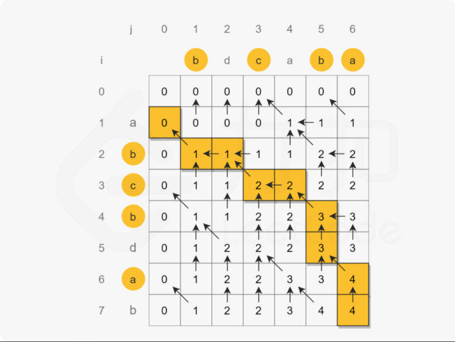

**代码**：

```java
var longestCommonSubsequence = function(text1, text2) {
    const m = text1.length, n = text2.length;
    // 用于存储表格
    const dp = new Array(m + 1).fill(0).map(() => new Array(n + 1).fill(0));
    for (let i = 1; i <= m; i++) {
        const c1 = text1[i - 1];
        for (let j = 1; j <= n; j++) {
            const c2 = text2[j - 1];
            if (c1 === c2) {
                dp[i][j] = dp[i - 1][j - 1] + 1;
            } else {
                dp[i][j] = Math.max(dp[i - 1][j], dp[i][j - 1]);
            }
        }
    }
    // console.log(dp)
    return dp[m][n];
};

// [
//   [ 0, a, b, c, d ],
//   [ a, 1, 1, 1, 1 ],
//   [ b, 1, 2, 2, 2 ],
//   [ c, 1, 2, 3, 3 ]
// ]
```

## 两个字符串的删除操作

描述：[两个字符串的删除操作](https://leetcode-cn.com/problems/delete-operation-for-two-strings/)

>给定两个单词 `word1` 和 `word2` ，返回使得 `word1` 和 `word2` **相同**所需的**最小步数**。
>
>**每步** 可以删除任意一个字符串中的一个字符。
>
>示例 1：
>
>输入: word1 = "sea", word2 = "eat"
>输出: 2
>解释: 第一步将 "sea" 变为 "ea" ，第二步将 "eat "变为 "ea"

**代码**：

```javascript
/**
 * @param {number[]} nums
 * @return {number}
 */
var numberOfArithmeticSlices = function (nums) {
    if(nums.length<3) return 0
    let dp = new Array(nums.length).fill(0)
    let res = 0
    for (let i = 2; i < nums.length; i++) {
        if (nums[i] - nums[i - 1] == nums[i - 1] - nums[i - 2]) {
            dp[i - 2]++
            for (let j = i - 3; j >= 0; j--) {
                if (dp[j] !== 0) {
                    dp[j]++
                }else {
                    break
                }
            }
        }
    }
    res = dp.reduce((total,num) => {
        return total + num
    },0)
    return res
var minDistance = function(word1, word2) {
    const m = word1.length, n = word2.length;
    const dp = new Array(m + 1).fill(0).map(() => new Array(n + 1).fill(0));
    for (let i = 1; i <= m; i++) {
        const c1 = word1[i - 1];
        for (let j = 1; j <= n; j++) {
            const c2 = word2[j - 1];
            if (c1 === c2) {
                dp[i][j] = dp[i - 1][j - 1] + 1;
            } else {
                dp[i][j] = Math.max(dp[i - 1][j], dp[i][j - 1]);
            }
        }
    }
    const lcs = dp[m][n];
    // 取出公共字串，然后使用横列减去公共子串就是最终结果
    return m - lcs + n - lcs;
};
```


# 深度优先（DFS：Depth First Search）和广度优先（BFS：Breath First Search）

## 性质

- **深度优先**：沿着一个子节点找到最深的那个节点，当没有子节点的时候，返回上一级节点，寻找另外的子节点，继续向下遍历
- **广度优先**：对每一层的节点进行依次访问，一层访问结束后进入下一层 

## 图像渲染

描述：[图像渲染](https://leetcode-cn.com/problems/flood-fill/)

有一幅以二维整数数组表示的图画，每一个整数表示该图画的像素值大小，数值在 0 到 65535 之间。

给你一个坐标 (sr, sc) 表示图像渲染开始的像素值（行 ，列）和一个新的颜色值 newColor，让你重新上色这幅图像。

为了完成上色工作，从初始坐标开始，记录初始坐标的上下左右四个方向上像素值与初始坐标相同的相连像素点，接着再记录这四个方向上符合条件的像素点与他们对应四个方向上像素值与初始坐标相同的相连像素点，……，重复该过程。将所有有记录的像素点的颜色值改为新的颜色值。

最后返回经过上色渲染后的图像。

**思路（广度优先）**

> 1、获取行和高的边界值，m（最大行）,n（最大列）
>
> 2、判断如果oldColor==newColor则直接return image
>
> 3、入栈第一个点[[sr,sc]]
>
> 4、循环栈，每次对栈中的一个点处理
>
> > 赋值该点为新颜色
> >
> > 判断该坐标的上、下、左、右方向是否是等于旧值并且对边界进行判断，如果等于旧颜色则push到栈内
> >
> > 结束循环的条件就是没有新值如栈

**思路（深度优先）**

>1、2同上，仅仅在处理方面不同
>
>4、创建染色方法fill，从某一个方向开始染色，然后进行递归，知道最深处return，然后换方向继续递归，直到染色到最深处

代码

```javascript
// 广度优先
var floodFill = function (image, sr, sc, newColor) {
    let oldColor = image[sr][sc]
    let m = image.length
    let n = image[0].length
    if (oldColor == newColor) return image
    let queue = [[sr, sc]]
    while (queue.length) {
        let item = queue.shift()
        image[item[0]][item[1]] = newColor
        // 上方向
        if (item[0] + 1 < m && (image[(item[0] + 1)][item[1]]) == oldColor) queue.push([item[0] + 1, item[1]])
        // 下
        if (item[0] - 1 >= 0 && image[(item[0] - 1)][item[1]] == oldColor) queue.push([item[0] - 1, item[1]])
        // 左
        if (item[1] - 1 >= 0 && image[item[0]][item[1] - 1] == oldColor) queue.push([item[0], item[1] - 1])
        // 右
        if (item[1] + 1 < n && image[item[0]][item[1] + 1] == oldColor) queue.push([item[0], item[1] + 1])
    }
    return image
};
// 深度优先
var floodFill = function (image, sr, sc, newColor) {
    let oldColor = image[sr][sc]
    let m = image.length
    let n = image[0].length
    if (oldColor == newColor) return image
    const fill = (i, j) => {
        if (i < 0 || i > m - 1 || j < 0 || j > n - 1 || image[i][j] != oldColor) {
            return
        }
        image[i][j] = newColor
        fill(i - 1, j)
        fill(i + 1, j)
        fill(i, j - 1)
        fill(i, j + 1)
    }
    fill(sr,sc)
    return image
};
```

## 岛屿的最大面积

描述：[岛屿的最大面积](https://leetcode-cn.com/problems/max-area-of-island/)

给你一个大小为 m x n 的二进制矩阵 grid 。

岛屿 是由一些相邻的 1 (代表土地) 构成的组合，这里的「相邻」要求两个 1 必须在 水平或者竖直的四个方向上 相邻。你可以假设 grid 的四个边缘都被 0（代表水）包围着。

岛屿的面积是岛上值为 1 的单元格的数目。

计算并返回 grid 中最大的岛屿面积。如果没有岛屿，则返回面积为 0 。

**思路**

一、广度优先

>1、创建变量储存二维数组的边界，定义max储存最大值
>
>2、创建fill函数用于处理每一次循环的岛屿大小
>
>```
>function fill(i,j) {
>	判断grid[i][j]是否为0，为0则直接return，为零标识该店没有岛屿无须继续判断
>	增加count变量用于存储每一次以初始岛屿遍历出来的整体岛屿大小，用于判断之后的最大岛屿
>	while循环栈条件是queue栈为空{
>		提取栈中的两个变量sr，sc
>		判断该坐标(sr,sc)是否为零 为零则跳过本次循环  因为入栈过程中会出现某个点重复入栈，如果为零则表示之前已经为此点做了处理避免重复处理
>		对该店的上下左右做判断并入栈
>		增加本地从count并重置值为0
>	}
>}
>```
>
>3、双重循环对每一个点进行处理

**代码**

```javascript
// 广度优先
var maxAreaOfIsland = function (grid) {
    let n = grid.length
    let m = grid[0].length
    let max = 0
    const fill = (i, j) => {
        if (grid[i][j] == 0) return 0
        let queue = [[i, j]]
        let count = 0
        while (queue.length) {
            let [sr, sc] = queue.shift()
            if(grid[sr][sc] == 0) continue
            if (sr + 1 < n && grid[sr + 1][sc] !== 0) queue.push([sr + 1, sc]);
            if (sr - 1 >= 0 && grid[sr - 1][sc] !== 0) queue.push([sr - 1, sc]);
            if (sc + 1 < m && grid[sr][sc + 1] !== 0) queue.push([sr, sc + 1]);
            if (sc - 1 >= 0 && grid[sr][sc - 1] !== 0) queue.push([sr, sc - 1]);
            count++
            grid[sr][sc] = 0
        }
        return count
    }
    for (let i = 0; i < grid.length; i++) {
        for (let j = 0; j < grid[i].length; j++) {
            max = Math.max(max, fill(i, j))
        }
    }
    return max
};
// 深度优先（因为和广度优先差不多所以思路直接写在代码注释内）
var maxAreaOfIsland = function (grid) {
    let n = grid.length
    let m = grid[0].length
    let max = 0
   const fill = (i, j) => {
        // 判断边界，如果达到边界后不需要继续递归表示本层已经到达最深处
        if (i < 0 || i >= n || j < 0 || j >= m || grid[i][j] == 0) {
            return 0
        }
        // 初始化grid的值避免重复计算该岛屿的大小
        grid[i][j] = 0
        let ans = 1
        // 此时fill(x,y)的函数的结果表示为以x,y为根节点的总岛屿数量，ans+fill(x,y)就是当前的岛屿适量加上之后的数量
        // 执行步骤就是首先将该点递归到最深处依次执行fill函数计算出以x,y为根节点的总岛屿数量
        // 因为岛屿的定义就是上下左右链接为相邻，所以依次执行上下左右为根节点的fill函数计算出以传入的初始i,j为坐标的岛屿大小
        ans = ans + fill(i - 1, j)
        ans = ans + fill(i + 1, j)
        ans = ans + fill(i, j + 1)
        ans = ans + fill(i, j - 1)
        return ans
    }
    for (let i = 0; i < grid.length; i++) {
        for (let j = 0; j < grid[i].length; j++) {
            max = Math.max(max, fill(i, j))
        }
    }
    return max
};
```

## 合并二叉树

**描述：**[合并二叉树](https://leetcode-cn.com/problems/merge-two-binary-trees/)

给你两棵二叉树： root1 和 root2 。

想象一下，当你将其中一棵覆盖到另一棵之上时，两棵树上的一些节点将会重叠（而另一些不会）。你需要将这两棵树合并成一棵新二叉树。合并的规则是：如果两个节点重叠，那么将这两个节点的值相加作为合并后节点的新值；否则，不为 null 的节点将直接作为新二叉树的节点。

返回合并后的二叉树。

注意: 合并过程必须从两个树的根节点开始。

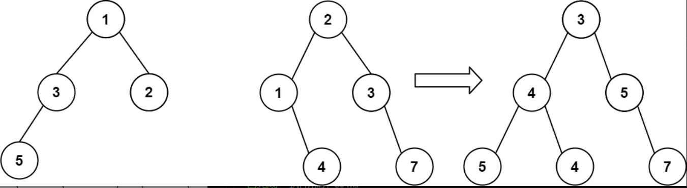

**代码：**

```javascript
var mergeTrees = function (root1, root2) {
    //使用递归 用于处理二叉树合并方法 使用DFS
    const preOrder = (root1, root2) => {
        // 如果其中一个的下一个节点没有 则取另一个分支的节点作为自己节点 不需要判断其他的多种情况
        // 正常情况下的几种情况：(root1有，root2无) (root1有，root2有) (root1无，root2无) (root1无，root2有)
        // 此时需要解决的是其中包含'无'的三种情况，那么，如果自身没有就直接获取另一个节点的分支就可以实现
        if (!root1) return root2;
        if (!root2) return root1
        // 存在节点则相加
        root1.val += root2.val
        // 递归左节点和右节点 
        root1.left = preOrder(root1.left, root2.left)
        root1.right = preOrder(root1.right, root2.right)
        return root1
    }
    return preOrder(root1,root2)
};
```

## 填充每个节点的下一个右侧节点指针

描述：[填充每个节点的下一个右侧节点指针](https://leetcode-cn.com/problems/populating-next-right-pointers-in-each-node/)

给定一个 完美二叉树 ，其所有叶子节点都在同一层，每个父节点都有两个子节点。二叉树定义如下：

struct Node {
  int val;
  Node *left;
  Node *right;
  Node *next;
}
填充它的每个 next 指针，让这个指针指向其下一个右侧节点。如果找不到下一个右侧节点，则将 next 指针设置为 NULL。

初始状态下，所有 next 指针都被设置为 NULL。

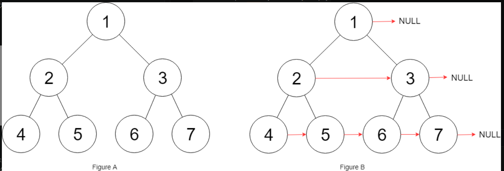

**代码**

```javascript
var connect = function (root) {
    // 计算边界 如果不存在直接返回
    if (root===null) {
        return root
    }
    // 入栈根元素
    let Q = [root]
    while (Q.length) {
        // 获取当前栈大小， 此时栈的大小就是该层的数量
        let size = Q.length
        // 遍历当前层的各个节点并入栈其中的子节点
        // 因为这一次的处理所以size是 某层的数量
        // 这一层的处理目的是为了区分各层
        for (let i = 0; i < size; i++) {
            let item = Q.shift()
            // 用于示例处理， 把当前层的节点依次链接
            if (i < size - 1) {
                item.next = Q[0]
            }
            if (item.left) {
                Q.push(item.left)
            }
            if (item.right) {
                Q.push(item.right)
            }
        }
    }
    return root
};
```

## 矩阵

**描述：**[ 矩阵](https://leetcode-cn.com/problems/01-matrix/)

给定一个由 0 和 1 组成的矩阵 mat ，请输出一个大小相同的矩阵，其中每一个格子是 mat 中对应位置元素到最近的 0 的距离。

两个相邻元素间的距离为 1 。

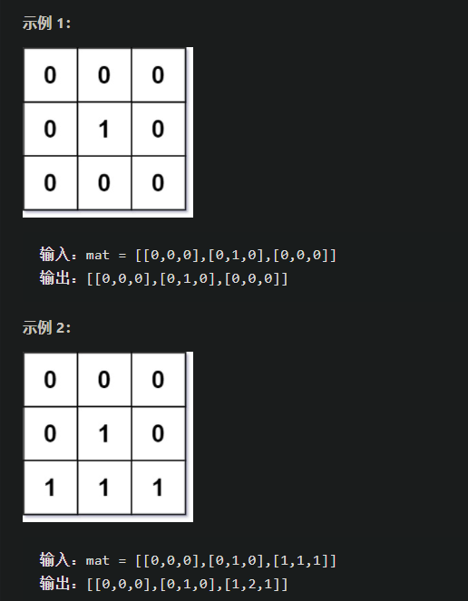

**代码**

```javascript
/**
 * @param {number[][]} mat
 * @return {number[][]}
 */
var updateMatrix = function (mat) {
  let rows = mat.length,
    cols = mat[0].length;
  // 目标返回结果集
  let dist = new Array(rows).fill(0).map(() => new Array(cols).fill(0));
  // 判断是否访问过 默认为false
  let vis = new Array(rows).fill(false).map(() => new Array(cols).fill(false));
  // 方向数组
  let directions = [
    [0, 1],
    [0, -1],
    [-1, 0],
    [1, 0],
  ];
  let queue = [];
  for (let i = 0; i < rows; i++) {
    for (let j = 0; j < cols; j++) {
      if (mat[i][j] == 0) {
        queue.push([i, j]);
        // 这里要置为true  就不会存在0 到 0 扩散的路径了
        // 原因：因为首先访问0值，把并且访问后改为true那么之后发栈处理会直接跳过
        vis[i][j] = true;
      }
    }
  }
  while (queue.length) {
    let [curI, curJ] = queue.shift();
    for (let dir of directions) {
      let newI = curI + dir[0],
        newJ = curJ + dir[1];
      // 超出边界 或者已经访问过了
      if (
        newI < 0 ||
        newI >= rows ||
        newJ < 0 ||
        newJ >= cols ||
        vis[newI][newJ]
      )
        continue;
      // 从上一个点扩散到当前点  路径长度加1
      // 这个点有点难理解，前面已经对值为0处理过了，也就是说现在只会访问有值的格子
      // 当前格子的距离 = 1 + 旁边格子到0的距离
      // 因为是扩散的所以不会出现从mat中间进行计算，也就是说计算一定是从(0,0)坐标到其他地方扩散计算并且只有这样计算当前这个代码才是正确的
      dist[newI][newJ] = dist[curI][curJ] + 1;
      vis[newI][newJ] = true;
      queue.push([newI, newJ]);
    }
  }
  return dist;
};
```

## 腐烂的橘子

**描述：**

在给定的 m x n 网格 grid 中，每个单元格可以有以下三个值之一：

值 0 代表空单元格；
值 1 代表新鲜橘子；
值 2 代表腐烂的橘子。
每分钟，腐烂的橘子 周围 4 个方向上相邻 的新鲜橘子都会腐烂。

返回 直到单元格中没有新鲜橘子为止所必须经过的最小分钟数。如果不可能，返回 -1 。

**代码**

```javascript
/**
 * @param {number[][]} grid
 * @return {number}
 */
var orangesRotting = function (grid) {
    let queue = []
    let count = -1
    // 方向值定义
    let directions = [
        [0, 1],
        [0, -1],
        [-1, 0],
        [1, 0],
    ];
    // 遍历所有橘子中腐烂的橘子 因为感染在一瞬间是一起传播的
    for (let i = 0; i < grid.length; i++) {
        for (let j = 0; j < grid[i].length; j++) {
            if (grid[i][j] == 2) {
                queue.push([i, j])
            }
        }
    }
    // 使用栈做广度优先算法
    while (queue.length) {
        let size = queue.length
        count++
        // 此循环每循环一次代表 当前所有腐烂橘子散播感染了一次
        for (let i = 0; i < size; i++) {
            let [x, y] = queue.shift()
            for (let dir of directions) {
                let _x = x + dir[0], _y = y + dir[1]
                // 如果当前处理栈的橘子是已经感染的橘子或者没有橘子 则直接跳过一次处理
                // 没有橘子跳过好理解，但是遇到感染的橘子跳过不好理解
                // 因为每次处理是所有的橘子感染感染一次，因此如果下一个橘子是感染过的则说明两个根节点的感染橘子已经扩散并连接了
                if (_x < 0 || _x >= grid.length || _y < 0 || _y >= grid[0].length || grid[_x][_y] == 0 || grid[_x][_y] == 2) {
                    continue;
                }
                grid[_x][_y] = 2
                queue.push([_x, _y])
            }
        }
    }
    // 当处理完之后循环判断是否还有为感染的橘子， 如果有的化返回-1
    for (let i = 0; i < grid.length; i++) {
        for (let j = 0; j < grid[i].length; j++) {
            if (grid[i][j] == 1) {
                return -1
            }
        }
    }
    return count == -1 ? 0 : count
};
```

## 二进制矩阵中的最短路径

描述：[二进制矩阵中的最短路径](https://leetcode-cn.com/problems/shortest-path-in-binary-matrix/)

>给你一个 n x n 的二进制矩阵 grid 中，返回矩阵中最短 畅通路径 的长度。如果不存在这样的路径，返回 -1 。
>
>二进制矩阵中的 畅通路径 是一条从 左上角 单元格（即，(0, 0)）到 右下角 单元格（即，(n - 1, n - 1)）的路径，该路径同时满足下述要求：
>
>路径途经的所有单元格都的值都是 0 。
>路径中所有相邻的单元格应当在 8 个方向之一 上连通（即，相邻两单元之间彼此不同且共享一条边或者一个角）。
>畅通路径的长度 是该路径途经的单元格总数。
>
>```
>输入：grid = [[0,1],[1,0]]
>输出：2
>```

代码：

```javascript
// 我写的
var shortestPathBinaryMatrix = function (grid) {
    let queue = [[0, 0]]
    let xleg = grid.length
    let yleg = grid[0].length
    let count = 0
    let before = grid[xleg - 1][yleg - 1]
    // 边界情况
    if (grid[0][0] == 1 || grid[xleg-1][yleg-1] == 1) return -1;
    // 如果只有一个元素的情况
    if (xleg == 0) return 1;
    while (queue.length) {
        // 获取当前层数的数量
        let size = queue.length
        count++
        // 遍历层数
        for (let i = 0; i < size; i++) {
            let [sc, sr] = queue.shift()
            // 走到了终点
      	    if (x == xleg-1 && y == yleg-1) return depth;
            if (grid[sc][sr] !== 0) continue
            grid[sc][sr] = count
            // 用于获取上下左右和四角的位置
            let dir = [
                [0, 1],
                [0, -1],
                [-1, 0],
                [1, 0],
                [1, 1],
                [-1, -1],
                [-1, 1],
                [1, -1]
            ]
            // 遍历位置并且判断配置加入栈循环
            for (let name in dir) {
                let [x, y] = dir[name]
                if (sc + x >= 0 && sc + x < xleg && sr + y >= 0 && sr + y < yleg && grid[sc + x][sr + y] == 0) {
                    queue.push([sc + x, sr + y])
                }else {
				continue;
                }
            }
        }
    }
    return -1;
};
// 答案
var shortestPathBinaryMatrix = function (grid) {
  let depth = 0;
  // 是一个正方形
  let m = grid.length - 1;
  // 边界情况，如果开头或结尾是1的情况下，不论怎么走都不可能达到题目要求
  if (grid[0][0] == 1 || grid[m][m] == 1) return -1;
  // 如果只有一个元素的情况
  if (m == 0) return 1;
  let queue = [[0, 0]];
  // 走过的路都标记为1  因为在BFS里面也只会去走为0的路
  grid[0][0] = 1;
  let directions = [
    // 垂直向上
    [0, -1],
    // 垂直向下
    [0, 1],
    // 向左
    [-1, 0],
    // 向右
    [1, 0],
    // 左上
    [-1, -1],
    // 左下
    [-1, 1],
    // 右上
    [1, -1],
    // 右下
    [1, 1],
  ];
  while (queue.length) {
    depth++;
    let size = queue.length;
    // 这样写比较简单
    while (size--) {
      let [x, y] = queue.shift();
      // 走到了终点
      if (x == m && y == m) return depth;
      for (let dir of directions) {
        let curX = x + dir[0],
          curY = y + dir[1];
        // 超出边界或者已经访问过了
        if (
          curX > m ||
          curY > m ||
          curX < 0 ||
          curY < 0 ||
          grid[curX][curY] == 1
        )
          continue;
        queue.push([curX, curY]);
        grid[curX][curY] = 1;
      }
    }
  }
  // 这里应该是-1  而不是depth 因为如果上面走通了上面就返回了  只有走不通没返回才到这里
  return -1;
};
```

## 所有可能的路径

描述：[所有可能的路径](https://leetcode-cn.com/problems/all-paths-from-source-to-target/)

>给你一个有 n 个节点的 有向无环图（DAG），请你找出所有从节点 0 到节点 n-1 的路径并输出（不要求按特定顺序）
>
> graph[i] 是一个从节点 i 可以访问的所有节点的列表（即从节点 i 到节点 graph[i][j]存在一条有向边）。
>
>输入：graph = [[4,3,1],[3,2,4],[3],[4],[]]
>输出：[[0,4],[0,3,4],[0,1,3,4],[0,1,2,3,4],[0,1,4]]

**代码：**

```javascript
var allPathsSourceTarget = function(graph) {
    // stack栈缓存   ans结果使用
    const stack = [], ans = [];
    // 我的理解graph代表的就是地图 x则是父节点 n就是最大深度
    
    const dfs = (graph, x, n) => {
        // 如果到达最大深度就表示以x为根节点的树遍历结束
        if (x === n) {
            ans.push(stack.slice());
            return;
        }
        // 遍历下层所有的节点 其中每一个节点都是一个栈
        // 并且按照栈的顺序逐一执行，
        // 也就是说后一个栈的开始执行是上一个栈执行全部结束的时候
        // 所以这也成为深度优先遍历
        for (const y of graph[x]) {
            // 子节点入栈递归
            stack.push(y);
            dfs(graph, y, n);
            // 递归结束后出栈上一个节点
            stack.pop();
        }
    }
    // 加入树根
    stack.push(0);
    dfs(graph, 0, graph.length - 1);
    return ans;
};
```


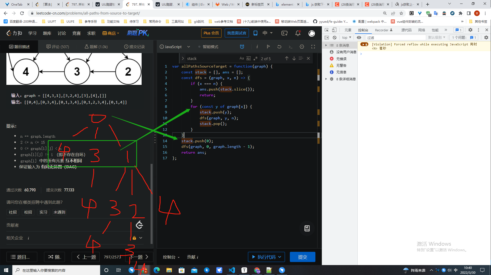

## 被围绕的区域（*）

题目：[被围绕的区域](https://leetcode-cn.com/problems/surrounded-regions/)

>给你一个 `m x n` 的矩阵 `board` ，由若干字符 `'X'` 和 `'O'` ，找到所有被 `'X'` 围绕的区域，并将这些区域里所有的 `'O'` 用 `'X'` 填充。
>
>输入：board = [["X","X","X","X"],["X","O","O","X"],["X","X","O","X"],["X","O","X","X"]]
>输出：[["X","X","X","X"],["X","X","X","X"],["X","X","X","X"],["X","O","X","X"]]
>解释：被围绕的区间不会存在于边界上，换句话说，任何边界上的 'O' 都不会被填充为 'X'。 任何不在边界上，或不与边界上的 'O' 相连的 'O' 最终都会被填充为 'X'。如果两个元素在水平或垂直方向相邻，则称它们是“相连”的。
>
>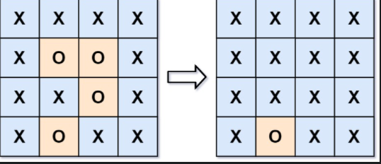

代码

```javascript

var solve = function (board) {
    // 判断什么情况下是被围绕
    // 从哪里开始作为广度优先的根
    
    /*
    思路：
    1、克隆一个board，_board，用于表示原始的board值
    2、把board全部重置为‘X’值
    3、因为边缘的O是必然不会被转化，因此只要遍历边缘的O来拿出来不会被转化的O
    4、把不会转化的O的位置提取，然后操作重置过后的board的值为‘O’
     */
    let leg = board.length;
    let nleg = board[0].length;
    let arrBfs = [];
    // 存储是否遍历过
    let visible = new Array(leg).fill(0).map((value, index) => {
        return new Array(board[index].length).fill(0);
    })
    let _board = []
    const bfs = (sx, sy) => {
        let queue = [[sx, sy]];
        let dir = [
            [0, 1],
            [0, -1],
            [-1, 0],
            [1, 0]
        ];
        while (queue.length) {
            let [i, n] = queue.shift();
            if (visible[i][n] == 1) continue;
            visible[i][n] = 1;
            if (_board[i][n] == 'O') {
                board[i][n] = 'O'
            }
            for (let [x, y] of dir) {
                if (x + i >= leg || x + i < 0 || y + n >= nleg || y + n < 0 || _board[x + i][y + n] == 'X') continue
                queue.push([x + i, y + n])
            }
        }
    }
    // 遍历周围一圈是否存在0
    // 存在则如列队，使从最边上的O进行开始遍历，
    for (let i = 0; i < leg; i++) {
        if (board[i][0] == 'O') {
            arrBfs.push([i, 0])
        }
        if (board[i][nleg - 1] == 'O') {
            arrBfs.push([i, nleg - 1])
        }
    }
    for (let n = 0; n < nleg; n++) {
        if (board[0][n] == 'O' && n !== 0 && n !== nleg - 1) {
            arrBfs.push([0, n])
        }
        if (board[leg - 1][n] == 'O' && n !== 0 && n !== nleg - 1) {
            arrBfs.push([leg - 1, n])
        }
    }
    for (let i = 0; i < leg; i++) {
        _board[i] = [...board[i]]
        for (let n = 0; n < nleg; n++) {
            board[i][n] = 'X'
        }
    }
    for (let [x, y] of arrBfs) {
        bfs(x, y)
    }
    return board
};
/* 优化的算法 */
const solve = (board) => {
  const m = board.length;
  if (m == 0) return [];
  const n = board[0].length;
  const dirs = [[1, 0], [-1, 0], [0, 1], [0, -1]]; 
  const bfs = (i, j) => {
    const queue = [[i, j]];
    board[i][j] = 'NO';                   // 入列的“root”染色一下
    while (queue.length) {
      const [curI, curJ] = queue.shift(); // 获取出列节点的i、j坐标
      for (const [dx, dy] of dirs) {      // 四个方向
        const x = curI + dx;              // 求出新坐标
        const y = curJ + dy;
        if (x < 0 || x == m || y < 0 || y == n) continue; // 越界了就忽略
        if (board[x][y] == 'O') {         // 是O，染色成XO
          board[x][y] = 'NO';   
          queue.push([x, y]);             // 染色成XO的节点入列
        }
      }
    }
  };
  for (let i = 0; i < m; i++) {
    for (let j = 0; j < n; j++) {
      if (i == 0 || i == m - 1 || j == 0 || j == n - 1) {
        if (board[i][j] == 'O') bfs(i, j); // 从最外层的O，开始BFS
      }
    }
  }
  for (let i = 0; i < m; i++) {
    for (let j = 0; j < n; j++) {
      if (board[i][j] === 'NO') board[i][j] = 'O';
      else if (board[i][j] === 'O') board[i][j] = 'X';
    }
  }
};
```


# 递归

递归定义：一个过程或者函数在其定义或者说明中有直接或者间接调用自身的方法，他通常是把一个大型复杂的问题层层转会为一个与原问题相似的规模来求解，递归策略只需要少量的程序就可描述出题解过程所需要的多次重复计算，大大减少了程序的代码量

-通常是减少代码量，有时并不能减少计算量，甚至会更多

回溯：回溯是在一个枚举或者不断求解的过程中，发现当前已经不满足条件而直接得出结果的的情况，就是“回溯”，尝试别的路径。

-当遇到若干种选择，所以我们对每一种选择进行尝试。如果发现某种选择违反了条件则直接return；如果符合条件则加入正解数组，在这种思想下，我们需要清晰的找出三个要素：选择（options）、限制（restraints）、结束条件（Termination）

回溯是一种算法思想，它是用递归实现的。

## 递归、回溯和深度优先的区别

- 递归是一种算法或者编程技巧，回溯是一种算法思想

## 反转列表

**描述**：[反转链表](https://leetcode-cn.com/problems/reverse-linked-list/)

**代码**：

```javascript
var reverseList = function (head) {
	// 递归到最后一个节点返回最后一个节点
    if (!head || head.next == null) {
        return head
    }
    // node代表的是当前head的下一个节点
    let node = reverseList(head.next)
    // 目的是为了将后面节点的.next = 本身节点
    head.next.next = head
    // 删除head.next节点
    head.next = null
    return node
};
```

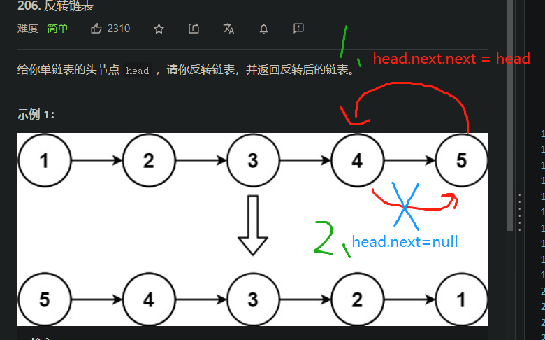

## **组合**

**描述**：[组合](https://leetcode-cn.com/problems/combinations/)

**解释**：

给定两个整数 `n` 和 `k`，返回范围 `[1, n]` 中所有可能的 `k` 个数的组合。

你可以按 **任何顺序** 返回答案。

```
输入：n = 4, k = 2
输出：
[
  [2,4],
  [3,4],
  [2,3],
  [1,2],
  [1,3],
  [1,4],
]
```

**代码**

```javascript
var combine = function (n, k) {
    // anst存取符合的temp
    const anst = []
    const dfs = (cur, n, k, temp) => {
        // 如果数组的长度加上，最大值减去当前回溯值小于K的话说明之后的值都不符合
        if (temp.length + (n - cur + 1) < k) {
            return
        }
        // 符合的数组
        if (temp.length == k) {
            anst.push(temp)
            return
        }
        // 选择当前的数组继续回溯
        dfs(cur + 1, n, k, [...temp, cur])
        // 不选则当前值
        dfs(cur + 1, n, k, temp)
    }
    dfs(1, n, k, [])
    return anst
};
```

## 全排列

描述：[全排列](https://leetcode-cn.com/problems/permutations/)

给定一个不含重复数字的数组 `nums` ，返回其 *所有可能的全排列* 。你可以 **按任意顺序** 返回答案。

```
输入：nums = [1,2,3]
输出：[[1,2,3],[1,3,2],[2,1,3],[2,3,1],[3,1,2],[3,2,1]]
```

**代码：**

```javascript
var permute = function (nums) {
    // res存储所有符合的值
    // path存储当前遍历的值，符合的话push到res中
    // backtracking三个参数：nums：需要组合的数组、nums：组合数组的长度、used：用于记录遍历的值是否处理过
    const res = [], path = [];
    backtracking(nums, nums.length, [])
    return res
    function backtracking(n, k, used) {
        // 如果回溯的path的长度达到规定长度则加入新值，然后return
        if (path.length == k) {
            res.push([...path])
            return
        }
        for (let i = 0; i < k; i++) {
            if (used[i]) continue
            path.push(n[i])
            used[i] = true
            backtracking(n, k, used)
            path.pop()
            used[i] = false
        }
    }
};
```

## 字母大小写全排列

**描述**：[字母大小写全排列](https://leetcode-cn.com/problems/letter-case-permutation/)

给定一个字符串 `s` ，通过将字符串 `s` 中的每个字母转变大小写，我们可以获得一个新的字符串。

返回 *所有可能得到的字符串集合* 。以 **任意顺序** 返回输出。

```
输入：s = "a1b2"
输出：["a1b2", "a1B2", "A1b2", "A1B2"]
```

**代码**

```javascript
/**
 * @param {string} s
 * @return {string[]}
 */
var letterCasePermutation = function (s) {
    let ans = [], n = s.length
    // dfs函数在这个程序中的作用是，把以字符串s1为基值，最大长度为n为限制
    // 遍历在s[s1.length,n]中有多少种以排列顺序不变仅改变大小写的最大数量的新字符串

    // 处理了几个问题 
    // 1、长度是否达到
    // 2、长度未达到有拆分两种判断：是否是字母，如果是字母的话分别加入大、小写字母并更改函数的基础字符串s1，和当前的字符串长度
    // 3、不是字母直接修改不需要增加新的分支
    // 也就是说只要循环解决这几个问题就可以处理整个问题
    const dfs = (s1, i) => {
        // 如果得到的长度等于需要的长度则加入可以栈
        if (s1.length == n) {
            ans.push(s1)
            return
        }
        if (isNaN(s[i])) {
            // 递归子节点，理解这个意思首先需要理解整个函数的意思
            dfs(s1 + s[i].toLocaleLowerCase(), i + 1)
            dfs(s1 + s[i].toUpperCase(), i + 1)
        } else {
            dfs(s1 + s[i], i + 1)
        }
    }
    dfs('',0)
    return ans
};
```

## 全排列Ⅱ（*）

**描述：**[全排列 II](https://leetcode-cn.com/problems/permutations-ii/)

>给定一个可包含重复数字的序列 `nums` ，**按任意顺序** 返回所有不重复的全排列。
>
>**示例 1：**
>
>```
>输入：nums = [1,1,2]
>输出：
>[[1,1,2],
> [1,2,1],
> [2,1,1]]
>```

**代码：**

```javascript
/**
 * @param {number[]} nums
 * @return {number[][]}
 */
var permuteUnique = function (nums) {
    let vis = new Array(nums.length).fill(false)
    const res = []
    const backtrack = (idx, preVal) => {
        // 长度达到规定长度直接返回值
        if (idx === nums.length) {
            res.push(preVal.slice())
            return
        }
        // ++i 只是为了效率并不是从i=1开始循环
        for (let i = 0; i < nums.length; ++i) {
            // 访问过或者上一位和这一位相等并且访问过了则跳过，用于去重
            if (vis[i] || (i > 0 && nums[i - 1] === nums[i] && vis[i - 1])) {
                continue;
            }
            if (!vis[0]) {
                console.log('+++++++++')
                console.log(vis, nums, preVal, i)
            }
            /*
            vis[i]
            判断当前位等于上一位时跳过
            这样有问题因为0位置访问过1仅仅和上一个比了但是后续没有比较
            !vis[i - 1] 和 vis[i] 的区别
            第一种判断逻辑：
            优化了重复的情况
            这种判断的是同层循环入栈的情况的去重
            原本也是需要这样操作，这样是合理的
            比如例子[1,1,1,1]
            取第一位的时候[?] ? = 各个下标的1都一样 
             */
            // if (vis[i] || (i > 0 && nums[i - 1] === nums[i] && !vis[i - 1])) {
            //     continue;
            // }
            preVal.push(nums[i])
            vis[i] = true
            backtrack(idx + 1, preVal)
            vis[i] = false
            preVal.pop()
        }
    }
    nums.sort((x, y) => x - y);
    backtrack(0, [])
    return res
};
```

证明：

```javascript
// 示例 [1,1,1,1]
// !vis[i - 1]
+++++++++
[ false, false, false, false ] [ 1, 1, 1, 1 ] [] 0
// vis[i - 1]
+++++++++
[ false, false, false, false ] [ 1, 1, 1, 1 ] [] 0
+++++++++
[ false, false, false, false ] [ 1, 1, 1, 1 ] [] 1
+++++++++
[ false, true, false, false ] [ 1, 1, 1, 1 ] [ 1 ] 0
+++++++++
[ false, true, false, false ] [ 1, 1, 1, 1 ] [ 1 ] 3
+++++++++
[ false, true, false, true ] [ 1, 1, 1, 1 ] [ 1, 1 ] 0
+++++++++
[ false, false, false, false ] [ 1, 1, 1, 1 ] [] 2
+++++++++
[ false, false, true, false ] [ 1, 1, 1, 1 ] [ 1 ] 0
+++++++++
[ false, false, true, false ] [ 1, 1, 1, 1 ] [ 1 ] 1
+++++++++
[ false, true, true, false ] [ 1, 1, 1, 1 ] [ 1, 1 ] 0
+++++++++
[ false, false, false, false ] [ 1, 1, 1, 1 ] [] 3
+++++++++
[ false, false, false, true ] [ 1, 1, 1, 1 ] [ 1 ] 0
+++++++++
[ false, false, false, true ] [ 1, 1, 1, 1 ] [ 1 ] 1
+++++++++
[ false, true, false, true ] [ 1, 1, 1, 1 ] [ 1, 1 ] 0
+++++++++
[ false, false, false, true ] [ 1, 1, 1, 1 ] [ 1 ] 2
+++++++++
[ false, false, true, true ] [ 1, 1, 1, 1 ] [ 1, 1 ] 0
```

## 数组总和

**描述：**[组合总和](https://leetcode-cn.com/problems/combination-sum/)

>给你一个 无重复元素 的整数数组 candidates 和一个目标整数 target ，找出 candidates 中可以使数字和为目标数 target 的 所有 不同组合 ，并以列表形式返回。你可以按 任意顺序 返回这些组合。
>
>candidates 中的 同一个 数字可以 无限制重复被选取 。如果至少一个数字的被选数量不同，则两种组合是不同的。 
>
>对于给定的输入，保证和为 target 的不同组合数少于 150 个。
>
>示例 1：
>
>输入：candidates = [2,3,6,7], target = 7
>输出：[[2,2,3],[7]]
>解释：
>2 和 3 可以形成一组候选，2 + 2 + 3 = 7 。注意 2 可以使用多次。
>7 也是一个候选， 7 = 7 。
>仅有这两种组合。

```javascript
/**
 * @param {number[]} candidates
 * @param {number} target
 * @return {number[][]}
 */
var combinationSum = function (candidates, target) {
    let res = []
    const backtrack = (target, combination, idx) => {
        if (idx === candidates.length) {
            return
        }
        if (target === 0) {
            res.push(combination)
            return
        }
        // 不选择当前值
        backtrack(target, combination, idx + 1)
        // 选择当前值，并且判断与当前选择的差大于零
        if (target - candidates[idx] >= 0) {
            backtrack(target - candidates[idx], [candidates[idx], ...combination], idx)
        }
    }
    backtrack(target, [], 0)
    return res
};
```

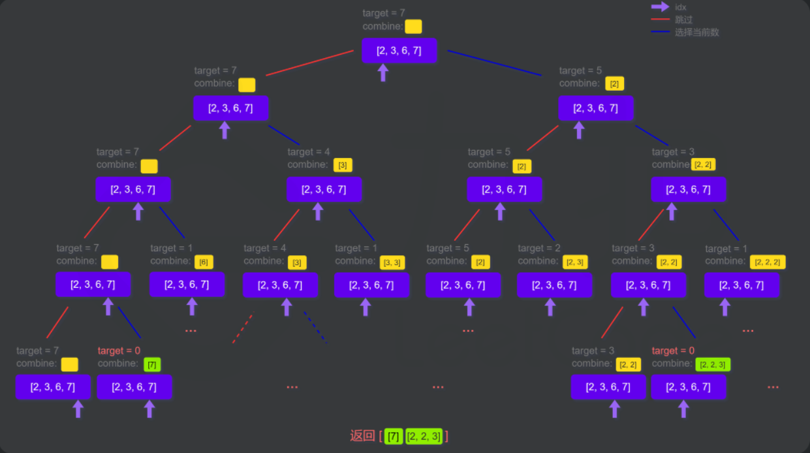

## 数组总和Ⅱ

描述：[组合总和 II](https://leetcode-cn.com/problems/combination-sum-ii/)

>给定一个候选人编号的集合 candidates 和一个目标数 target ，找出 candidates 中所有可以使数字和为 target 的组合。
>
>candidates 中的每个数字在每个组合中只能使用 一次 。
>
>注意：解集不能包含重复的组合。 
>
>示例 1:
>
>输入: candidates = [10,1,2,7,6,1,5], target = 8,
>输出:
>[
>[1,1,6],
>[1,2,5],
>[1,7],
>[2,6]
>]

**代码**

```javascript
/**
 * @param {number[]} candidates
 * @param {number} target
 * @return {number[][]}
 */
 // 递归就是把一个大问题拆分成一个个相等的小问题，重复处理这个小问题最终得到结果
var combinationSum2 = function (candidates, target) {
    let path = [], leng = candidates.length;
    const res = []
    // 排序用于顺序入栈
    candidates.sort();
    backtrack(0, 0)
    return res
    /**
        需要解决的问题：找出所有不重复的数组并且累计和等于指定值的所有组合
        此递归处理的小问题：
        1、入栈条件：当前栈的总和+当前遍历值 < 目标值并且之前没有重复的
        --重复判断当前遍历不等于之前的值，因为已经排序所以不会出现相互颠倒的值
        2、出栈条件：符合条件的组合保存过后，出栈
        3、处理：循环所有值，对每一个值进行分析
        --是否符合入栈条件
        --是否需要出栈
        所有的判断都是为最终的结果进行服务
     */
    function backtrack(num, j) {
        // 如果大于目标值回溯
        if (num > target) return;
        if (num === target) {
            res.push(Array.from(path))
            return
        }
        // 定义f用于过滤重复值
        let f = -1
        for (let i = j; i < leng; ++i) {
            let n = candidates[i]
            // 值大于目标或者值相等则越过这个值
            if (target < num + n || n === f) {
                continue
            }
            // 符合条件的入栈
            path.push(n)
            // 保存当前栈内数的总和
            num += n
            // 保存当前遍历的值用于下次遍历判断重复值
            f = n
            // 递归下一个值
            backtrack(num, i + 1)
            // 出栈最后一个值，相当于遍历下一个符合条件的值
            path.pop()
            // 减去当前出栈的值
            num -= n;
        }
    }
};
```

## 电话号码的字母组合

**描述**：[电话号码的字母组合](https://leetcode-cn.com/problems/letter-combinations-of-a-phone-number/)

>给定一个仅包含数字 2-9 的字符串，返回所有它能表示的字母组合。答案可以按 任意顺序 返回。
>
>给出数字到字母的映射如下（与电话按键相同）。注意 1 不对应任何字母。
>
>
>
>**示例 1：**
>
>```javascript
>输入：digits = "23"
>输出：["ad","ae","af","bd","be","bf","cd","ce","cf"]
>```

**代码**：

```javascript
/**
 * @param {string} digits
 * @return {string[]}
 */
var letterCombinations = function (digits) {
    // 判断空情况
    if(!digits) return []
    // 字典查表
    let arr = [
        [''],
        ['a', 'b', 'c'],
        ['d', 'e', 'f'],
        ['g', 'h', 'i'],
        ['j', 'k', 'l'],
        ['m', 'n', 'o'],
        ['p', 'q', 'r', 's'],
        ['t', 'u', 'v'],
        ['w', 'x', 'y', 'z']
    ]
    // 存储结果
    let res = []
    backtrack([], 0)
    return res
    function backtrack(combination, j) {
        // 如果到达位数则返回结果
        // 三个法则
        /*  1、入栈条件
            2、出栈条件
            3、入栈处理
         */
        if (combination.length === digits.length) {
            res.push(combination.join(''))
            return
        }
        if (j >= digits.length) return
        // 3、入栈处理：取当前位的下标，每一次处理的只是针对当前位置处理，然后遍历当前位置可能出现的所有情况
        let item = +(digits[j]) - 1
        for (let i = 0; i < arr[item].length; ++i) {
            // 1、入栈条件：当前遍历位字母入栈
            combination.push(arr[item][i])
            backtrack(combination, j + 1)
            // 2、处理完成后出栈
            combination.pop()
        }
    }
};
```


# 位运算

原码：**是最简单的机器数表示法，用最高位表示符号位，其他位存放该数的二进制的绝对值**

>最高位的代表正负数，0表示正数，1表示负数,以带符号位的四位二进制数为例
>
>+1 : 0001
>
>-1 : 1001

反码：**正数的反码还是等于原码；负数的反码就是它的原码除符号位外，按位取反**。

>反码,以带符号位的四位二进制数为例
>
>+1: 0001 反码 0110
>
>-1: 1001 反码 1110

补码 : **正数的补码等于它的原码；负数的补码等于反码+1**

负数的补码，就用它的正数，减一取反，即可得到补码。

**javascript中进制的表示**

>javascript中提供的进制表示方法由四种：十进制、二进制、十六进制、八进制

十进制（Decimal）：取值数字0-9；不用前缀；

二进制（Binary）：前缀0b或者0B

十六进制（Hexadecimal）:前缀0x或者0X

八进制（Octal）：前缀0o或0o

**javaScript位运算符**

| 运算符 | 名称         | 描述                                                     |
| :----- | :----------- | :------------------------------------------------------- |
| &      | AND          | 如果两位都是 1 则设置每位为 1                            |
| \|     | OR           | 如果两位之一为 1 则设置每位为 1                          |
| ^      | XOR          | 如果两位只有一位为 1 则设置每位为 1                      |
| ~      | NOT          | 反转所有位                                               |
| <<     | 零填充左位移 | 通过从右推入零向左位移，并使最左边的位脱落。             |
| >>     | 有符号右位移 | 通过从左推入最左位的拷贝来向右位移，并使最右边的位脱落。 |
| >>>    | 零填充右位移 | 通过从左推入零来向右位移，并使最右边的位脱落。           |

> 符号使用示例：
>
> | 操作     | 结果       | 等同于       | 结果 |
> | :------- | :--------- | :----------- | :--- |
> | 5 & 1    | 1          | 0101 & 0001  | 0001 |
> | 5 \| 1   | 5          | 0101 \| 0001 | 0101 |
> | 5 ^ 1    | 4          | 0101 ^ 0001  | 0100 |
> | ~ 5      | 10         | ~0101        | 1010 |
> | 5 << 1   | 10         | 0101 << 1    | 1010 |
> | 5 >> 1   | 2          | 0101 >> 1    | 0010 |
> | 5 >>> 1  | 2          | 0101 >>> 1   | 0010 |
> | -8 >>> 1 | 2147483644 |              |      |
>
> -8 >>> 1 :因为js负数的存储是由补码的方式存储，因此使用零填右位移会导致最高位所表示正负的符号字符"1"被推入表示数字位，同时符号位填充为0，因此最高位由0变为1，符号位由1变为0，导致由负数转变位正数，由小数字变为大数字

## 2的幂

描述：[2 的幂](https://leetcode-cn.com/problems/power-of-two/)

>给你一个整数 n，请你判断该整数是否是 2 的幂次方。如果是，返回 true ；否则，返回 false 。
>
>如果存在一个整数 x 使得 n == 2x ，则认为 n 是 2 的幂次方。
>

代码：

```javascript
// &符号的使用
// 原因：例如 n=8
// 8的二进制是1000 8-1 的二进制是 0111
// 也就是说如果是2的倍数那么&运算之后会等于0
var isPowerOfTwo = function (n) {
    return n > 0 ? (n & n - 1) == 0 : 0
};
// 由于负数在计算机中存储时按照补码存储，也就是说，-n的二进制表示为n的二进制的每一位取反再加上1
// 那么如果n可以被2整除那么只有一个高位1，取反就是n-1，补码需要取反位+1，也就是说 n & -n 那么就等于n
var isPowerOfTwo = function(n) {
    return n > 0 && (n & -n) === n;
};
```

## 位1的个数

描述：[位1的个数](https://leetcode-cn.com/problems/number-of-1-bits/)

>编写一个函数，输入是一个无符号整数（以二进制串的形式），返回其二进制表达式中数字位数为 '1' 的个数（也被称为汉明重量）。
>
>示例 1：
>
>输入：00000000000000000000000000001011
>输出：3
>解释：输入的二进制串 00000000000000000000000000001011 中，共有三位为 '1'。

代码：

```javascript
// 第一种 n & n-1 会把最低位的1变为0
// n 如果最低位是0 则n-1会向上借位，也就是说，n又几个1则会循环几次
// 例如 n = 1011
// 1次=> n=1011、n-1=1010、n & n-1 = 1010
// 2次=> n=1010、n-1=1001、n & n-1 = 1000
// 3次=> n=1000、n-1=0111、n & n-1 = 0000
var hammingWeight = function(n) {
    let res = 0
    while(n) {
        n = n & n-1
        res++
    }
    return res
};
// 第二种使用 1的零填左充位移
// 也就是说遍历32位，如果当前左充后返回不为零则表示当前位上有
var hammingWeight = function (n) {
    let res = 0
    for (let i = 1; i <= 32; i++) {
        if ((n & (1 << i)) !== 0) {
            res++
        }
    }
    return res
};
```

## 子集（*）

**描述**：[子集](https://leetcode-cn.com/problems/subsets/)

>给你一个整数数组 `nums` ，数组中的元素 **互不相同** 。返回该数组所有可能的子集（幂集）。
>
>解集 **不能** 包含重复的子集。你可以按 **任意顺序** 返回解集。
>
>```
>输入：nums = [1,2,3]
>输出：[[],[1],[2],[1,2],[3],[1,3],[2,3],[1,2,3]]
>```


**代码**

```javascript
var subsets = function (nums) {
    // 位运算解决的什么?
    // 什么情况下使用位运算
    // 几种位运算方式和解决问题的类型
    const ans = [];
    const n = nums.length;
    // 一共需要几次遍历
    for (let mask = 0; mask < (1 << n); ++mask) {
        // 保存遍历后符合条件的子集
        const t = [];
        for (let i = 0; i < n; ++i) {
            // 遍历每一位，push符合条件的子集
            // 为什么需要遍历，因为机器和人不同
            // 例如原始值{0,1,3} 如果使用011 表示取后两个子集，
            // 我们可以第一时间就看出来并直接找出{1,3}
            // 但是机器必须从001 010 100逐个遍历，一位一位找符合条件的值
            // 也就是001 & 011，010 & 011，100 & 011
            if (mask & (1 << i)) {
                t.push(nums[i]);
            }
        }
        ans.push(t);
    }
    return ans;
};
```


**思考**：二进制所表示

## 子集Ⅱ

**描述**：[[子集 II](https://leetcode-cn.com/problems/subsets-ii/)](https://leetcode-cn.com/problems/subsets/)

>给你一个整数数组 nums ，其中可能包含重复元素，请你返回该数组所有可能的子集（幂集）。
>
>解集 不能 包含重复的子集。返回的解集中，子集可以按 任意顺序 排列。
>
>```
>输入：nums = [1,2,2]
>输出：[[],[1],[1,2],[1,2,2],[2],[2,2]]
>```

| 0/1 序列 | 子集        | 0/1 序列对应的二进制数 |
| -------- | ----------- | ---------------------- |
| 000      | {}          | 0                      |
| 001      | {2}         | 1                      |
| 010      | {2}(重复)   | 2                      |
| 011      | {2,2}       | 3                      |
| 100      | {1}         | 4                      |
| 101      | {1,2}       | 5                      |
| 110      | {1,2}(重复) | 6                      |
| 111      | {1,2,3}     | 7                      |

因为不能包含重复数字，


