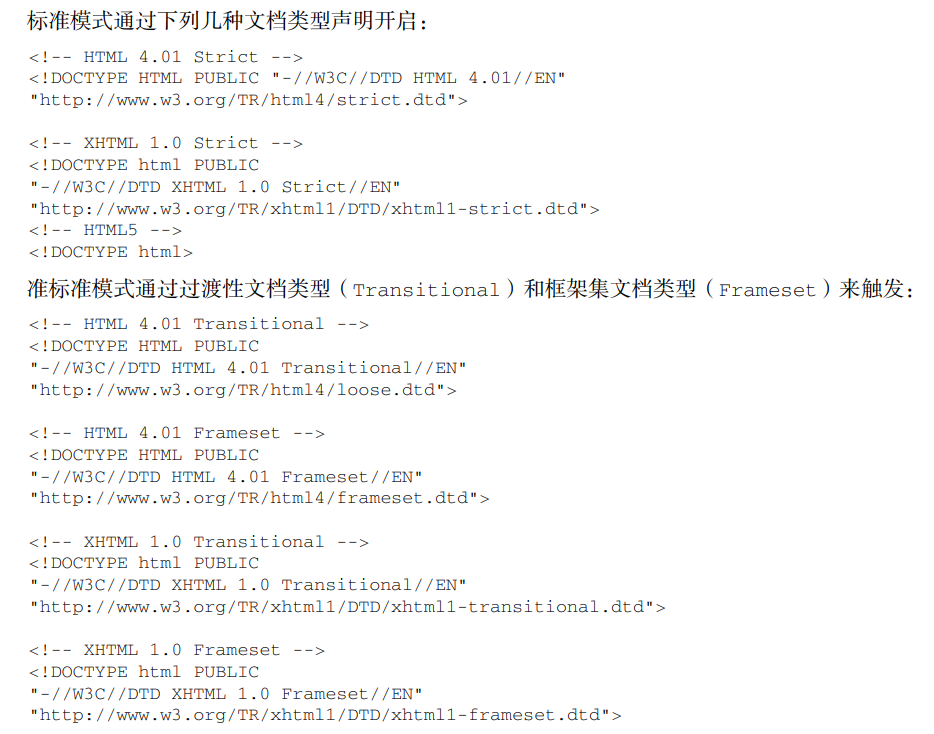
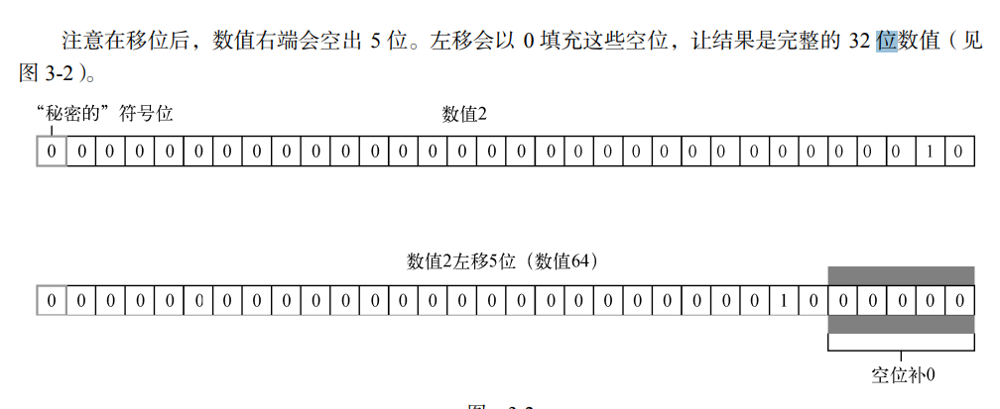
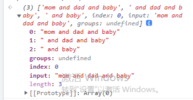
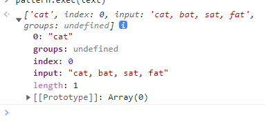

浏览器具体运行情况

浏览器访问（计算机网络）

# javaScripte历史

起始的目的是为了代替Perl等服务器语言处理输入验证；

因为极慢的网上容忍不了在输入完表单后几分钟响应的错误返回，所以在浏览器上加入javascript作为表单验证

## DOM（Document Object Model：文档对象模型）

DOM通过创建表示文档的树，开发者可以随心所以的控制网页的内容和结构。使用Dom API可以轻松的删除、添加、替换、修改节点

开发者可以做到不刷新页面而修改页面外观的内容，由于网景和微软采用不同思路开发DHTML（Dynamic HTML）动态HTML

**DOM1**：作为映射文档结构

**DOM2**

- DOM视图：
- DOM事件：描述事件及事件处理接口
- DOM样式：描述处理元素CSS样式的接口
  DOM遍历和范围：描述遍历和操作DOM树的接口

**DOM3**

- 验证文档的方法（DOM Validation）。
- 支持了所有 XML 1.0 的特性

其他**DOM**

- 可伸缩矢量图（SVG，Scalable Vector Graphics）
- 数学标记语言（MathML，Mathematical Markup Language）
- 同步多媒体集成语言（SMIL，Synchronized Multimedia Integration Language）

## BOM：浏览器对象模型

用于支持访问和操作浏览器的窗口。

没有相关标准的JavaScript实现，HTML5改变了这个局面

**扩展能力：**

- 弹出新浏览器窗口的能力；
- 移动、缩放和关闭浏览器窗口的能力；
- navigator 对象，提供关于浏览器的详尽信息；
- location 对象，提供浏览器加载页面的详尽信息；
- screen 对象，提供关于用户屏幕分辨率的详尽信息；
- performance 对象，提供浏览器内存占用、导航行为和时间统计的详尽信息；
- 对 cookie 的支持；
- 其他自定义对象，如 XMLHttpRequest 和 IE 的 ActiveXObject。

## 小结

**三个主要组曾部分**

- ECMAScript：由 ECMA-262 定义并提供核心功能。
- 文档对象模型（DOM）：提供与网页内容交互的方法和接口。
- 浏览器对象模型（BOM）：提供与浏览器交互的方法和接口。

有点像网络结构？网络边缘、网络核心、接入网

# HTML内的JavaScript

## script标签元素

script标签元素有八个属性

- async：可选。异步加载文件，只针对外部文件有效
- charset：可选。使用src属性指定的代码字符集，很少使用，大多数浏览器忽略他的值
- crossorigin：可选。配置相关请求的CORS（跨源资源共享）设置。默认不使用CORS。crossorigin= "anonymous"配置文件请求不必设置凭据标志。crossorigin="use-credentials"设置凭据 标志，意味着出站请求会包含凭据。引申：[crossorigin详解](https://blog.csdn.net/qq_40028324/article/details/107076751)
- defer：可选。延迟加载，表示脚本可以延迟到文档完全被解析和显示之后再执行。只对外部脚本文件有效。
- integrity：可选。允许比对接收到的资源和指定的加密签名以验证子资源完整性（SRI， Subresource Integrity）。如果接收到的资源的签名与这个属性指定的签名不匹配，则页面会报错， 脚本不会执行。这个属性可以用于确保内容分发网络（CDN，Content Delivery Network）不会提 供恶意内容
- language：废弃。最初用于表示代码中的脚本语言言（如"JavaScript"、"JavaScript 1.2" 或"VBScript"）。大多数浏览器都会忽略这个属性，不应该再使用它。
- src：可选。表示包含要执行的代码的外部文件。
- type：可选。代替language表示代码块中脚本语言的内容类型（也称 MIME 类型）。按照惯 例，这个值始终都是"text/javascript"，尽管"text/javascript"和"text/ecmascript" 都已经废弃了。JavaScript 文件的 MIME 类型通常是"application/x-javascript"，不过给 type 属性这个值有可能导致脚本被忽略。在非 IE 的浏览器中有效的其他值还有 "application/javascript"和"application/ecmascript"。如果这个值是 module，则代 码会被当成 ES6 模块，而且只有这时候代码中才能出现 import 和 export 关键字。

使用了 src 属性的标签中再包含其他 JavaScript 代码。如果两者都提供的话，则浏览器只会下载并执行脚本文件，从而忽略行内代码。

```Html
// 过去，所有<script>元素都被放在页面的<head>标签内，如下面的例子所示：
<html>
 <head>
 <title>Example HTML Page</title>
 <script src="example1.js"></script>
 <script src="example2.js"></script>
 </head>
 <body>
 <!-- 这里是页面内容 -->
 </body>
</html>
```

这种做法的主要目的是把外部的 CSS 和 JavaScript 文件都集中放到一起。不过，把所有 JavaScript 文件都放在里，也就意味着必须把所有 JavaScript 代码都下载、解析和解释完成后，才能开始渲 染页面（页面在浏览器解析到的起始标签时开始渲染）。对于需要很多 JavaScript 的页面，这会 导致页面渲染的明显延迟，在此期间浏览器窗口完全空白。为解决这个问题，现代 Web 应用程序通常 将所有 JavaScript 引用放在元素中的页面内容后面

## 文档模式

IE5.5发明了文档模式概念，即可以使用doctype切换文档模式。

最初的文档模式有两种：**混杂模式（quirks mode）、标准模式（standards mode）**、**准标准模式（almost standards mode）**



# 语言基础

## 语言标准和惯例

- javascript区分大小写
- 标识符（变量、函数、属性或函数参数的名称）：第一个字符必须是一个字母、下户线或$，剩下的其他字符可以是字母、下划线、美元符号或者数字
- 惯例：标识符使用驼峰大小写，即第一个单次的首字母小写，后面的每个单次的首字母大写
- 注释：// 单行注释 、/* 多行注释 */

## 严格模式

严格模式是一种不同的 JavaScript 解析和执 行模型，ECMAScript 3 的一些不规范写法在这种模式下会被处理，对于不安全的活动将抛出错误。

>要对 整个脚本启用严格模式，在脚本开头加上这一行： "use strict"; 

选择这种语法形式的目的是不破坏 ECMAScript 3 语法。 也可以单独指定一个函数在严格模式下执行，只要把这个预处理指令放到函数体开头即可

```javascript
 function doSomething() { 
 	"use strict"; // 函数体 
 } 
```

## 关键字保留

>**ECMA-262 第 6 版规定的所 有关键字如下**

| break    | do       | in         | typeof |
| -------- | -------- | ---------- | ------ |
| case     | else     | instanceof | var    |
| catch    | export   | new        | void   |
| class    | extends  | return     | while  |
| const    | finally  | super      | with   |
| continue | for      | switch     | yield  |
| debugger | function | this       | import |
| default  | if       | throw      | try    |
| delete   |          |            |        |

>**未来保留字**

始终保留：enum

严格模式下保留：implements、package、public、interface、protected、static、let、private 

模块代码中保留：await

## var关键字

**作用域**

- 函数作用域：在函数内声明的变量在函数外无法访问
- 块级作用域：只要是{}内声明的变量，在{}外无法访问

**1、var声明作用域**

函数作用域：在函数内部定义会在函数退出时被销毁

```javascript
function test() {
 var message = "hi"; // 局部变量
}
test();
console.log(message); // 出错！
```

**2、var生命提升**

声明的变量会自动提升到作用域的顶部，不会报错

```javascript
function foo() {
 console.log(age);
 var age = 26;
}
foo(); // undefined 
// 之所以不会报错，是因为 ECMAScript 运行时把它看成等价于如下代码：
function foo() {
 var age;
 console.log(age);
 age = 26;
}
foo(); // undefined
```

此外，反复生命多次var变量也没有问题：

```javascript
function foo() {
 var age = 16;
 var age = 26;
 var age = 36;
 console.log(age);
}
foo(); // 36 
```

## let 声明

**特点**：块级作用域、没有变量提升、没有全局声明

**1、块级作用域**

块作用域 是函数作用域的子集，因此适用于 var 的作用域限制同样也适用于 let。

let在if、for等大括号内的变量声明后不会在大括号外访问到----块级作用域

**2、暂时性死区**

let和var的不同是，let没有变量提升

```javascript
// name 会被提升
console.log(name); // undefined
var name = 'Matt';
// age 不会被提升
console.log(age); // ReferenceError：age 没有定义
let age = 26;
```

在解析代码时，JavaScript 引擎也会注意出现在块后面的 let 声明，只不过在此之前不能以任何方 式来引用未声明的变量。在 let 声明之前的执行瞬间被称为“暂时性死区”（temporal dead zone），在此 阶段引用任何后面才声明的变量都会抛出 ReferenceError。

**3、全局声明**

let关键字不同，var在全局作用域中声明的变量会挂载在window对象上，但是let不会成为window对象的属性

```javascript
var name = 'Matt';
console.log(window.name); // 'Matt'
let age = 26;
console.log(window.age); // undefined 
```

## const声明

const的行为与let基本相同，位移一个区别是它声明变量时必须初始化变量，而且尝试修改const声明的变量会导致运行错误。

const声明对象，改变对象值不会违反const的限制

## 数据类型

ECMAScript有种简单数据类型（也称为原始类型）：Undefined、Null、Boolean、Number、 String 和 Symbol。Symbol（符号）是 ECMAScript 6 新增的。还有一种复杂数据类型叫 Object（对 象）。Object 是一种无序名值对的集合。

因为 ECMAScript 的类型系统是松散的，所以需要一种手段来确定任意变量的数据类型。**typeof** 操作符就是为此而生的。对一个值使用 typeof 操作符会返回下列字符串之一： 

- "undefined"表示值未定义：Undefined 类型只有一个值，就是特殊值 undefined。当使用 var 或 let 声明了变量但没有初始 化时，就相当于给变量赋予了 undefined 值，undefined值的变量和未定义的变量是有区别的。

  ```javascript
  let message; // 这个变量被声明了，只是值为 undefined
  // 确保没有声明过这个变量
  // let age
  console.log(message); // undefined
  console.log(age); // 报错
  ```

- "boolean"表示值为布尔值； 

- "string"表示值为字符串； 

- "number"表示值为数值；

- "object"表示值为对象（而不是函数）或 null； 

- "function"表示值为函数；

- "symbol"表示值为符号。

>严格来讲，函数在 ECMAScript 中被认为是对象，并不代表一种数据类型。可是， 函数也有自己特殊的属性。为此，就有必要通过 typeof 操作符来区分函数和其他对象。

undefined 值是由 null 值派生而来的，因此 ECMA-262 将它们定义为表面上相等，如下面的例 子所示：

```javascript
 console.log(null == undefined); // true
```

即使 null 和 undefined 有关系，它们的用途也是完全不一样的。永远不必显式地将变量值设置为 undefined。但 null 不是这样的。任何时候，只要变量要保存对象，而当时又没有那个 对象可保存，就要用 null 来填充该变量。这样就可以保持 null 是空对象指针的语义，并进一步将其 与 undefined 区分开来。

也就是说初始化对象并且没有特定的值的时候设置为null

### **Boolean类型**

其他类型对布尔类型的转换

| 数据类型  | 转换为 true 的值       | 转换为 false 的值 |
| --------- | ---------------------- | ----------------- |
| Boolean   | true                   | false             |
| String    | 非空字符串             | ""（空字符串）    |
| Number    | 非零数值（包括无穷值） | 0、NaN            |
| Object    | 任意对象               | null              |
| Undefined | N/A（不存在）          | undefined         |

### **Number类型**

0.000 000 000 000 000 03。这个数值用科学记数法 可以表示为 3e-17。

```javascript
let floatNum = 3.125e7; // 等于 31250000
```

例外：浮点值的精确度最高可达 17 位小数，但在算术计算中远不如整数精确。例如，0.1 加 0.2 得到的不 是 0.3，而是 0.300 000 000 000 000 04。由于这种微小的舍入错误，导致很难测试特定的浮点值。

>注意 之所以存在这种错误，是因为使用了 IEEE 754 数值，这种错误并非 ECMAScript 所独有。其他使用相同格式的语言也有这个问题。

**1、值的范围**

ECMAScript，由于内存问题，ECMAScript并不支持表示这个世界上所有的数值。

- Number.Min_VALUE：最小数值，大多数浏览器中是5e-324
- Number.MAX_VALUE：最大数值，大所属浏览器中是1.797 693 134 862 315 7e+308

如果计算出来的值超过了这个返回会自动转换为Infinity表示，该值将不能再进一步用于任何计算

要确定一个值是不是有限大（即介于 JavaScript 能表示的 最小值和最大值之间），可以使用 isFinite()函数，如下所示： 

```javascript
let result = Number.MAX_VALUE + Number.MAX_VALUE; 
console.log(isFinite(result)); // false 
```

>使用 Number.NEGATIVE_INFINITY 和 Number.POSITIVE_INFINITY 也可以获 取正、负 Infinity。没错，这两个属性包含的值分别就是-Infinity 和 Infinity。

**2、NaN**

有一个特殊的数值叫 NaN，意思是“不是数值”（Not a Number），用于表示本来要返回数值的操作 失败了（而不是抛出错误）。比如，用 0 除任意数值在其他语言中通常都会导致错误，从而中止代码执 行。但在 ECMAScript 中，0、+0 或0 相除会返回 NaN：

```javascript
console.log(0/0); // NaN
console.log(-0/+0); // NaN
// 如果分子是非 0 值，分母是有符号 0 或无符号 0，则会返回 Infinity 或-Infinity：
console.log(5/0); // Infinity
console.log(5/-0); // -Infinity
```

- NaN，任何涉及到NaN的操始终返回NaN

- NaN不同于包括NaN在内的任何值。

  ```javascript
  console.log(NaN == NaN); // false 
  // 为此提供了isNaN()函数，传一个参数，为任何不能转换为数值的值返回false
  console.log(isNaN(NaN)); // true
  console.log(isNaN(10)); // false，10 是数值
  console.log(isNaN("10")); // false，可以转换为数值 10
  console.log(isNaN("blue")); // true，不可以转换为数值
  console.log(isNaN(true)); // false，可以转换为数值 1
  ```

>虽然不常见，但 isNaN()可以用于测试对象。此时，首先会调用对象的 valueOf() 方法，然后再确定返回的值是否可以转换为数值。如果不能，再调用 toString()方法， 并测试其返回值。这通常是 ECMAScript 内置函数和操作符的工作方式

**3、数值转换**

>Number()、parseInt()、parseFloat() 三个转型函数

Number()转换规则

- 布尔值，true 转换为 1，false 转换为 0。
- 数值，直接返回
- null，返回 0
- undefined，返回 NaN
- 字符串规则，几种情况，有数字、无数字、数字字母混合、空字符
  1. 如果字符串包含数值字符，包括数值字符前面带加、减号的情况，则转换为一个十进制数值。 因此，Number("1")返回 1，Number("123")返回 123，Number("011")返回 11（忽略前面 的零）。
  2. 如果字符串包含有效的浮点值格式如"1.1"，则会转换为相应的浮点值（同样，忽略前面的零）。
  3. 如果字符串包含有效的十六进制格式如"0xf"，则会转换为与该十六进制值对应的十进制整 数值。
  4. 如果是空字符串（不包含字符），则返回 0。
  5. 如果字符串包含除上述情况之外的其他字符，则返回 NaN。
- 对象，调用 valueOf()方法，并按照上述规则转换返回的值。如果转换结果是 NaN，则调用 toString()方法，再按照转换字符串的规则转换。

parseInt()：会从第一个不是空字符的位置开始判断，如果第一个不是数字直接返回NaN，如果第一个字符 是数值字符、加号或减号，则继续依次检测每个字符，直到字符串末尾，或碰到非数值字符。

```javascript
let num1 = parseInt("1234blue"); // 1234
let num2 = parseInt(""); // NaN
let num3 = parseInt("0xA"); // 10，解释为十六进制整数
let num4 = parseInt(22.5); // 22
let num5 = parseInt("70"); // 70，解释为十进制值
let num6 = parseInt("0xf"); // 15，解释为十六进制整数
// 不同的数值格式很容易混淆，因此 parseInt()也接收第二个参数，用于指定底数（进制数）。
let num1 = parseInt("AF", 16); // 175
let num2 = parseInt("AF"); // NaN 
```

### **String类型**

**1、字符字面量**

| 字 面 量 | 含 义                                                        |
| -------- | ------------------------------------------------------------ |
| \n       | 换行                                                         |
| \t       | 制表                                                         |
| \b       | 退格                                                         |
| \r       | 回车                                                         |
| \f       | 换页                                                         |
| \\\      | 反斜杠（\）                                                  |
| \\'      | 单引号（'），在字符串以单引号标示时使用，例如'He said, \'hey.\'' |
| \\"      | 双引号（"），在字符串以双引号标示时使用，例如"He said, \"hey.\"" |
| \\`      | 反引号（`），在字符串以反引号标示时使用，例如`He said, \`hey.\`` |
| \xnn     | 以十六进制编码 nn 表示的字符（其中 n 是十六进制数字 0~F），例如\x41 等于"A" |
| \unnnn   | 以十六进制编码 nnnn 表示的 Unicode 字符（其中 n 是十六进制数字 0~F），例如\u03a3 等于希腊字 符"Σ" |

**2、转换字符串**

有两种方式把一个值转换为字符串。首先是使用几乎所有值都有的 toString()方法。这个方法唯 一的用途就是返回当前值的字符串等价物

所有值都有**toString()方法**，这个方法位移的用途就是返回当前值的字符串等价物。

```javascript
let age = 11;
let ageAsString = age.toString(); // 字符串"11"
let found = true;
let foundAsString = found.toString(); // 字符串"true" 
```

**通过传入参数**，可以得到数值的**二进制、八进制、十六进制**，或者其他任何有效基 数的字符串表示

```javascript
let num = 10;
console.log(num.toString()); // "10"
console.log(num.toString(2)); // "1010"
console.log(num.toString(8)); // "12"
console.log(num.toString(10)); // "10"
console.log(num.toString(16)); // "a"
```

**3、模板字符串**

```javascript
let a = 6;
let b = 9;
function simpleTag(strings, aValExpression, bValExpression, sumExpression) {
 console.log(strings);
 console.log(aValExpression);
 console.log(bValExpression);
 console.log(sumExpression);
 return 'foobar';
}
let untaggedResult = `${ a } + ${ b } = ${ a + b }`;
let taggedResult = simpleTag`${ a } + ${ b } = ${ a + b }`;
// ["", " + ", " = ", ""]
// 6
// 9
// 15
console.log(untaggedResult); // "6 + 9 = 15"
console.log(taggedResult); // "foobar" 
```

### Object类型

ECMAScript中的对象其实就是一组数据和功能的集合。

开发者可以通过创建 Object 类型的实例来创建自己的对象，然后再给对象添加属性和方法： 

```javascript
let o = new Object();
```

Object实例都有入戏属性和方法：

- constructor：用于创建当前对象的函数，在前面的例子中，这个属性的值就是 Object() 函数。

- hasOwnProperty( propertyName )：用于判断当前对象实例（不是原型）上是否存在给定的属性。

- isPrototypeOf(object)：用于判断当前对象是否为另一个对象的原型。

- propertyIsEnumerable( propertyName )：用于判断给定的属性是否可以使用for-in枚举。

- toLocaleString()：返回对象的字符串表示，该字符串反应对象坐在的本地化执行环境。

  ```javascript
  let obj = {};
  obj.toLocaleString(); // '[object Object]'
  ```

- toString()：返回对象的字符串表示

  ```javascript
  let obj = {}
  obj.toString() // '[object Object]'
  ```

- valueOf()：返回对象对应的字符串、数值或者布尔值表示

## 操作符

### **一元操作符**

>只操作一个值的操作符叫一元操作符（unary operator）。

**1、递增/递减操作符**：++age、--age、age++、age--

符号在前，先自加（自减）再计算，符号在后先计算再自加（自减）

2、一元家和减

**一元加**：+num

如果将一元加应用到非数值，则会执行与使用 Number()转型函数一样的类型转换：布尔值 false 和 true 转换为 0 和 1，字符串根据特殊规则进行解析，对象会调用它们的 valueOf()和/或 toString() 方法以得到可以转换的值。

```javascript
let s1 = "01";
let s2 = "1.1"; 
let s3 = "z";
let b = false;
let f = 1.1;
let o = {
 valueOf() {
 return -1;
 }
};
s1 = +s1; // 值变成数值 1
s2 = +s2; // 值变成数值 1.1
s3 = +s3; // 值变成 NaN
b = +b; // 值变成数值 0
f = +f; // 不变，还是 1.1
o = +o; // 值变成数值-1 
```

**一元加减**：-num

一元减由一个减号（-）表示，放在变量前头，主要用于把数值变成负值

对数值使用一元减会将其变成相应的负值（如上面的例子所示）。在应用到非数值时，一元减会遵 循与一元加同样的规则，先对它们进行转换，然后再取负值

### 位操作符

位运算用于数值的底层操作

ECMAScript中所有数值都是以IEEE 754 64位格式存储，但是位操作不直接应用到64位表示，二十先把值转换位32位正数，再进行操作，之后再把结果转换为64位

**有符号正式使用32位的前31位表示整数**，最后一位表示符号：0（正数）、1（负数），空的用0填充

**负数**是以补码的二进制编码储存

补码：正数的补码是其二进制表示，与原码相同、**负数的补码是将其原码除符号位外的所有位取反**

```javascript
// 基于上述步骤确定18 的二进制表示，首先从 18 的二进制表示开始
0000 0000 0000 0000 0000 0000 0001 0010
然后，计算一补数，即反转每一位的二进制值：
1111 1111 1111 1111 1111 1111 1110 1101
最后，给一补数加 1：
1111 1111 1111 1111 1111 1111 1110 1101
 1
----------------------------------------------
1111 1111 1111 1111 1111 1111 1110 1110
```

**2、按位非**

按位非操作符用波浪符（~）表示，它的作用是返回数值的一补数

```javascript
let num1 = 25; // 二进制 00000000000000000000000000011001
let num2 = ~num1; // 二进制 11111111111111111111111111100110
console.log(num2); // -26
```

**3、按位与**

按位与操作符用和号（&）表示，有两个操作数。本质上，按位与就是将两个数的每一个位对齐， 然后基于真值表中的规则，对每一位执行相应的与操作。

按位与操作在两个位都是 1 时返回 1，在任何一位是 0 时返回 0。

```javascript
let result = 25 & 3;
console.log(result); // 1 
// 25 = 0000 0000 0000 0000 0000 0000 0001 1001
// 3 =  0000 0000 0000 0000 0000 0000 0000 0011
---------------------------------------------
// AND= 0000 0000 0000 0000 0000 0000 0000 0001
```

**4、按位或**

按位或操作符用管道符（|）表示，同样有两个操作数

按位或操作在至少一位是 1 时返回 1，两位都是 0 时返回 0

仍然用按位与的示例，如果对 25 和 3 执行按位或，代码如下所示：

```javascript
let result = 25 | 3;
console.log(result); // 27
// 可见 25 和 3 的按位或操作的结果是 27：
//25 = 0000 0000 0000 0000 0000 0000 0001 1001
// 3 = 0000 0000 0000 0000 0000 0000 0000 0011
---------------------------------------------
// OR= 0000 0000 0000 0000 0000 0000 0001 1011
```

**5、左移**

左移操作符用两个小于号（<<）表示，会按照指定的位数将数值的所有位向左移动

比如，**如果数 值 2（二进制 10）向左移 5 位，就会得到 64**（二进制 1000000），如下所示

```javascript
let oldValue = 2; // 等于二进制 10
let newValue = oldValue << 5; // 等于二进制 1000000，即十进制 64
```



>**注意：**左移会保留它所操作数值的符号。比如，如果-2 左移 5 位，将得到-64，而不是正 64

**6、有符号右移**

有符号右移由两个大于号（>>）表示，会将数值的所有 32 位都向右移，同时保留符号（正或负）。 有符号右移实际上是左移的逆运算

比如，如果将 64 右移 5 位，那就是 2

```javascript
let oldValue = 64; // 等于二进制 1000000
let newValue = oldValue >> 5; // 等于二进制 10，即十进制 2
```

**7、无符号右移**

无符号右移用 3 个大于号表示（>>>），会将数值的所有 32 位都向右移。对于正数，无符号右移与 有符号右移结果相同。仍然以前面有符号右移的例子为例，64 向右移动 5 位，会变成 2

```javascript
let oldValue = 64; // 等于二进制 1000000
let newValue = oldValue >>> 5; // 等于二进制 10，即十进制 2 
```

负数的存储是按照补码存储，因此负数右移之后结果会变得非常大

```javascript
let oldValue = -64; // 等于二进制 11111111111111111111111111000000
let newValue = oldValue >>> 5; // 等于十进制 134217726 
```

### 布尔操作符

!（取反）、&&（与）、||（或）

### 指数操作符

ECMAScript 7 新增了指数操作符，**Math.pow()**现在有了自己的操作符**，结果是一样的

```javascript
console.log(Math.pow(3, 2); // 9
console.log(3 ** 2); // 9
console.log(Math.pow(16, 0.5); // 4
console.log(16** 0.5); // 4
```

指数操作符也有自己的指数赋值操作符**=，该操作符执行指数运算和结果的赋值操作

```javascript
let squared = 3;
squared **= 2;
console.log(squared); // 9 
let sqrt = 16;
sqrt **= 0.5;
console.log(sqrt); // 4
```

### 减法操作符

减法操作符也有一组规则用于处理 ECMAScript 中不同类型之间的转换

- 如果两个操作数都是数值，则执行数学减法运算并返回结果。
- 如果有任一操作数是 NaN，则返回 NaN。
- 如果是 Infinity 减 Infinity，则返回 NaN。
- 如果是-Infinity 减-Infinity，则返回 NaN。
- 如果是 Infinity 减-Infinity，则返回 Infinity。
- 如果是-Infinity 减 Infinity，则返回-Infinity。
- 如果是+0 减+0，则返回+0。
- 如果是+0 减-0，则返回-0。
- 如果是-0 减-0，则返回+0。
- 如果有任一操作数是字符串、布尔值、null 或 undefined，则先在后台使用 Number()将其转 换为数值，然后再根据前面的规则执行数学运算。如果转换结果是 NaN，则减法计算的结果是 NaN。
- 如果有任一操作数是对象，则调用其 valueOf()方法取得表示它的数值。如果该值是 NaN，则 减法计算的结果是 NaN。如果对象没有 valueOf()方法，则调用其 toString()方法，然后再 将得到的字符串转换为数值。

```javascript
let result1 = 5 - true; // true 被转换为 1，所以结果是 4
let result2 = NaN - 1; // NaN
let result3 = 5 - 3; // 2
let result4 = 5 - ""; // ""被转换为 0，所以结果是 5
let result5 = 5 - "2"; // "2"被转换为 2，所以结果是 3
let result6 = 5 - null; // null 被转换为 0，所以结果是 5
```

### 关系操作符

关系操作符执行比较两个值的操作，包括**小于**（<）、**大于**（>）、**小于等于**（<=）和**大于等于**（>=）， 

- 如果操作数都是数值，则执行数值比较。
- 如果操作数都是字符串，则逐个比较字符串中对应字符的编码。
- 如果有任一操作数是数值，则将另一个操作数转换为数值，执行数值比较
- 如果有任一操作数是对象，则调用其 valueOf()方法，取得结果后再根据前面的规则执行比较。 如果没有 valueOf()操作符，则调用 toString()方法，取得结果后再根据前面的规则执行比较。
- 如果有任一操作数是布尔值，则将其转换为数值再执行比较。

**两个字符串的比较并不是按照字母顺序比较，而是使用编码数值**

```javascript
let result = "Brick" < "alphabet"; // true 
// 在这里，字符串"Brick"被认为小于字符串"alphabet"，因为字母 B 的编码是 66，字母 a 的编码是 97
```

**两个字符串数字比较时并不会有理想的结果，因为两个字符串比较也是使用编码比较**

```javascript
// 字符"2"的编码是 50，而字符"3"的编码是 51
let result = "23" < "3"; // true
```

**任何涉及到NaN都会返回false**

```javascript
let result1 = NaN < 3; // false
let result2 = NaN >= 3; // false 
```

### 相等操作符

等于操作符用两个等于号（==）表示，如果操作数相等，则会返回 true。不等于 操作符用叹号和等于号（!=）表示，如果两个操作数不相等，则会返回 true。

- 如果任一操作数是布尔值，则将其转换为数值再比较是否相等。false 转换为 0，true 转换 为 1。
- 如果一个操作数是字符串，另一个操作数是数值，则尝试将字符串转换为数值，再比较是否 相等。
- 如果一个操作数是对象，另一个操作数不是，则调用对象的 valueOf()方法取得其原始值，再 根据前面的规则进行比较。
- null 和 undefined 相等。
- null 和 undefined 不能转换为其他类型的值再进行比较。
- 如果有任一操作数是 NaN，则相等操作符返回 false，不相等操作符返回 true。记住：即使两 个操作数都是 NaN，相等操作符也返回 false，因为按照规则，NaN 不等于 NaN。
- 如果两个操作数都是对象，则比较它们是不是同一个对象。如果两个操作数都指向同一个对象， 则相等操作符返回 true。否则，两者不相等。

```javascript
null == undefined  // true
"NaN" == NaN //false
5 == NaN //false
NaN == NaN //false
NaN != NaN //true
false == 0 //true
true == 1 //true
true == 2 //false
undefined == 0 //false
null == 0 //false
"5" == 5 //true
```

**全等和不全等**

全等和不全等操作符与相等和不相等操作符类似，只不过它们在比较相等时不转换操作数。全等操 作符由 3 个等于号（===）表示，只有两个操作数在不转换的前提下相等才返回 true

```javascript
let result1 = ("55" == 55); // true，转换后相等
let result2 = ("55" === 55); // false，不相等，因为数据类型不同
```

### 赋值操作符

复合赋值使用乘性、加性或位操作符后跟等于号（=）表示。这些赋值操作符是类似如下常见赋值 操作的简写形式：

```javascript
let num = 10;
num = num + 10; 
// 以上代码的第二行可以通过复合赋值来完成
```

## 小结

因为只提取一些比较缺漏的知识点，所以没有都做笔记

- ECMAScript 中的基本数据类型包括：undefined、null、number、String、Booolean、Symbol
- 与其他语言不同，ECMAScript 不区分整数和浮点值，只有 Number 一种数值数据类型。
- Object 是一种复杂数据类型，它是这门语言中所有对象的基类。
- ECMAScript 提供了 C 语言和类 C 语言中常见的很多基本操作符，包括数学操作符、布尔操作符、 关系操作符、相等操作符和赋值操作符等。
- 这门语言中的流控制语句大多是从其他语言中借鉴而来的，比如 if 语句、for 语句和 switch 语句等

ECMAScript 中的函数与其他语言中的函数不一样。

- 不需要指定函数的返回值，因为任何函数可以在任何时候返回任何值。
- 不指定返回值的函数实际上会返回特殊值 undefined。

# 变量、作用域和内存

基本数据类型：boolean、string、number、undefined、null

引用数据类型：function、array、object、

**基本数类型和引用数据类型的区别**

- 基本数据类型无法增加自定义属性
- 基本数据类型保存在栈内存中，引用数据累心保存在堆内存
- 赋值不同
- 基本数据类型按值访问，引用数据类型按指针访问

## 原始值和引用值

ECMAScript变量

- 引用值（primitive value）：最简单的数据
- 引用值（reference value）：是由多个值构成的对象

在把一个值赋给变量时，javaScript引擎必须确定这个值是原始值还是引用值。

**原始值**：undefined（未定义）、null（空指针）、boolean、string、number、symbol，原始值的变量是按值访问的，因为我们操作的就是存储在变量中的实际值。

引用值是保存在内存中对象。javascript不允许直接访问内存位置，因此不能直接操作对象所在的内存空间。因此实际上操作的是该对象的引用而非本身。为此，保存引用值的变量是按照引用访问的

>**注意：** 在很多语言中，字符串是使用对象表示的，因此被认为是引用类型。ECMAScript
>打破了这个惯例。

### 动态属性

原始值和引用值定义类似，但是可以对值做什么差别很大，原始值无法操作属性，引用值可以操作属性

**注意**，原始类型的初始化可以只使用原始字面量形式。如果使用的是 new 关键字，则 JavaScript 会 创建一个 Object 类型的实例，但其行为类似原始值。下面来看看这两种初始化方式的差异

```javascript
let name1 = "Nicholas";
let name2 = new String("Matt");
name1.age = 27;
name2.age = 26;
console.log(name1.age); // undefined
console.log(name2.age); // 26
console.log(typeof name1); // string
console.log(typeof name2); // object
```

### 复制值

原始值复制值会

存储方式、复制方式

```javascript
// new 出来的obj ths.name = name 只是指向 属于浅拷贝
class Person {
    constructor(name, obj) {
        this.name = name
        this.obj = obj
    }
}
//  {...obj} 结构出来的只能深拷贝一层
// 方法内修改对象也会影响到外部
function test(obj) {
    obj.a = 123
    return obj
}
```

### 确定类型

typeof：操作符最适合用来判断一个变量是否为原始类型。更确切地说，它是判断一 个变量是否为字符串、数值、布尔值或 undefined 的最好方式。无法准确的判断object、array、null

```javascript
let s = "Nicholas";
let b = true;
let i = 22;
let u;
let n = null;
let o = new Object();
console.log(typeof s); // string
console.log(typeof i); // number
console.log(typeof b); // boolean
console.log(typeof u); // undefined
console.log(typeof n); // object
console.log(typeof o); // object 
```

instanceof：我们通常不关心一个值是不是对象， 而是想知道它是什么类型的对象。为了解决这个问题，ECMAScript 提供了 instanceof 操作符

```javascript
console.log(person instanceof Object); // 变量 person 是 Object 吗？
console.log(colors instanceof Array); // 变量 colors 是 Array 吗？
console.log(pattern instanceof RegExp); // 变量 pattern 是 RegExp 吗？
```

## 执行上下文与作用域

变量或函数的上下文决定 了它们可以访问哪些数据，以及它们的行为。每个上下文都有一个关联的变量对象（variable object）， 而这个上下文中定义的所有变量和函数都存在于这个对象上。虽然无法通过代码访问变量对象，但后台 处理数据会用到它。

使用 let 和 const 的顶级声明不会定义在全局上下文中，但在作用域链解析上效果是一样的。

上下文在其所有代码都执行完毕后会被销毁，包括定义 在它上面的所有变量和函数（全局上下文在应用程序退出前才会被销毁，比如关闭网页或退出浏览器）。

每个函数调用都有自己的上下文。当代码执行流进入函数时，函数的上下文被推到一个上下文栈上。 在函数执行完之后，上下文栈会弹出该函数上下文，将控制权返还给之前的执行上下文。ECMAScript 程序的执行流就是通过这个上下文栈进行控制的。

上下文中的代码在执行的时候，会创建变量对象的一个作用域链（scope chain）。决定 了各级上下文中的代码在访问变量和函数时的顺序,代码正在执行的上下文的变量对象始终位于作用域 链的最前端。

上下文之间的连接是线性的、有序的。每个上下文都可以 到上一级上下文中去搜索变量和函数，但任何上下文都不能到下一级上下文中去搜索。

```javascript
var color = "blue";
function changeColor() {
 let anotherColor = "red";
 function swapColors() {
 let tempColor = anotherColor;
 anotherColor = color;
 color = tempColor;
 // 这里可以访问 color、anotherColor 和 tempColor
 }
 // 这里可以访问 color 和 anotherColor，但访问不到 tempColor
 swapColors();
}
// 这里只能访问 color
changeColor();
```

### 作用域链增强

```javascript
function buildUrl() {
 let qs = "?debug=true";
 with(location){
 let url = href + qs;
 }
 return url;
}
```

这里，with 语句将 location 对象作为上下文，因此 location 会被添加到作用域链前端。 buildUrl()函数中定义了一个变量 qs。当 with 语句中的代码引用变量 href 时，实际上引用的是 location.href，也就是自己变量对象的属性。在引用 qs 时，引用的则是定义在 buildUrl()中的那 个变量，它定义在函数上下文的变量对象上。而在 with 语句中使用 var 声明的变量 url 会成为函数 上下文的一部分，可以作为函数的值被返回；但像这里使用 let 声明的变量 url，因为被限制在块级作 用域（稍后介绍），所以在 with 块之外没有定义。

### 变量声明

ES6 之后，JavaScript 的变量声明经历了翻天覆地的变化。

1. **使用 var 的函数作用域声明**

```javascript
function add(num1, num2) {
 var sum = num1 + num2;
 return sum;
}
let result = add(10, 20); // 30
console.log(sum); // 报错：sum 在这里不是有效变量

function add(num1, num2) {
 sum = num1 + num2;
 return sum;
}
let result = add(10, 20); // 30
console.log(sum); // 30 
```

>未经声明而初始化变量是 JavaScript 编程中一个非常常见的错误，会导致很多问题。 为此，读者在初始化变量之前一定要先声明变量。在严格模式下，未经声明就初始化变量 会报错。

var 声明会被拿到函数或全局作用域的顶部，位于作用域中所有代码之前。这个现象叫作“提升” （hoisting）。

通过在声明之前打印变量，可以验证变量会被提升。声明的提升意味着会输出 undefined 而不是 Reference Error

```javascript
console.log(name); // undefined
var name = 'Jake';
function() {
 console.log(name); // undefined
 var name = 'Jake';
} 

```

2. **使用 let 的块级作用域声明**

ES6 新增的 let 关键字跟 var 很相似，但它的作用域是块级的，这也是 JavaScript 中的新概念。块 级作用域由最近的一对包含花括号{}界定。换句话说，if 块、while 块、function 块，甚至连单独 的块也是 let 声明变量的作用域。

let 的行为非常适合在循环中声明迭代变量。使用 var 声明的迭代变量会泄漏到循环外部，这种情 况应该避免。

```javascript
for (var i = 0; i < 10; ++i) {}
console.log(i); // 10
for (let j = 0; j < 10; ++j) {}
console.log(j); // ReferenceError: j 没有定义
```

严格来讲，let 在 JavaScript 运行时中也会被提升，但由于“暂时性死区”（temporal dead zone）的 缘故，实际上不能在声明之前使用 let 变量。因此，从写 JavaScript 代码的角度说，let 的提升跟 var 是不一样的。

**暂时性死区**：只要块级作用域内存在`let`命令，它所声明的变量就“绑定”（binding）这个区域，不再受外部的影响。

3. **使用 const 的常量声明**

除了 let，ES6 同时还增加了 const 关键字。使用 const 声明的变量必须同时初始化为某个值。 一经声明，在其生命周期的任何时候都不能再重新赋予新值。

```javascript
const a; // SyntaxError: 常量声明时没有初始化
const b = 3;
console.log(b); // 3
b = 4; // TypeError: 给常量赋值
// const 除了要遵循以上规则，其他方面与 let 声明是一样的
```

const 声明只应用到顶级原语或者对象。换句话说，赋值为对象的 const 变量不能再被重新赋值 为其他引用值，但对象的键则不受限制。

4. **标识符查找**

在局部上下文中找到该标识符，则搜索 停止，变量确定；如果没有找到变量名，则继续沿作用域链搜索。（注意，作用域链中的对象也有一个 原型链，因此搜索可能涉及每个对象的原型链。）这个过程一直持续到搜索至全局上下文的变量对象。 如果仍然没有找到标识符，则说明其未声明。

```javascript
var color = 'blue';
function getColor() {
 return color;
}
console.log(getColor()); // 'blue' 
```

在这个例子中，调用函数 getColor()时会引用变量 color。为确定 color 的值会进行两步搜索。 第一步，搜索 getColor()的变量对象，查找名为 color 的标识符。结果没找到，于是继续搜索下一 个变量对象（来自全局上下文），然后就找到了名为 color 的标识符。因为全局变量对象上有 color 的定义，所以搜索结束。

在局部变量 color 声明之后的任何代码都无法访问全局变量 color，除非使用完全限定的写法 window.color。

## 垃圾回收

JavaScript 通过自动内存管理实现内存分配和闲置资源回收。基本思路很简单：确定哪个变量不会再 使用，然后释放它占用的内存。这个过程是周期性的，即垃圾回收程序每隔一定时间（或者说在代码执 行过程中某个预定的收集时间）就会自动运行。垃圾回收过程是一个近似且不完美的方案，因为某块内存是否还有用，属于“不可判定的”问题，意味着靠算法是解决不了的。

如何标记未使用的变量也许有不同的实现方式。用到过两种主要的 标记策略：**标记清理**和**引用计数**。

### 标记清理（mark-and-sweep）

JavaScript 最常用的垃圾回收策略是**标记清理**。

当变量进入上下文时，这个变量就是增加存在于上下文中的标记，离开上下文后会被标记离开上下文的标记，当垃圾回收机制运行的时候，会查询内存中的变量，把当前上下文中的变量和引用到的变量标记去掉，那么剩下有标记的变量就是永远都不会使用的垃圾，随后垃圾回收程序做一次**内存清理**，销毁带标记的所有值并释放内存

问题就在于垃圾回收机制什么时候开始运行？

### 引用计数（reference counting）

每个值给一个引用数目，比如：赋一个引用值时，这个引用数目就加1，如果同一个值被赋给另一个值，则引用数目就加1，如果保存对该值的引用变量被其他值给覆盖了，那么引用数减1。当引用值等于0则表示该无法再访问到了，可以回收了。

引用计数最早由 Netscape Navigator 3.0 采用，但很快就遇到了严重的问题：循环引用。所谓循环引 用，就是对象 A 有一个指针指向对象 B，而对象 B 也引用了对象 A。比如：

```javascript
function problem() {
 let objectA = new Object();
 let objectB = new Object();
 objectA.someOtherObject = objectB;
 objectB.anotherObject = objectA;
} 
```

在这个例子中，objectA 和 objectB 通过各自的属性相互引用，意味着它们的引用数都是 2。在 标记清理策略下，这不是问题，因为在函数结束后，这两个对象都不在作用域中。而在引用计数策略下，objectA 和 objectB 在函数结束后还会存在，因为它们的引用数永远不会变成 0。如果函数被多次调 用，则会导致大量内存永远不会被释放。为此，Netscape 在 4.0 版放弃了引用计数，转而采用标记清理。 事实上，引用计数策略的问题还不止于此。

### 内存管理

垃圾回收程序会周期性运行，如果内存中分配了很多变量，则可能造成性能损失，因此垃圾回收的 时间调度很重要。尤其是在内存有限的移动设备上，垃圾回收有可能会明显拖慢渲染的速度和帧速率。 开发者不知道什么时候运行时会收集垃圾，因此最好的办法是在写代码时就要做到：无论什么时候开始 收集垃圾，都能让它尽快结束工作。

将内存占用量保持在一个较小的值可以让页面性能更好。优化内存占用的最佳手段就是保证在执行 代码时只保存必要的数据。如果数据不再必要，那么把它设置为 null，从而释放其引用。这也可以叫 作解除引用。这个建议最适合全局变量和全局对象的属性。局部变量在超出作用域后会被自动解除引用， 如下面的例子所示

```javascript
function createPerson(name){
 let localPerson = new Object();
 localPerson.name = name;
 return localPerson;
}
let globalPerson = createPerson("Nicholas");
// 解除 globalPerson 对值的引用
globalPerson = null; 
```

### 内存泄漏

1、意外声明全局变量

```javascript
function setName() {
 name = 'Jake';
} 
```

**意外声明全局变量**：解释器会把变量 name 当作 window 的属性来创建（相当于 window.name = 'Jake'）。 可想而知，在 window 对象上创建的属性，只要 window 本身不被清理就不会消失。

2、定时器

```
let name = 'Jake';
setInterval(() => {
 console.log(name);
}, 100); 
```

**定时器**导致内存泄漏。只要定时器一直运行，回调函数中引用的 name 就会一直占用内存。垃圾回收程序当然知道这一点， 因而就不会清理外部变量。

3、**闭包内存泄露**

```javascript
let outer = function() {
    let name = 'Jake';
    return function() {
        return name;
    };
}; 
```

调用 outer()会导致分配给 name 的内存被泄漏。以上代码执行后创建了一个内部闭包，只要返回 的函数存在就不能清理 name，因为闭包一直在引用着它。假如 name 的内容很大（不止是一个小字符 串），那可能就是个大问题了。

# 基本引用类型

构造函数、实例

引用值（**对象**）是某个特定引用类型的**实例**。在 ECMAScript 中，**引用类型**是把数据和功能组织到一起的结构，经常被人错误地称作“**类**”。

**对象被认为是某个特定引用类型的实例**。新对象通过使用 new 操作符后跟一个构造函数（constructor） 来创建。构造函数就是用来创建新对象的函数

```javascript
let now = new Date(); 
// Date为引用类型、构造函数
// now为引用值也称作对象或者实例
// 引用类型是一组特定功能和数据的结构
```

## Date()

```javascript
// 本地时间 2000 年 1 月 1 日零点
let y2k = new Date(2000, 0);
// 本地时间 2005 年 5 月 5 日下午 5 点 55 分 55 秒
let allFives = new Date(2005, 4, 5, 17, 55, 55); 
// ECMAScript 还提供了 Date.now()方法，返回表示方法执行时日期和时间的毫秒数。
// 起始时间
let start = Date.now();
// 调用函数
doSomething();
// 结束时间
let stop = Date.now(),
result = stop - start; 
```

# RegExp

g：全局模式，表示查找字符串的全部内容，而不是找到第一个匹配的内容就结束。

i：不区分大小写，表示在查找匹配时忽略 pattern 和字符串的大小写。

m：多行模式，表示查找到一行文本末尾时会继续查找。

y：粘附模式，表示只查找从 lastIndex 开始及之后的字符串。

u：Unicode 模式，启用 Unicode 匹配。

s：dotAll 模式，表示元字符.匹配任何字符（包括\n 或\r）。

## 构造函数属性

RegExp 构造函数本身也有几个属性。（在其他语言中，这种属性被称为静态属性。）

这些属性适用 于作用域中的所有正则表达式，而且会根据最后执行的正则表达式操作而变化。

每个属性都有一个全名和一个简写。

| 全名         | 简写 | 说明                                      |
| ------------ | ---- | ----------------------------------------- |
| input        | $_   | 最后搜索的字符串（非标准特性）            |
| lastMatch    | $&   | 最后匹配的文本                            |
| lastParen    | $+   | 最后匹配的捕获组（非标准特性）            |
| leftContext  | $`   | input 字符串中出现在 lastMatch 前面的文本 |
| rightContext | $'   | input 字符串中出现在 lastMatch 后面的文本 |

```javascript
let text = "this has been a short summer";
let pattern = /(.)hort/g;
if (pattern.test(text)) {
 console.log(RegExp.input); // this has been a short summer
 console.log(RegExp.leftContext); // this has been a
 console.log(RegExp.rightContext); // summer
 console.log(RegExp.lastMatch); // short
 console.log(RegExp.lastParen); // s
} 
```

RegExp 还有其他几个构造函数属性，可以存储最多 9 个捕获组的匹配项。这些属性通过 RegExp. $1~RegExp.$9 来访问，分别包含第 1~9 个捕获组的匹配项。

```javascript
let text = "this has been a short summer";
let pattern = /(..)or(.)/g;
if (pattern.test(text)) {
 console.log(RegExp.$1); // sh
 console.log(RegExp.$2); // t
}
```


## 实例方法

### **exec()**

如果模式设置了全局标记，则每次调用 exec()方法会返回一个匹配的信息。如果没有设置全局标 记，则无论对同一个字符串调用多少次 exec()，也只会返回第一个匹配的信息。



```javascript
let text = "mom and dad and baby";
let pattern = /mom( and dad( and baby)?)?/gi;
let matches = pattern.exec(text);
console.log(matches.index); // 0
console.log(matches.input); // "mom and dad and baby"
console.log(matches[0]); // "mom and dad and baby"
console.log(matches[1]); // " and dad and baby"
console.log(matches[2]); // " and baby" 
```

没有全局模式



```javascript
let text = "cat, bat, sat, fat";
let pattern = /.at/;
let matches = pattern.exec(text);
console.log(matches.index); // 0
console.log(matches[0]); // cat
console.log(pattern.lastIndex); // 0
matches = pattern.exec(text);
console.log(matches.index); // 0
console.log(matches[0]); // cat
console.log(pattern.lastIndex); // 0
```

如果模式设置了粘附标记 y，则每次调用 exec()就只会在 lastIndex 的位置上寻找匹配项。粘附 标记覆盖全局标记。

```javascript
let text = "cat, bat, sat, fat";
let pattern = /.at/y;
let matches = pattern.exec(text);
console.log(matches.index); // 0
console.log(matches[0]); // cat
console.log(pattern.lastIndex); // 3
// 以索引 3 对应的字符开头找不到匹配项，因此 exec()返回 null
// exec()没找到匹配项，于是将 lastIndex 设置为 0
matches = pattern.exec(text);
console.log(matches); // null
console.log(pattern.lastIndex); // 0
// 向前设置 lastIndex 可以让粘附的模式通过 exec()找到下一个匹配项：
pattern.lastIndex = 5;
matches = pattern.exec(text);
console.log(matches.index); // 5
console.log(matches[0]); // bat
console.log(pattern.lastIndex); // 8 
```

## y：粘附模式

全局匹配(/g)操作会读取还会更新lastIndex属性的值,在匹配失败后,lastIndex属性的值会被重置为0

粘滞匹配(/y)也会让这样做会读取还会更新lastIndex属性的值但不会把lastIndex属性的值重置为0

全局匹配和粘滞匹配都会从字符串中由正则对象的lastIndex属性的值指定的偏移位置处开始匹配,但区别是:粘滞匹配中,^元字符的意义变了,它代表的不是整个字符串的开头位置,而代表的就是这个偏移位置.

```javascript
// 全局匹配
var re = /^./g;
print(re.test("foo"));   //true
print(re.lastIndex);     //1
print(re.test("foo"));   //false
print(re.lastIndex);     //0
// 粘滞匹配
var re = /^./y;
print(re.test("foo"));   //true
print(re.lastIndex);     //1
print(re.test("foo"));   //true
print(re.lastIndex);     //2
```

每个粘滞正则中不管第一个字符是不是^元字符,都会被隐式的加上^.

```javascript
/o/y.test("foo") 
// 相当于
/^o/y.test("foo") 
```

# 原始值包装类型

每当用 到某个原始值的方法或属性时，后台都会创建一个相应原始包装类型的对象，从而暴露出操作原始值的各种方法。

```javascript
let s1 = "some text";
let s2 = s1.substring(2); 
```

字符串原本不应该存在方法，但实际上又继续运行了

当 第二行访问 s1 时，是以读模式访问的，也就是要从内存中读取变量保存的值。在以读模式访问字符串 值的任何时候，后台都会执行以下 3 步：

1. 创建一个String类型的实例
2. 调用实例上的特定方法
3. 销毁实例

可以把这 3 步想象成执行了如下 3 行 ECMAScript 代码：

```javascript
let s1 = new String("some text");
let s2 = s1.substring(2);
s1 = null; 
```

引用类型与原始值包装类型的主要区别在于对象的生命周期。在通过 new 实例化引用类型后，得到 的实例会在离开作用域时被销毁，而自动创建的原始值包装对象则只存在于访问它的那行代码执行期 间。这意味着不能在运行时给原始值添加属性和方法。

```javascript
let s1 = "some text";
s1.color = "red";
console.log(s1.color); // undefined 
```

在第二段代码中，创建了一个新的String对象，然后增加color属性，之后销毁，当进行第三段代码时，又重新创建了新的String对象，但此时的String实例是没有color属性的。

## Boolean引用类型

Boolean对象和原始值区别

- !!new Boolean(false)  // true  因为是对象所以转换为true
- falseObject instanceof Boolean  // true、falseValue instanceof Boolean  // false

**所有的原始值不要使用对象定义**

## Number

与 Boolean 类型一样，Number 类型重写了 valueOf()、toLocaleString()和 toString()方 法。valueOf()方法返回 Number 对象表示的原始数值，另外两个方法返回数值字符串。toString() 方法可选地接收一个表示基数的参数，并返回相应基数形式的数值字符串

```javascript
let num = 10;
console.log(num.toString()); // "10"
console.log(num.toString(2)); // "1010"
console.log(num.toString(8)); // "12"
console.log(num.toString(10)); // "10"
console.log(num.toString(16)); // "a"
```

浮点精度问题

toPrecision()方法会根据情况返回最合理的输出结果，可能是固定长度，也可能是科学记数法 形式。这个方法接收一个参数，表示结果中数字的总位数（不包含指数）。

```javascript
let num = 99;
console.log(num.toPrecision(1)); // "1e+2"
console.log(num.toPrecision(2)); // "99"
console.log(num.toPrecision(3)); // "99.0"
```

ES6 新增了 Number.isInteger()方法，isInteger()方法与安全整数

```javascript
console.log(Number.isInteger(1)); // true
console.log(Number.isInteger(1.00)); // true
console.log(Number.isInteger(1.01)); // false 
```

为了鉴别整数是否在这个范围内，可以使用 Number.isSafeInteger()方法

```javascript
console.log(Number.isSafeInteger(-1 * (2 ** 53))); // false
console.log(Number.isSafeInteger(-1 * (2 ** 53) + 1)); // true
console.log(Number.isSafeInteger(2 ** 53)); // false
console.log(Number.isSafeInteger((2 ** 53) - 1)); // true 
```

**不同进制的标记字符**

0B、0b开头为二进制

0o开头为8进制

0开头为十进制

0x、0X开头为十六进制

```javascript
// 二进制 Binary system
// 以0b或0B开头
var FLT_SIGNBIT  = 0b10000000000000000000000000000000; // 2147483648
var FLT_EXPONENT = 0b01111111100000000000000000000000; // 2139095040
var FLT_MANTISSA = 0B00000000011111111111111111111111; // 8388607

// 二进制展示（方便展示，理解上却更难了）
// 正数：就是正数的原码
// 负数：负号+正数的原码
// 不是数值的二进制补码
parseInt(-10).toString(2) // -1010

// 八进制 Octal number system
// 以0开头，ECMAScript 6支持0o
var n = 0755; // 493
var m = 0644; // 420
var e = 0o755; // 493 ECMAScript 6规范

// 十进制 Decimal system
// 以0开头，但是后面跟8以下会当作八进制处理
var d = 1234567890;
var l = 0888; // 888 十进制
var o = 0777; // 511 八进制

// 十六进制 Hexadecimal
// 以0x或0X开头
0xFFFFFFFFFFFFFFFFF // 295147905179352830000
0x123456789ABCDEF   // 81985529216486900
0XA                 // 10
```


## String

### startsWith()、 endsWith()和 includes()。

这些方法都会从字符串中搜索传入的字符串，并返回一个表示是否包含 的布尔值。它们的区别在于，startsWith()检查开始于索引 0 的匹配项，endsWith()检查开始于索 引(string.length - substring.length)的匹配项，而 includes()检查整个字符串

```javascript
let message = "foobarbaz";
console.log(message.startsWith("foo")); // true
console.log(message.startsWith("bar")); // false
console.log(message.endsWith("baz")); // true
console.log(message.endsWith("bar")); // false
console.log(message.includes("bar")); // true
console.log(message.includes("qux")); // false 
```

startsWith()和 includes()方法接收可选的第二个参数，表示开始搜索的位置。

endsWith()方法接收可选的第二个参数，表示应该当作字符串末尾的位置。

###  repeat()

ECMAScript 在所有字符串上都提供了 repeat()方法。这个方法接收一个整数参数，表示要将字 符串复制多少次，然后返回拼接所有副本后的结果

```javascript
let stringValue = "na ";
console.log(stringValue.repeat(16) + "batman");
// na na na na na na na na na na na na na na na na batman
```

### padStart()和 padEnd()方法

padStart()和 padEnd()方法会复制字符串，如果小于指定长度，则在相应一边填充字符，直至 满足长度条件。这两个方法的第一个参数是长度，第二个参数是可选的填充字符串，默认为空格

```javascript
let stringValue = "foo";
console.log(stringValue.padStart(6)); // " foo"
console.log(stringValue.padStart(9, ".")); // "......foo"
console.log(stringValue.padEnd(6)); // "foo "
console.log(stringValue.padEnd(9, ".")); // "foo......"
```

### replace()函数

第二个参数是字符串的情况下，有几个特殊的字符序列，可以用来插入正则表达式操作的值。

使用这些特殊的序列，可以在替换文本中使用之前匹配的内容，如下面的例子所示

```javascript
let text = "cat, bat, sat, fat";
result = text.replace(/(.at)/g, "word ($1)");
console.log(result); // word (cat), word (bat), word (sat), word (fat) 
```

replace()的第二个参数可以是一个函数。在只有一个匹配项时，这个函数会收到 3 个参数：与整 个模式匹配的字符串、匹配项在字符串中的开始位置，以及整个字符串。在有多个捕获组的情况下，每 个匹配捕获组的字符串也会作为参数传给这个函数，但最后两个参数还是与整个模式匹配的开始位置和 原始字符串。这个函数应该返回一个字符串，表示应该把匹配项替换成什么。使用函数作为第二个参数 可以更细致地控制替换过程

```javascript
function htmlEscape(text) {
 return text.replace(/[<>"&]/g, function(match, pos, originalText) {
 switch(match) {
 case "<":
 return "&lt;";
 case ">":
 return "&gt;";
 case "&":
 return "&amp;";
 case "\"":
 return "&quot;";
 }
 });
}
console.log(htmlEscape("<p class=\"greeting\">Hello world!</p>"));
// "&lt;p class=&quot;greeting&quot;&gt;Hello world!</p>" 
```

# 单例内置对象

## Global

在全局作用域中定义的变量和函数都会变成 Global 对象的属性 。前面介绍的函数， 包括 isNaN()、isFinite()、parseInt()和 parseFloat()，实际上都是 Global 对象的方法。除 了这些，Global 对象上还有另外一些方法。

###  URL 编码方法

encodeURI()和 encodeURIComponent()方法用于编码统一资源标识符（URI），使用 URI 编码方法来编码 URI 可以让浏览器能够理解它们， 同时又以特殊的 UTF-8 编码替换掉所有无效字符。

两个方法的区别：

- encodeURI()不会编码属于 URL 组件的特殊字符，比如冒号、斜杠、问号、 井号，
-  encodeURIComponent()会编码它发现的所有非标准字符。

```javascript
let uri = "http://www.wrox.com/illegal value.js#start";
// "http://www.wrox.com/illegal%20value.js#start"
console.log(encodeURI(uri));
// "http%3A%2F%2Fwww.wrox.com%2Fillegal%20value.js%23start"
console.log(encodeURIComponent(uri));
```

>URI方法 encodeURI()、encodeURIComponent()、decodeURI()和 decodeURIComponent()取代了 escape()和 unescape()方法，后者在 ECMA-262 第 3 版中就已经 废弃了。URI 方法始终是首选方法，因为它们对所有 Unicode 字符进行编码，而原来的方 法只能正确编码 ASCII 字符。不要在生产环境中使用 escape()和 unescape()。

### Global 对象属性

Global 对象有很多属性，其中一些前面已经提到过了。像 undefined、NaN 和 Infinity 等特殊 值都是 Global 对象的属性。此外，所有原生引用类型构造函数，比如 Object 和 Function，也都是 Global 对象的属性。

### window 对象

虽然 ECMA-262 没有规定直接访问 Global 对象的方式，但浏览器将 window 对象实现为 Global 对象的代理。

```javascript
var color = "red";
function sayColor() {
 console.log(window.color);
}
window.sayColor(); // "red"
```

### 小结

JavaScript 比较独特的一点是，函数实际上是 Function 类型的实例，也就是说函数也是对象。因 为函数也是对象，所以函数也有方法，可以用于增强其能力。

由于原始值包装类型的存在，JavaScript 中的原始值可以被当成对象来使用。有 3 种原始值包装类 型：Boolean、Number 和 String。它们都具备如下特点。

- 每种包装类型都映射到同名的原始类型。
- 以读模式访问原始值时，后台会实例化一个原始值包装类型的对象，借助这个对象可以操作相 应的数据。
- 涉及原始值的语句执行完毕后，包装对象就会被销毁。

# 集合引用类型

## Object

## Array

### Array.from()

的第一个参数是一个类数组对象，即任何可迭代的结构，或者有一个 length 属性 和可索引元素的结构。

```javascript
// 字符串会被拆分为单字符数组
console.log(Array.from("Matt")); // ["M", "a", "t", "t"]
```

Array.from()还接收第二个可选的映射函数参数。这个函数可以直接增强新数组的值，而无须像 调用 Array.from().map()那样先创建一个中间数组。还可以接收第三个可选参数，用于指定映射函 数中 this 的值。但这个重写的 this 值在箭头函数中不适用。

```javascript
const a1 = [1, 2, 3, 4];
const a2 = Array.from(a1, x => x**2);
const a3 = Array.from(a1, function(x) {return x**this.exponent}, {exponent: 2});
console.log(a2); // [1, 4, 9, 16]
console.log(a3); // [1, 4, 9, 16] 
```

### 数组索引

数组 length 属性的独特之处在于，它不是只读的。通过修改 length 属性，可以从数组末尾删除

```javascript
let colors = ["red", "blue", "green"]; // 创建一个包含 3 个字符串的数组
colors.length = 2;
alert(colors[2]); // undefined 
```

使用 length 属性可以方便地向数组末尾添加元素，

```javascript
let colors = ["red", "blue", "green"]; // 创建一个包含 3 个字符串的数组
colors[colors.length] = "black"; // 添加一种颜色（位置 3）
colors[colors.length] = "brown"; // 再添加一种颜色（位置 4）
```

### 迭代器方法

Array 的原型上暴露了 3 个用于检索数组内容的方法：keys()、values()和 entries()。keys()返回数组索引的迭代器，values()返回数组元素的迭代器，而 entries()返回 索引/值对的迭代器

```javascript
const a = ["foo", "bar", "baz", "qux"];
// 因为这些方法都返回迭代器，所以可以将它们的内容
// 通过 Array.from()直接转换为数组实例
const aKeys = Array.from(a.keys());
const aValues = Array.from(a.values());
const aEntries = Array.from(a.entries()); 
console.log(aKeys); // [0, 1, 2, 3]
console.log(aValues); // ["foo", "bar", "baz", "qux"]
console.log(aEntries); // [[0, "foo"], [1, "bar"], [2, "baz"], [3, "qux"]] 
```

使用 ES6 的解构可以非常容易地在循环中拆分键/值对：

```javascript
const a = ["foo", "bar", "baz", "qux"];
for (const [idx, element] of a.entries()) {
 alert(idx);
 alert(element);
}
```

### 栈 \ 队列方法：push、pop、shift、unshift

push()方法接收任意数量的参数，并将它们添加到数组末尾，返回数组的最新长度。pop()方法则 用于删除数组的最后一项，同时减少数组的 length 值，返回被删除的项。

```javascript
let colors = new Array(); // 创建一个数组
let count = colors.push("red", "green"); // 推入两项
alert(count); // 2
count = colors.push("black"); // 再推入一项
alert(count); // 3
let item = colors.pop(); // 取得最后一项
alert(item); // black
alert(colors.length); // 2
```

### 排序方法

#### reverse()、sort()

reverse()方法就 是将数组元素反向排列。

```javascript
let values = [1, 2, 3, 4, 5];
values.reverse();
alert(values); // 5,4,3,2,1 
```

sort()

- 按照升序重新排列数组元素，即最小的值在前面，最大的值在后面。
- 数值的字符串形式重新排序，字符串"10"在字符串"5"的前头
- 比较函数接收两个参数，如果第一个参数应该排在第二个参数前面，就返回负值；如果两个参数相等，就返回 0；如果第一个参数应该排在第二个参数后面，就返回正值。

### 操作方法

#### concat()

concat()方法可以在现有数组全部元素基础上 创建一个新数组。它首先会创建一个当前数组的副本，然后再把它的参数添加到副本末尾，最后返回这 个新构建的数组

打平数组参数的行为可以重写，方法是在参数数组上指定一个特殊的符号：Symbol.isConcatSpreadable。这个符号能够阻止 concat()打平参数数组。相反，把这个值设置为 true 可以强制打平 类数组对象：

```javascript
let colors = ["red", "green", "blue"];
let newColors = ["black", "brown"];
let moreNewColors = {
 [Symbol.isConcatSpreadable]: true,
 length: 2,
 0: "pink",
 1: "cyan"
};
newColors[Symbol.isConcatSpreadable] = false;
// 强制不打平数组
let colors2 = colors.concat("yellow", newColors);
// 强制打平类数组对象
let colors3 = colors.concat(moreNewColors);
console.log(colors); // ["red", "green", "blue"]
console.log(colors2); // ["red", "green", "blue", "yellow", ["black", "brown"]]
console.log(colors3); // ["red", "green", "blue", "pink", "cyan"] 
```

#### slice()

slice()方法可以 接收一个或两个参数：返回元素的开始索引和结束索引。

获得的值是：开始索引到结束索引-1 的内容数组

```javascript
let colors = ["red", "green", "blue", "yellow", "purple"];
let colors2 = colors.slice(1);
let colors3 = colors.slice(1, 4);
alert(colors2); // green,blue,yellow,purple
alert(colors3); // green,blue,yellow 
```

#### splice()：只是展示一下

### 搜索和位置方法

**严格相等**：indexOf()、lastIndexOf()和 includes()

```javascript
let numbers = [1, 2, 3, 4, 5, 4, 3, 2, 1];
alert(numbers.indexOf(4)); // 3
alert(numbers.lastIndexOf(4)); // 5
alert(numbers.includes(4)); // true
alert(numbers.indexOf(4, 4)); // 5
alert(numbers.lastIndexOf(4, 4)); // 3
alert(numbers.includes(4, 7)); // false
let person = { name: "Nicholas" };
let people = [{ name: "Nicholas" }];
let morePeople = [person];
alert(people.indexOf(person)); // -1
alert(morePeople.indexOf(person)); // 0
alert(people.includes(person)); // false
alert(morePeople.includes(person)); // true
```

断言函数：find()和 findIndex()方法使用了断言函数。

这两个方法都从数组的最小索引开始。find()返回 第一个匹配的元素，findIndex()返回第一个匹配元素的索引。这两个方法也都接收第二个可选的参数， 用于指定断言函数内部 this 的值。

```javascript
const people = [
 {
 name: "Matt",
 age: 27
 },
 {
 name: "Nicholas",
 age: 29
 }
];
alert(people.find((element, index, array) => element.age < 28));
// {name: "Matt", age: 27}
alert(people.findIndex((element, index, array) => element.age < 28));
// 0 
const evens = [2, 4, 6];
// 找到匹配后，永远不会检查数组的最后一个元素
evens.find((element, index, array) => {
 console.log(element);
 console.log(index);
 console.log(array);
 return element === 4;
});
// 2
// 0
// [2, 4, 6]
// 4
// 1
// [2, 4, 6] 
```

### 迭代方法

every()、filter()、forEach()、map()、some()

### 归并方法

reduce()、reduceRight()

这两个方法都接收两个参数：对每一项都会运行的归并函数，以及可选的以之为归并起点的初始值。 传给 reduce()和 reduceRight()的函数接收 4 个参数：上一个归并值、当前项、当前项的索引和数 组本身。这个函数返回的任何值都会作为下一次调用同一个函数的第一个参数。如果没有给这两个方法 传入可选的第二个参数（作为归并起点值），则第一次迭代将从数组的第二项开始，因此传给归并函数 的第一个参数是数组的第一项，第二个参数是数组的第二项

## 定型数组

### ArrayBuffer

Float32Array 实际上是一种“视图”，可以允许 JavaScript 运行时访问一块名为 ArrayBuffer 的 预分配内存。ArrayBuffer 是所有定型数组及视图引用的基本单位。

ArrayBuffer()是一个普通的 JavaScript 构造函数，可用于在内存中分配特定数量的字节空间。

ArrayBuffer 一经创建就不能再调整大小。不过，可以使用 slice()复制其全部或部分到一个新 实例中

```javascript
const buf1 = new ArrayBuffer(16);
const buf2 = buf1.slice(4, 12);
alert(buf2.byteLength); // 8 
```

### DataView

第一种允许你读写 ArrayBuffer 的视图是 DataView。这个视图专为文件 I/O 和网络 I/O 设计，其 API 支持对缓冲数据的高度控制，但相比于其他类型的视图性能也差一些。DataView 对缓冲内容没有 任何预设，也不能迭代。

必须在对**已有的 ArrayBuffer读取或写入时才能创建 DataView 实例**。这个实例可以使用全部或 部分 ArrayBuffer，且维护着对该缓冲实例的引用，以及视图在缓冲中开始的位置。

```javascript
const buf = new ArrayBuffer(16);
// DataView 默认使用整个 ArrayBuffer
const fullDataView = new DataView(buf);
alert(fullDataView.byteOffset); // 0
alert(fullDataView.byteLength); // 16
alert(fullDataView.buffer === buf); // true

// 构造函数接收一个可选的字节偏移量和字节长度
// byteOffset=0 表示视图从缓冲起点开始
// byteLength=8 限制视图为前 8 个字节
const firstHalfDataView = new DataView(buf, 0, 8);
alert(firstHalfDataView.byteOffset); // 0
alert(firstHalfDataView.byteLength); // 8
alert(firstHalfDataView.buffer === buf); // true

// 如果不指定，则 DataView 会使用剩余的缓冲
// byteOffset=8 表示视图从缓冲的第 9 个字节开始
// byteLength 未指定，默认为剩余缓冲
const secondHalfDataView = new DataView(buf, 8);
alert(secondHalfDataView.byteOffset); // 8
alert(secondHalfDataView.byteLength); // 8
alert(secondHalfDataView.buffer === buf); // true 

```

要通过 DataView 读取缓冲，还需要几个组件。 

- 首先是要读或写的字节偏移量。可以看成 DataView 中的某种“地址”。 
- DataView 应该使用 ElementType 来实现 JavaScript 的 Number 类型到缓冲内二进制格式的转换。 
- 最后是内存中值的字节序。默认为大端字节序。

#### 1、ElementType

| ElementType | 字 节 | 说 明                 | 等价的 C 类型  | 值的范围                     |
| ----------- | ----- | --------------------- | -------------- | ---------------------------- |
| Int8        | 1     | 8位有符号整数         | signed char    | -128~127                     |
| Uint8       | 1     | 8 位无符号整数        | unsigned char  | 0~255                        |
| Int16       | 2     | 16 位有符号整数       | short          | -32 768~32 767               |
| Uint16      | 2     | 16 位无符号整数       | unsigned short | 0~65 535                     |
| Int32       | 4     | 32 位有符号整数       | int            | -2 147 483 648~2 147 483 647 |
| Uint32      | 4     | 32 位无符号整数       | unsigned int   | 0~4 294 967 295              |
| Float32     | 4     | 32 位 IEEE-754 浮点数 | float          | -3.4e+38~+3.4e+38            |
| Float64     | 8     | 64 位 IEEE-754 浮点数 | double         | -1.7e+308~+1.7e+308          |

DataView 为上表中的每种类型都暴露了 get 和 set 方法，这些方法使用 byteOffset（字节偏移 量）定位要读取或写入值的位置。类型是可以互换使用的

```javascript
// 在内存中分配两个字节并声明一个 DataView
const buf = new ArrayBuffer(2);
const view = new DataView(buf);
// 说明整个缓冲确实所有二进制位都是 0
// 检查第一个和第二个字符
// 一共创建了2个字节，一个字符用一个字节，一个字节占8位
alert(view.getInt8(0)); // 0
alert(view.getInt8(1)); // 0
// 检查整个缓冲
alert(view.getInt16(0)); // 0
// 将整个缓冲都设置为 1
// 255 的二进制表示是 11111111（2^8 - 1）
view.setUint8(0, 255);
// DataView 会自动将数据转换为特定的 ElementType
// 255 的十六进制表示是 0xFF
view.setUint8(1, 0xFF);
// 现在，缓冲里都是 1 了
// 如果把它当成二补数的有符号整数，则应该是-1
alert(view.getInt16(0)); // -1 
```


#### 2、字节序

“字节序”指的是计算系统维护的一种字节顺序的约 定。DataView 只支持两种约定：大端字节序和小端字节序。**大端字节序也称为“网络字节序”**，意思 是最高有效位保存在第一个字节，而最低有效位保存在最后一个字节。小端字节序正好相反，即最低有效位保存在第一个字节，最高有效位保存在最后一个字节。

JavaScript 运行时所在系统的原生字节序决定了如何读取或写入字节，但 DataView 并不遵守这 个约定。对一段内存而言，DataView 是一个中立接口，它会遵循你指定的字节序。DataView 的所 有 API 方法都以大端字节序作为默认值，但接收一个可选的布尔值参数，设置为 true 即可启用小端 字节序。

读取的0位是最左边，从左到右

```javascript
// 在内存中分配两个字节并声明一个 DataView
const buf = new ArrayBuffer(2);
const view = new DataView(buf);
// 填充缓冲，让第一位和最后一位都是 1
view.setUint8(0, 0x80); // 设置最左边的位等于 1
view.setUint8(1, 0x01); // 设置最右边的位等于 1
// 缓冲内容（为方便阅读，人为加了空格）
// 0x8 0x0 0x0 0x1
// 1000 0000 0000 0001
// 按大端字节序读取 Uint16
// 0x80 是高字节，0x01 是低字节
// 0x8001 = 2^15 + 2^0 = 32768 + 1 = 32769
alert(view.getUint16(0)); // 32769

// 按小端字节序读取 Uint16
// 因为按照小端字节读取，低有效位保存在第一个字节，最高有效位保存在最后一个字节
// 0000 0001 1000 0000
// 0x01 是高字节，0x80 是低字节
// 0x0180 = 2^8 + 2^7 = 256 + 128 = 384
alert(view.getUint16(0, true)); // 384 

// 按大端字节序写入 Uint16
// 使用16进制 每一位的1代表16的X次方
// 也就是说设置为256为，view.setUint16(0,0x0100)
view.setUint16(0, 0x0004);
// 缓冲内容（为方便阅读，人为加了空格）
// 0x0 0x0 0x0 0x4
// 0000 0000 0000 0100
alert(view.getUint8(0)); // 0
alert(view.getUint8(1)); // 4
// 按小端字节序写入 Uint16
view.setUint16(0, 0x0002, true);
// 缓冲内容（为方便阅读，人为加了空格）
// 0x0 0x2 0x0 0x0
// 0000 0010 0000 0000
alert(view.getUint8(0)); // 2
alert(view.getUint8(1)); // 0
```

#### 3、边界情形

DataView 完成读、写操作的前提是必须有充足的缓冲区，否则就会抛出 RangeError：

```javascript
const buf = new ArrayBuffer(6);
const view = new DataView(buf);
// 尝试读取部分超出缓冲范围的值
view.getInt32(4);
// RangeError
// 尝试读取超出缓冲范围的值
view.getInt32(8);
// RangeError
// 尝试读取超出缓冲范围的值
view.getInt32(-1);
// RangeError
// 尝试写入超出缓冲范围的值
view.setInt32(4, 123);
// RangeError
```

DataView 在写入缓冲里会尽最大努力把一个值转换为适当的类型，后备为 0。如果无法转换，则 抛出错误

````javascript
const buf = new ArrayBuffer(1);
const view = new DataView(buf);
view.setInt8(0, 1.5);
alert(view.getInt8(0)); // 1
view.setInt8(0, [4]);
alert(view.getInt8(0)); // 4
view.setInt8(0, 'f');
alert(view.getInt8(0)); // 0
view.setInt8(0, Symbol());
// TypeError
````

## Map

### 基本 API

如果想在创建的同时初始化实例，可以给 Map 构造函数传入一个可迭代对象，需要包含键/值对数 组。可迭代对象中的每个键/值对都会按照迭代顺序插入到新映射实例中

```javascript
// 使用嵌套数组初始化映射
const m1 = new Map([
 ["key1", "val1"],
 ["key2", "val2"],
 ["key3", "val3"]
]); 
// 使用自定义迭代器初始化映射
const m2 = new Map({
 [Symbol.iterator]: function*() {
 yield ["key1", "val1"];
 yield ["key2", "val2"];
 yield ["key3", "val3"];
 }
});
alert(m2.size); // 3 
```

与 Object 只能使用数值、字符串或符号作为键不同，Map 可以使用任何 JavaScript 数据类型作为 键。Map 内部使用 SameValueZero 比较操作（ECMAScript 规范内部定义，语言中不能使用），基本上相 当于使用严格对象相等的标准来检查键的匹配性。与 Object 类似，映射的值是没有限制的。

```javascript
const m = new Map();
const functionKey = function() {};
const symbolKey = Symbol();
const objectKey = new Object();
m.set(functionKey, "functionValue");
m.set(symbolKey, "symbolValue");
m.set(objectKey, "objectValue");
alert(m.get(functionKey)); // functionValue
alert(m.get(symbolKey)); // symbolValue
alert(m.get(objectKey)); // objectValue
// SameValueZero 比较意味着独立实例不冲突
alert(m.get(function() {})); // undefined 
```

与严格相等一样，在映射中用作键和值的对象及其他“集合”类型，在自己的内容或属性被修改时 仍然保持不变

```javascript
const m = new Map();
const objKey = {},
 objVal = {},
 arrKey = [],
 arrVal = [];
m.set(objKey, objVal);
m.set(arrKey, arrVal);
objKey.foo = "foo";
objVal.bar = "bar";
arrKey.push("foo");
arrVal.push("bar");
console.log(m.get(objKey)); // {bar: "bar"}
console.log(m.get(arrKey)); // ["bar"] 
```

### 顺序与迭代

