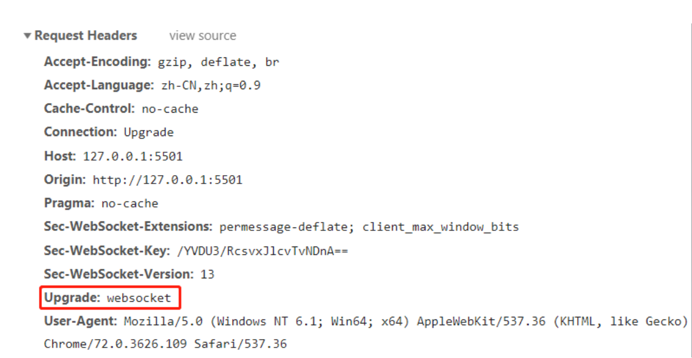

物理层、应用、

网络七层协议：应用层、表示层、会话层、传输层、网络层、数据链路层、物理层

**开放式系统互联通信参考模型**（英语：Open System Interconnection Reference Model，缩写为 OSI），简称为**OSI模型**（OSI model），一种[概念模型](https://baike.baidu.com/item/概念模型/3187025)，由[国际标准化组织](https://baike.baidu.com/item/国际标准化组织/779832)提出，一个试图使各种计算机在世界范围内互连为网络的标准框架

**TCP/IP（Transmission Control Protocol/Internet Protocol，传输控制协议/网际协议）**是指能够在多个不同网络间实现信息传输的协议簇。TCP/IP协议不仅仅指的是[TCP](https://baike.baidu.com/item/TCP/33012) 和[IP](https://baike.baidu.com/item/IP/224599)两个协议，而是指一个由[FTP](https://baike.baidu.com/item/FTP/13839)、[SMTP](https://baike.baidu.com/item/SMTP/175887)、TCP、[UDP](https://baike.baidu.com/item/UDP/571511)、IP等协议构成的协议簇， 只是因为在TCP/IP协议中TCP协议和IP协议最具代表性，所以被称为TCP/IP协议

# 协议

 对等层的实体有一个规则集合作为通讯协议，因此复杂且不同的端可以通讯

**协议分层次：**应用层、传输层、网络层、网络接口层

- **应用层**：HTTP
- **网络层**：IP
- **传输层**：TCP、UDP等

**一个协议需要包括的内容**：语法、语义、时序、动作

**服务器是什么**

- 应用层协议等级以下的应用实体

- 为分布式应用提供通讯服务的基础设施

**接入链路和骨干链路**

# 第一章：网络结构

**按照网络组成类型来划分聚类**（网络结构）：网络边缘、网络核心、接入网和物理媒体

- **网络边缘系统**：主机、应用程序（网络游戏、app应用等）
- **网络核心（起到数据交换的作用）**：网络交换节点以各个圆所组成的链路叫网络核心
- **接入网、物理媒体**：边缘网络与网路核心的链接（有线或者无线的通讯链路）

**网络核心**：是以全球范围内的路由器交换机和链接他们的链路所组成的分布式系统相互配合达到源主机到目标主机的数据传输（发布和接收）

**网络应用是互联网存在的理由**

## 按照网络类型划分

## 网络边缘 

网络边缘包括：分布式应用、主机、支持分布式应用通讯的基础设置

**基础设施**

- **作用**：为服务器的应用提供通讯服务
- **包括**：应用层以下的都是基础设施、应用层协议等级以下的应用实体

**两种模式**：C/S模式（Client/server）也就是客户端/服务器、P2P（peer-to-peer）也就是对等模式

**C/S模式**：浏览器 / web服务器

**P2P模式**：P2P打破了传统的C/S模式，在网络中每个点的地位都是对等的可以是服务器也可以实客户端，也就是说每个节点都能为其他节点提供服务同时也可以享用其他节点的服务

**PPP（point-to-point）和P2P（peer-to-peer）的不同**

- **性质不同**：PPP协议是在点对点连接上传输多个数据包所提供的一个标准方法，P2P是分配工作和工作负载的分布式应用架构
- **特点不同**：PPP是点到点串行通讯协议，P2P是一种网络结构的思想
- **模式不同**：P2P打破了传统的C/S模式，在网络中每个点的地位都是对等的可以是服务器也可以实客户端，也就是说每个节点都能为其他节点提供服务同时也可以享用其他节点的服务。PPP协议通信完毕时，NCP释放网络层链接，收回原来分配出去的IP地址

**向上层提供的服务有两种**：面向连接的（TCP）、无连接的（UDP）

**面向链接服务：**TCP服务

**TCP服务**：可靠性、流量控制、拥塞控制

- 可靠性：确认和重传
- 流量控制：发送方不会淹没接收方
- 拥塞控制：当网络拥塞时，发送方降低速率

**无连接的服务**：UDP服务

## 网络核心

由分组交换构成的网络

**数据怎样通过网络进行传输？**

- 电路交换（circuit switch）：为每一个呼叫预留一个专有电路，如电话网
- 分组交换（packet switch）

### 电路交换：FDM和TDM

Q：两个交换节点连在一起采用什么方法来划分piece？

A：将带宽分成片：频分（Frequency-division multiplexing）、时分（Time-division multiplexing）、波分（Wave-division multiplexing）

TDM（时分）：如果把整个带宽分为24个时间段，24个时间段为一个周期，一个用户分配一个时间端，如果带宽为1.536Mbps，则每个用户会分配（1.536 * 1000）/ 24=64Kbps，因此使用TDM影响单个带宽的速率有几点原因：带宽、单个周期内的时间段

使用TDM计算文件传输的速度需要几点前提：传播时间 = 文件大小Kb / （总带宽M / 1000）/ 周期片段 +  端到端连接建立时间 + 传播延迟，传播延迟=两个主机距离 / 光速（其实是使用的传播介质在大气中的传播速度）

（640/64 + 0.5）= 10.5s

### **分组交换**：虚电路网络（有连接）和数据报网络（无连接）

传输总时间 = 排队时延+传播时延+传输时间+单个存储时间（感觉有几个节点就需要翻倍）

**排队：**分组将会排队，等待传输

**丢失：**如果路由器的缓存用完了，分组将会丢失

因为分组的排队等待会占用缓存，如果带宽不够高则就会造成堵塞，排队多了就回对后来者丢弃（自我理解）

**虚电路网络**

- 虚电路的链接不仅仅体现在发送主机和目标主机上，同时体现在中间所经过的所有节点之上
- 每一个分组都带有VCID代表目标的下一跳
- 在呼叫建立时决定路径，并在传输中保持不变
- 路由器维持每个呼叫的状态信息

**数据报网络**

- 分组的目标地址决定下一条
- 在不同的阶段路由可以改变
- 类似：问路

**面向连接和有链接的区别**

- TCP是面向连接，TCP向应用进程提供服务的时候，仅仅体现在端系统和应用实体上，中间的节点不维护他们的状态
- 有链接网络。体现在虚电路网络，链接不仅仅体现在发送主机和目标主机上，同时体现在中间所经过的所有节点之上

## 接入网和物理媒体

端系统--网络边缘--网络核心

作用：网络边缘接入网络核心

**如何接入？**

1. 住宅网接入
2. 单位网络接入
3. 无线网络接入

接入网络的带宽分为两种：共享和独享，共享则每个个体户分配总的上网带宽，独享则独自享受运营商的带宽。

### modem：调制解调器

俗称的猫接入，将上网数据调制加载到音频信号上，在电话线上传输，在局端其中的数据解调出来：反之亦然。

传输的几种方式：调频、条幅、调相位、总和调制

在音频的载波数据上修改，变成所需要的上网数据

缺点：56Kbps的速率直接接入路由器（通常更低），不能同时上网和通话，不能总是在线

### digital subscriber line（DSL）

分离电话线：一部分用于电话通讯，一部分用于上网

用于上网的分为上行数据和下行数据，两个数据如果是不对称的话叫ADSL

### 电缆网络

有限电视原本用于单项传输，只能传向下行

把有限电视的线路传输进行数字化和双向改造，使用的是FDM

HFC：hvbrid fiber coax（混合光纤同轴电缆），非对称上行30Mbps，下行2Mbps

线缆和光纤网络将个家庭用户接入到ISP（互联网提供服务商）路由器

### 无线接入

无线LANs（建筑物内部：例如无线路由器提供的）和广域无线接入（由运营商提供的：例如3G、4G网络）

### 物理媒介

连接网络的介质

- 导引性媒体：光纤、以太网网线、同轴电缆、双绞线
- 非导引性媒体：无线电                               

光纤传输：速率快、带宽高

## Internet结构和ISP

历史发展：如果所有的网络需要实现互联的话，每个交换机需要与其他交换机互联，复杂度O(n²)，到达一定规模之后会导致可扩展性非常差，因此出现ISP

ISP（Internet Service Provider：互联网服务提供商）：ISP是经国家主管部门批准的正式运营企业，享受国家法律保护，一般是服务器与虚拟主机提供商必须具备的，相互连接通过IXP（Internet exchange point：互联网交换点）

ICP（Internet Content Provider：网络内容服务商）：提供业务，不与ISP同级，仅仅是对用户提供服务，但是大型公司可以自己部署，例如：谷歌

center provider network（中心服务商网络）：大公司由于需要向世界或者较远地区提供优质化服务，则自身拉光纤配置DC（data center：数据中心），配置的DC位置一般是离ISP比较近，一般这种会绕过access ISP和Regional ISP（区域ISP）直接接入ISP

IXP：（Internet exchange point：互联网交换点）

ISP==》IXP==》Regional ISP（区域ISP）==》access ISP

**ISP之间的连接**

- POP：搞成ISP向客户网络的接入点，设计费用结算
- 对等接入：2个ISP对等互联，不涉及费用结算
- IXP：多个对等ISP互联互通之处
- ICP：自己部署专用网络，同时和各级ISP相连接

## 分组延时、丢失和吞吐量

>分组延时分为几种：节点处理延时、排队延时、传播延时

**节点处理延时（固定的）**

- 检查bit级差错
- 检查分组首部和决定将分组导向何处

**排队延时（随机的）**

- 分组到达链路的速率超过了链路的输出速率就会造成排队延时
- 某一分组在队尾，从队头到它之间的传输时间也是有延时

>**流量强度**
>
>设计的流量强度会影响到分组传输的排队延时
>
>链路带宽（R）、分组长度（L）、分组到达队列的平均速率（a） 
>
>La / R  = 流量强度
>
>流量强度趋近于0的时候，排队延时无穷大
>
>**分组丢失**
>
>解释：因为链路队列的缓冲区存储有限，当链路分组队列达到上限后新加入的队列会被自动遗弃

**传输延时（根据单位分组长度而定）**

- 因为传输时需要对分组数据进行存储转发
- 分组长度 / 网络带宽

**传播延时（根据传输距离而定）**

- 物理媒介传输一段分组数据到目的地其中的传输时间就是传播延时
- 传播长度 / 在该媒介的传播速度

| 传播延时 | 节点处理延时                     | 排队延时                         | 传输延时                             | 传播延时                                                   |
| -------- | :------------------------------- | -------------------------------- | ------------------------------------ | ---------------------------------------------------------- |
| 时间     | 固定的，通常是微秒               | 取决于堵塞程度                   | 根据单位分组长度而定                 | 根据传输距离而定                                           |
| 计算方式 | 节点处理数据的时间               | /                                | 分组长度(L) / 网络带宽(R)            | 传播长度(D) / 在该媒介的传播速度(S)                        |
| 描述     | 检查分组首部和决定将分组导向何处 | 检查分组首部和决定将分组导向何处 | 因为传输时需要对分组数据进行存储转发 | 物理媒介传输一段分组数据到目的地其中的传输时间就是传播延时 |
| 符号     | d(proc)                          | d(queue)                         | d(trans)                             | d(pron)                                                    |

所以分组数据从主机到达目标主机有可能经历：排队延时、节点处理延时、传输延时、传播延时

**吞吐量**

- 解释：在源端和目标端之间的传输速率（数据量 / 单位时间）
- 瞬间吞吐量：在一个时间点的速率
- 平均吞吐量：在一个长时间内平均值
- 短板效应：如果传输路径上有多个传输速率不同的链路组成，平均吞吐量取传输速率最少的

LAN（局域网：Local Area Network）、WLAN（无线局域网：Wireless Local Area Network）、WAN（广域网：Wide Area Network）

## 协议层和服务模型

### 协议基本概述

协议的实现借助于下层的服务才能实现，协议实现的目的是为了向上层提供更好的服务

实现本层协议的时候需要借助下层服务提供的接口interface实现

应用的最高层是网络存在的理由

计算机网络分成一个个功能明确的层次，具体实现是使用协议实体的相互动作，协议实体如何实现交互的动作？借助于层接的接口用下层的服务来交换PDU，目的是为了向上层提更更好的服务，向上层提供的服务包括当前层的下层的服务的总和与对等层的交互实现的新特性

**服务**：底层实体向上层实体提供他们之间的通信能力

**服务点（SAP：Services Access Point）**：上层使用下层提供的服务通过层间的接口--地点

**原语（primitive）：**上层使用下层的形式，高层使用底层的服务，以及底层向高层提供服务都是服务器访问原语来进行交互--形式

同一个服务提供者需要同时向多个上层用户提供服务，

### 服务的类型

**面向连接（TCP）：**

- 两个用户在使用下层提供的服务之前需要有一个握手的过程，这种服务就是面向连接的服务

**无连接（UDP）：**

- 两个对等层实体在通信前不需要建立连接，不预留资源，不需要双方都是活跃的

**服务和协议的区别**

- 服务是层级之间的关系，协议是对等层的实体在通讯过程当中应该遵守的规则的集合，服务是在相邻两层之间利用层间的关系在SAP通过原语的方式由下层向上层提供服务

**服务和协议的联系**：实现本层协议的时候需要使用下层提供的服务，本层实现的协议目的是为了向上层提供更好的服务

### 数据单元

**SDU**（服务数据单元：service data unit）

**PDU**（协议数据单元：ptotocol data unit）

**IDU**（接口数据单元：interface data unit）

**ICI**（接口控制信息：interface control infomation）

上层传输的SDU通过SAP传输到下一层，由下一层处理上层的SDU增加header形成本层的PDU，同时又三种情况

- 一对多，上层SDU数据单元较大，下层需要分块处理对每一块增加一个header形成多个本层的PDU
- 多对一，上层的SDU数据单元很小，下层可以合并上层多个较小的SDU然后增加一个header姓曾一个本层的PDU
- 一对一，直接增加header新城本层PDU

**分层处理和实现复杂系统的好处？**

概念化：结构清晰，便于标识网络组件，以及描述其相互关系

结构化：模块化更利于系统的维护和升级

### internet协议栈

物理层-》链路层-》网络层-》传输层-》应用层

物理层：线路之间bit和bit的传输

链路层：提供的是相邻两点之间由物理层传输的bit和bit的传输包装成一个帧，也就是相邻两点以帧为单位的传输

网络层：提供的是以相邻两点之间的帧传输的基础之上向传输层提供端到端之间的传输，两个重要的功能：转发与路由

传输层：解决的是服务进程到服务进程的数据传输，是由端口进行区分 同时把不可靠的报文由TCP包装成可靠的报文

应用层：在传输层提供的进程到进程之间可靠传输的基础之上实现各种各样的网络应用

### 各个层次的协议数据单元

应用层：报文（message）

传输层：报文段（segment）：TCP段、UDP数据报

网络层：分组packet（如果无连接方式：数据报文段datagram）

数据链路层：帧（frame）

物理层：位（bit）

## 总结与习题

是什么？作用？目的？

协议

- 概念：对等实体有一组规则集合作为通讯协议
- 作用：网络之间信息通信的桥梁
- 目的：多端相互通讯
- 组成内容：语法、语义、时序
- 语法：确定协议元素的格式，数据与控制信息的结构与格式
- 语义：确定协议元素的类型，规定通信双方要发何种信息，完成何种动作和做出何种应答
- 时序：规定事件实现顺序的详细说明

按照网络结构类型划分：网络边缘、网络核心、接入网

网络边缘

- 概念内容：主机、支持分布式应用通讯的基础设施
- 作用：应用数据存储

网络核心

- 内容：路由器、交换机
- 作用：信息的存储与转发
- 目的：实现从源主机到目标主机的信息交换
- 交换的类型：电路交换和分组交换
- 电路交换：TDM（时分）、频分（FDM）、波分（WDM）
- 时分的电路交换的计算方式：传播时间 = 文件大小Kb / （（总带宽M / 1000）/ 周期片段） +  端到端连接建立时间 + 传播延迟
- 传播延迟 = 两个主机距离 / 光速（其实是使用的传播介质在大气中的传播速度）
- 分组交换：虚电路网络（如今很少使用）和数据报网络
- 两种分组交换的区别：虚电路网络是有连接的数据报网络是无连接的
- 分组交换和电路交换的区别：分组交换每一个用户都可以享受全部的带宽，而电路交换需要大家共享带宽
- 分组交换的传播时间计算：传播时间 = 文件大小 / 总带宽 + 传播延时 + 排队延时

接入网络

- 概念：物理层的传输介质、无线接入（WLAN）、物理媒体：光纤、双绞线、同轴电缆
- 作用：传输通信信息
- 目的：接入网络核心

### “主机”和“端系统”有什么不同？

没有什么不同，主机就是端系统

### 列举几种不同类型的端系统……

### Web服务器是一种端系统么？

web服务器是一种端系统

# 第二章：应用层

## 应用层协议原理

网络应用的体系架构

### 客户-服务器（ C(client)  / S(serve) ）

缺点：在到达一个阈值的时候会发生断崖式的下降

原因：因为所有的客户都会请求一个服务器所以导致服务器压力提升

### P-P（对等服务）

### C/S和P2P混合服务

中心服务器、用户

服务逻辑：用户上线向中心服务器发送IP地址，下载资源时向中心服务器发送查询信息，中心服务器向已上线的用户中查询资源建立下载连接

用户越多下载越快，同时有中心服务器做集中和分发

### 进程通信

>分布式应用进程通讯需要解决的问题

### 进程标识和寻址问题

标识一个应用进程和寻址一个应用进程需要包括三个要素：主机IP、TCP还是UDP、端口号

### 传输层提供的服务-需要穿过层间的信息

位置：层间界面的SAP（TCP/IP : soket ）

形式：应用程序接口API（TCP/IP : socket API）

**层间接口必须要要携带的信息**：

- 要传输的报文（对本层来说时SDU）
- 谁传的：应用进程的标示：IP+TCP（UDP）端口
- 传给谁：对方的应用进程的标示：对方的IP+TCP（UDP）端口号

**传输层实体**（TCP或者UDP实体）根据这些信息进行TCP报文（UDP数据报）的封装

- 源端口号、目标端口号、数据等
- 将IP地址往下交IP实体，用于IP数据报：源IP，目标IP

### 传输层提供的服务-层接信息的代表

目的：减少层间传输的信息量

TCP socket：

- TCP服务，两个进程之间的通讯之前需要建立连接，两个进程通讯会**持续**一段时间，通讯关系稳定
- 可以用一个证书标识两个应用实体之间的通讯关系，**本地**标示
- 穿过层间接口的信息量**最小**
- TCP socket ：源IP、源端口、目标IP、目标IP、目标端口

**TCP之上的嵌套字（socket）**：对于TCP而言嵌套字是4元组的一个具有本地意义上的一个标示

- 4元组：源IP、源端口、本地IP、本地端口
- 唯一的指定了一个会话（2个进程之间的会话）
- 应用使用这个本地标示，与远程建立通信关系
- 不必再每一次发送都要制定这个4元组
- 简单、便于管理
- 物理上来看就是一个整数

TCP的socket就是一个整数返回的是主机之间的会话关系的本地标示

### 传输层的服务-层间信息的代码

UDP socket

- UDP服务，两个进程之间的通信之前，无需建立连接：每个报文都是独立传输的、前后报文可能给不同的非部署应用进程
- UDPsocket：本IP、本端口
- 发送报文时：必须提供本地IP、port
- 接收报文时：传输层需要上传对方的IP、port

传输时需要传输三个东西：数据报文、UDP socket、对方IP和端口

### 如何使用传输层提供的服务实现应用

定义应用实现协议：报文格式、解释、时序等

编制程序：通过API调用网络基础设施提供通信服务穿报文，解析报文，实现应用时序等

### 应用层协议

定义：

应用协议只是应用进程的一个组成部分

公开协议：HTTP、SMTP等

**应用层需要传输层提供什么样的服务？**

数据丢失率、延迟、吞吐、安全性

### 安全TCP

TCP&UDP

- 都没有加密
- 明文通过互联网传输，设置密码

SSL

- 在TCP上面实现，提供加密的TCP连接
- 私密性
- 数据完整性
- 端到端的鉴别
- 在应用层：应用采用SSL库，SSL库使用TCP通信

SSL socket API

- 应用通过API将明文交给socket，SSL将其加密在互联网上传输

## WEB与HTTP

什么时web、web是由什么组成的、

**web**

- 由一些对象组成
- 对象可以是HTML文件、JPEG图片、Java程序、声音剪辑文件等
- web有一个基本的HTML文件，该基本的HTML文件又包含多干个对象的引用
- 通过URL对每个对象进行引用：用户名、口令字、端口

>

web上传和请求不维护文件的边界

### 用户-服务器状态

**cookies：**

4个组成部分

- 在HTTP响应、请求报文中有一个cookie的首部行
- 在用户端系统中保留一个cookie文件，由用户的浏览器管理
- 在Web站点有一个后端数据库

### web缓存（代理服务器）

**优点**

- 降低服务器的载荷
- 降低客户端的相应时间
- 可以使较弱的ICP也能够有效的提供内容

排队延时：

- queue = I / 1-I * (L / R)
- I是流量强度

通过本地缓存进行一部分的流量控制，从而降低流量强度，降低陡增的排队延时，从而达到由2min的响应时间降低到1.2s的响应时间

## FTP（File Transfer Protocol：文件传输协议）

**FTP端口号**：21

向远程主机上传或者下载文件，客户 / 客户端 服务模式

**FTP控制连接与数据连接分开**

- FTP客户端和FTP服务器通过端口21联系，并使用TCP为传输协议
- 客户端通过控制连接获得身份确认
- 客户端通过控制连接发送命令浏览远程目录
- 收到一个传输文件命令时，服务器打开另一个客户端的数据连接
- 一个控制连接和一个数据连接
- 特点：数据命令的发出和数据信息的传输在两个不同的TCP连接上传输
- 有状态的

http在初始设计的时候是无状态的，后续通过cookie形成有状态的

## Email（电子邮件）

三个组成部分：

- 用户代理
- 邮件服务器
- 简单有见传输协议：SMTP

发邮件使用的是SMTP协议，但是拉取邮箱的协议可以是：http、POP3、TMAP

用户代理软件：指可阅读的邮件应用例如：outlook，等

SMTP的发送都是以明文发送，安全性较差

**总结**

- SMTP是持久性连接，发完一个邮件后可以继续发送
- SMTP要求报文（首部和主体）为7为ASCII编码
- SMTP服务器使用CRLF，CRLF决定报文的尾部

**SMTP和HTTP的区别**

- HTTP：拉取（pull），SMTP（推）：push
- 二者都是以ASCII形式的命令/响应交互、状态码
- HTTP：每个对象封装在各自的响应报文中
- SMTP：多个对象包含在一个报文中

### 报文格式：多媒体扩展

由于邮件传输只能传输ASCII报文，因此想要传输附件或者其他形式的信息需要进行多媒体扩展

**MIME：多媒体邮件扩展（multimedia mail extension）**

base64：把不在ASCII编码范围内的字节转化为更长但在ASCII范围内的字节

### POP3协议

用户确认阶段

- 客户端命令：user（用户名）、pass（口令）
- 服务器响应：+OK、-ERR

事物处理阶段、客户端

- list：报文列表
- retr：根据报文号检索报文
- del：删除
- quit：退出

## DNS

DNS：Domain Name System（域名解析系统），是互联网的一项服务，它将作为IP与域名互相映射的一个分布式数据库，能够使人更方便的访问互联网 

因此DNS是给其他应用的应用，完场的由域名到ip的解析

DNS的必要性：

- 需要使用有意义的字符来标识Internet上的设备，因此需要有一种字符串-IP地址的转换方式

### **DNS系统需要解决的问题**

- 如何命名设备？使用具有意义的字符串、解决一个平面命名的重名问题：层次化命名
- 如何完成名字到IP地址的转换？分布式数据库维护和响应式名字查询
- 如何维护增加、删除一个域，需要在域中做哪些工作？

### DNS历史

**ARPANET解决方案**

- 主机名：没有层次的一个字符串（一个平面）：自我理解：没有进行结构划分，所有域名统一管理
- 集中维护一个主机名-IP地址的文件：Hosts.txt
- 每台主机定时从维护站读取文件

**ARPANET解决方案的问题**

- 当网络中主机数量很大时
  1. 没有层次的主机很难分配
  2. 文件的管理、发布、查找都很麻烦

### DNS总体思路和目标

DNS是在网络边缘的应用进程上实现的

**DNS的主要思路**

- 分层的、基于域的命名机制
- 若干个分布式的数据库完场名字到IP姬直的转换
- 运行在UDP之上端口号为53的应用服务
- 核心的Internet，但在应用层协议实现

**DNS的主要目的**

- 实现主机名-IP地址的转换
- 主机别名到规范地址的转换：Host aliasing
- 邮件服务器别名到邮件服务器的正规名字的转换：Mail server aliasing
- 负载均衡：在从域名解析IP地址的时候可以根据服务器的负载情况分配到不同的主机进行提供服务因此达到负载均衡

### DNS的明明结构

NDS采用树状结构的命名方法

Internet根被划分为几百个顶级域

- 通用的（generic）：.con .edu .gov .int .mil .net .org .firm .hsop .web .arts .rec 
- 国家的（countries）：.cn .us .nl .jp

每个域下分为若干个子域

树叶是主机

### 区域名字服务器资源维护记录

每一个区域用一台名字服务器来维护，是关于这个区域的权威，上层的区域知道下层区域如何走

**资源记录（resource records）**

- 作用：维护域名-IP之间的映射关系
- 位置：Name Server的分布式数据库中

**RR格式**

- Domain_name：域名
- TTL：time to live ：生存时间（权威、缓冲记录）
- Class：类别：对于Internet值为in
- Type类别：资源记录的类型

### DNS记录

RR格式：name、value、type、ttl

**Type值**

- A：Name主机、value为主机地址
- CNAME：Name为规范名字的别名、value为规范名字
- NS：Name域名、Value为该服务器的权威服务器的域名
- MX：Value为name对应的邮件服务器的名字

TTL：生存时间，决定了资源记录应当从缓存中删除的时间

**一台设备上网需要具备4个信息**

- 主机的IP地址
- 子网掩码
- Default getway：默认路径
- local name server

### 名字服务器

**名字解析过程**

- 目标名字服务器在Local Name Server中
  1. 查询的名字在服务器内部
  2. 缓存

当本地名字不能解析时使用递归（深度优先遍历）查询根服务器

- 问题：根服务器负担太重
- 解决：使用迭代查询

迭代查询：广度优先遍历

缓存是为了性能，缓存删除是为了一致性

### DNS解析流程

权威DNS、递归DNS、转发DNS

TLD（Top-level domains）-first-level domains：顶级域名服务器，也翻译为国际顶级域名，也称一级域名

### 攻击NDS

### 总结

NDS：名字命名、名字查询、子域名查询、域名记录方式、NDS缓存的作用、域名维护（增删改查）

一个域名解析的查询步骤：

## P2P应用

### 纯P2P架构

**特点**

- 没有一直运行的服务器
- 任意端系统都可以直接通信
- 利用peer的服务能力
- Peer节点间歇上网，每次IP都有新变化

例子：文件分发（BitTorrent）、流媒体（KanKan）、VoIP（Skype）

### 文件分发时间：C/S模式

 **服务文件传输**：都是由服务器发送给Peer，服务器必须顺序传输（上载）N个文件拷贝：

- 发送一个copy：FUs
- 发送N个：NFUs

**客户端**：每一个客户端需要下载一个文件的拷贝

- Min(d)：客户端最小的下载速率
- 最小下载速率所用到的时间：F/Min(d)

因此将一个文件使用C/S的方式传输F所需要的时间：**D(c/s) >= Max( NF/Us , F/Min(d) )**

用户量较小的时候所需要的时间基本就是用户的最小下载速率，因为服务器的上载很充裕，单数如果用户基数很大，也就是N很大的时候服务器压力会持续增加同时传输速率会线性增长。

### 文件分发时间：P2P模式

**服务器传输**：最少需要上载一份拷贝

**客户端**：每个客户端必须下载一个拷贝

**客户端**：所有客户端总下载量NF

- 最大上载带宽是：Us（客户端上载带宽） + NUi（N分片节点上载带宽）
- 除了服务器可以上载，其他所有的peer节点都可以上载

所需要的最大耗时分为几个主要因素：1、服务器的上传，因为关系到第一份上载的拷贝，2、客户端下载的最小带宽，3、所有peer节点的总上传和下载量

所需要的最大耗时：Min（Us，F/d(min)，NF / NUi（N分片节点上载带宽））

### 非结构化P2P

两个问题：

- 如果确定所需资源
- 如何处理对等放的加入离开

可能的方案

- 集中、分散、半分散

**集中式目录**

最初的“Napster”设计

1. 对等放连接时告知中心服务器：有什么资源、IP地址
2. Alice查询"双截棍.mp3"
3. Alice从Bob处请求文件

集中式目录存在的问题：单点故障（中心服务挂掉后无法使用）、性能瓶颈（因为查询资源也是走的中心服务器虽然压力小但是还是有瓶颈）、侵犯版权

### **完全结构化分布式**

查询洪范：Gnutella

完全分布式没有中心服务、代码是开源的、

许多Gnutella客户端实现了Gnutella协议

**Gnutella：协议**

泛红查询：发出一个查询，首先向邻居节点发送查询，然后邻居再广度查询

**Guntella：对等放加入**

当加入覆盖网络时需要向邻居网络发送ping，然后获得ping报文的节点进行回传pong报文，标示建立连接同时标示加入覆盖网络

### 混合体

>利用不匀称性：KaZaA

每个节点要么是一个组长要么隶属于一个组

### P2P文件分发：BitTorrent

加入：peer加入torrent，刚进入没有资源块，通过其他节点累计资源块，向跟踪服务器注册获取peer节点列表建立连接

下载：当peer下载同时也会向其他节点提供上载服务

扰动churn：peer节点可能会随时下线或者上线

一旦一个peer拥有整个文件，他会离开（自私的）或者保留（利他主义）在torrent中

当进入洪流中首先随机请求数据块让自己加入洪流拥有上传和下载的能力，然后会请求洪流中稀缺的块进行对稀缺资源补充peer节点同时自己拥有稀缺资源后会增加别人的访问和请求，因此也变相增加了自己的上传和下载。 个人利益转换成团队利益

### DHT结构化P2P（*自行了解下）

## CDN

### 视频流量服务和CDN：上下文

为什么会有CDN？

现在又很多杀手级应用，大多数都是以提供视频为基础服务的应用，因此占用大量带宽

CDN的基本实现是什么？

分布式的，应用层面的基础设施

### 多媒体

CBR（constant bit rate）：以固定速率编码

VBR（variable bit rate）：视频编码速率随着视频速率变化而变化

> **多媒体流话服务：DASH**（Dynamic Adaptive Streaming over Http）

**服务器**

- 将视频文件分割成多块
- 每个块独立存储
- 告示文件（manifest file）：告知视频的各个版本解析度的url

**客户端**

- 先获取告示文件
- 周期性的测量服务器到客户端的带宽
- 查询告示文件，结合用户的实际情况或者用户手动切换动态改变视频码率，意思就是改变块的访问url

### CND部署策略

>**enter deep**：将CND服务器深入到许多接入网

更接近用户，可以为用户提供较好的服务，缺点是不易管理

例如：Akamai，1700个位置

>**bring home**：部署在关键位置。

因为网络的结构是松散的，因此在某些关键的节点是用户访问的大流量区域，在其中部署CDN节点也可以获取不错的服务，缺点是离用户太远

例如：Limelight

## TCP嵌套字编程

### Socket编程

>应用进程使用传输层协议提供的服务才能够交换报文，实现应用协议，实现应用

TCP/IP：应用进程使用Socket API访问传输服务

地点：界面上的SAP（Socket），方式：Socket API

目标：如何能够借助socket进行通讯C/S应用服务

socket：分布式应用进程之间的门，传输层协议提供的端到端之间的接口

**两种传输服务的socket类型：**TCP（可靠的、字节流服务）和UDP（不可靠、数据UDP报文）

### C/S socket交互：TCP（*）

### socket和websocket的区别

**sokect**：应用层和传输层之间的抽象层，是为了方便TCP和UDP使用出来的抽象层，它提供了一套API接口用于进程和进程之间的数据通信，本身不是协议

**websocket**：是HTML5出来的新协议，用于提供客户端和服务端的持久连接，它是建立在TCP之上的应用层协议。使用的标准的80和443接口，HTTP与HTTPS端（80和443），其中每一个websocket的连接建立都是基于HTTP请求，通过HTTP协议在传送Websocket支持的版本号，协议的版本号、原始地址、主机地址等等一些字段给服务器。Upgrade字段是用于把当前的http协议升级成websocket协议，所以一个websocket的连接是客户端在服务端之间http协议的初始握手阶段将其升级成websocket协议来建立的，其底层仍然是TCP/IP连接。

**客户端与服务端连接步骤**

>**客户端终止状态类型**：FIN-WAIT-1、FIN-WAIT-2、TIME-WAIT、CLOSED
>
>**服务端终止状态类型**：CLOSED-WAIT、LAST-ACK、CLOSED

1. 服务端：创建socket，
2. 服务端：绑定socket，ip和端口
3. 服务端：监听端口信息
4. 客户端：创建socket，嵌套字
5. 客户端：绑定socket
6. 客户端：发送soket连接请求
7. 服务端：listen监听到连接请求，然后确认身份，同时判断客户端的数据接收能力（第一次握手：请问你是？）
8. 客户端：响应身份确认，确认服务端的发送能力正常，同时要响应自己的发送能力在发送数据，同时也证明了自己已经收到了服务端的数据，确认了自己的数据接收能力正常（第二次握手，我是某，你是？）
9. 服务端：监听身份取人信息并回应，服务器收到客户端的接收和发送能力正常（第三次握手：某某你好，我是某）
10. 服务端：进行连接建立（accept连接请求）
11. 客户端与服务端数据交互
12. 客户端：请求结束，目的是告知服务端自己要关闭连接了（状态改变为FIN-WAIT-1、第一次挥手）
13. 服务端：响应结束，得知客户端的关闭消息，发送消息告知自己已经收到结束消息，自己进入CLOSED-WAIT（第二次挥手）
14. 客户端：收到服务端明白了自己的结束消息，自己进入FIN-WAIT-2
15. 服务端：发送之前未发送完的报文，发送结束后向客户端发送已经全部结束的消息自己进入LAST-ACK（第三次挥手）
16. 客户端：收到服务端发送的完全结束消息，做出一个回应ACK，自己进入TIME-WAIT状态（第四次挥手）
17. 服务端：收到ACK，直接关闭连接
18. 客户端：超长等待后关闭连接

## UDP嵌套字编程

**特点**

- 没有握手
- 发送端在每一个报文中都要明确标记目标端口和IP地址
- 服务器必须要从报文中提取端口和IP地址

Client/server socket 交互：UDP

>server 1.1.1.1:80  ------------->  client 2.2.2.2:777
>
>1. server：建立socket，返回一个整数
>2. server：绑定socket，bind
>3. server：readfrom 等待接收报文
>4. client：建立socket
>5. client：绑定socket
>6. client：send，发送报文
>7. server：接收报文，处理完后发送到客户端
>8. client：读取服务器返回的报文

